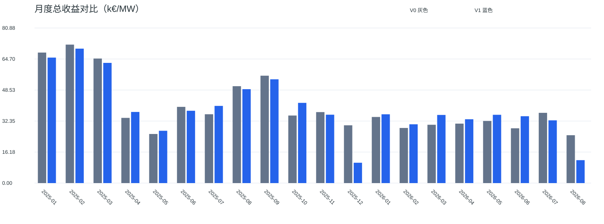
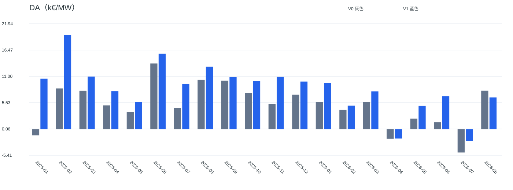
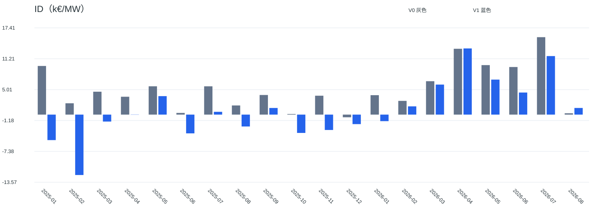
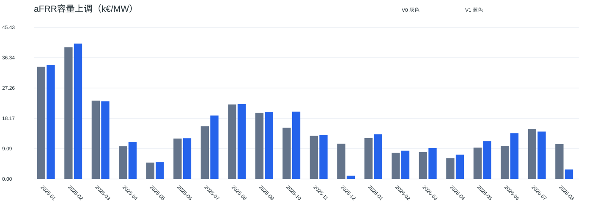
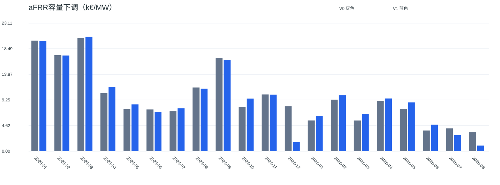
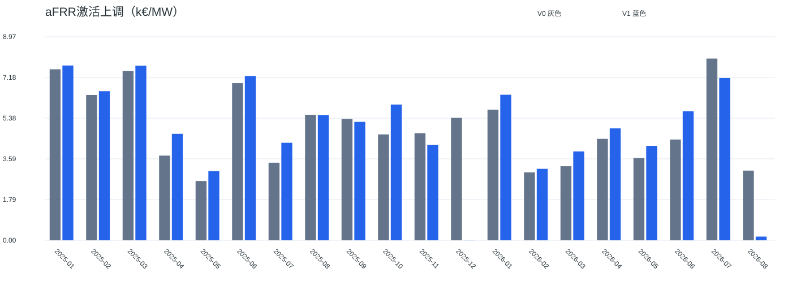
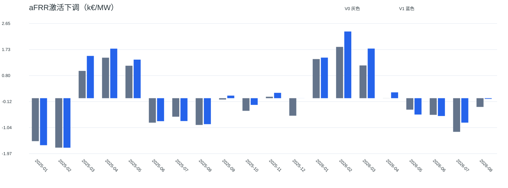

# 西班牙100 MW / 200 MWh：完美预测V1与V0全量对比

正式区间：马德里当地2025-01-01至2026-08-31，共20个月。V1另加载2026-09-01观察日，观察日现金不计入正式收益。
观察日2026-09-01的本地归档价格与激活字段全部缺失，96个QH以空值留证并禁用交易，不构成经济上有效的前瞻；正式终点SOC=10 MWh仍强制执行。
V0指优化前原模型的成功全量归档（历史执行文件名为v5，v1–v4为失败尝试编号），不是另一个未经确认的基准。V1在当前“完美预测模型优化V1”分支运行。

## 配置与比较口径

额定功率100 MW、额定容量200 MWh；可用SOC 10–190 MWh，初始及正式终点10 MWh，充放电效率各92%。两日规划、逐日执行，ts_start / cap_old / D（先下后上），MIP gap=1e-4、30秒/窗、presolve=False。
正式年度EFC预算与原结果一致：{'2025': 548.7661703394889, '2026': 345.99166170339595}；V1实际消耗：{'2025': 548.7661693394894, '2026': 345.9916607033961}。
V1首次达到常规可用EFC上限的当地时段：{'2025': '2025-11-22T23:45:00+01:00', '2026': '2026-07-23T23:45:00+02:00'}。2025口径为年度预算减数值余量；2026口径另扣正式终点预留0.543478 EFC，终点窗口释放。月度消耗见monthly_efc.csv。
使用既有REE/eSIOS及OMIE本地原始归档，没有新增下载或市场规则核验。价格及激活系数为事后已知，全额成交、GCT起检查备用余量及空闲桥接属于建模假设；cap_old历史时表仍待核实。收益为不扣手续费和退化现金的条件毛收益，不等于可实现收益，也不是全年联合优化的严格上界。
V1保留连续时间轴并对缺失时段空闲桥接，V0按有效片段重置状态；冻结、GCT余量与终点约束也存在差异。下列为各自完整运行结果对比，不把覆盖差异或约束变化全部归因为性能优化。缺失结算留空，不作为观测到的零收益。

补充共同结算时段比较：52247个QH，V0 796.611354、V1 779.408622 k€/MW，差额-17.202732 k€/MW。此为各自原调度结果在交集上的现金筛选，并非在共同输入上重新优化；月度见common_qh_monthly.csv。

## 总收益与用时

| 指标 | V0 | V1 | 差异 |
|---|---:|---:|---:|
| 总收益（k€/MW） | 796.611354 | 782.296071 | -14.315283（-1.80%） |
| 有效结算QH | 52247 | 52438 | |
| 覆盖率 | 89.519% | 89.846% | |
| 纯求解器时间（秒） | 158.246 | 614.341 | |
| 执行墙钟时间（秒） | 244.933 | 2037.276 | |
| 入口记录总时间（秒） | 274.538 | 2338.435 | |

V1首轮生产运行与成功续跑的进程耗时合计约2755.438秒（含最终文件写出，由两段进程启动记录和文件修改时间计算；不含中间诊断、首次续跑入口失败及人工处理间隔）。

V1数值重试共1次：默认presolve=False，仅当求解器报告不可行时以presolve=True重试，数学约束、预算和冻结订单不变。首轮在2025-11-22停止，恢复前325个已验收窗口继续。诊断放宽预算试验未用于正式结果。
V0计时来自原运行，并非本次同步基准测试。V1求解计时为首轮325个成功窗口加恢复运行全部求解尝试；首轮失败调用的求解时间未单独保存，诊断重放不计入，因此不是所有尝试总CPU时间。执行墙钟为首轮与续跑相加，包含审计、首轮每60窗检查点及报告物化。入口总时间在最终结果序列化前采样。
所有收益单位均为k€/MW；对100 MW项目，对应项目收益（千欧元）为表内数值乘100。

| 市场 | V0 | V1 | V1−V0 |
|---|---:|---:|---:|
| DA | 102.532007 | 170.988463 | +68.456456 |
| ID | 102.952490 | 16.399594 | -86.552896 |
| aFRR容量上调 | 299.425707 | 302.696892 | +3.271185 |
| aFRR容量下调 | 193.663553 | 192.043563 | -1.619989 |
| aFRR激活上调 | 99.434846 | 97.805519 | -1.629327 |
| aFRR激活下调 | -1.397249 | 2.362040 | +3.759289 |

## 月度总收益



| 月份 | V0 | V1 | 差额 | 变化 | V0/V1有效QH |
|---|---:|---:|---:|---:|---:|
| 2025-01 | 68.0647 | 65.4449 | -2.6198 | -3.85% | 2924/2928 |
| 2025-02 | 72.2117 | 70.1124 | -2.0993 | -2.91% | 2592/2592 |
| 2025-03 | 64.9566 | 62.6839 | -2.2727 | -3.50% | 2936/2961 |
| 2025-04 | 33.9999 | 37.0977 | +3.0979 | +9.11% | 2448/2491 |
| 2025-05 | 25.6051 | 27.2762 | +1.6711 | +6.53% | 2328/2346 |
| 2025-06 | 39.7483 | 37.7144 | -2.0339 | -5.12% | 2784/2784 |
| 2025-07 | 35.8926 | 40.2518 | +4.3592 | +12.15% | 2460/2463 |
| 2025-08 | 50.5287 | 48.9704 | -1.5583 | -3.08% | 2872/2879 |
| 2025-09 | 56.0035 | 54.1138 | -1.8898 | -3.37% | 2860/2867 |
| 2025-10 | 35.2257 | 41.8356 | +6.6099 | +18.76% | 2485/2504 |
| 2025-11 | 37.0175 | 35.6617 | -1.3558 | -3.66% | 2572/2576 |
| 2025-12 | 30.1350 | 10.6081 | -19.5270 | -64.80% | 2784/2784 |
| 2026-01 | 34.4765 | 35.8751 | +1.3985 | +4.06% | 2590/2591 |
| 2026-02 | 28.7403 | 30.6655 | +1.9252 | +6.70% | 2649/2666 |
| 2026-03 | 30.4127 | 35.5367 | +5.1240 | +16.85% | 2741/2757 |
| 2026-04 | 31.0090 | 33.2924 | +2.2834 | +7.36% | 2485/2489 |
| 2026-05 | 32.4038 | 35.6119 | +3.2081 | +9.90% | 2586/2587 |
| 2026-06 | 28.5752 | 34.8704 | +6.2952 | +22.03% | 2548/2567 |
| 2026-07 | 36.6379 | 32.7193 | -3.9186 | -10.70% | 2684/2686 |
| 2026-08 | 24.9663 | 11.9539 | -13.0124 | -52.12% | 1919/1920 |

收益下降集中在2025年12月与2026年8月；V1在此之前已用尽大部分常规EFC额度，后期物理充放电受到预算限制。两日滚动并不预留全年最高价月份的用量，因此完美价格信息不等于全年最优调度。该解释与EFC记录一致，但本次没有逐项关闭约束进行因果归因。
DA与ID合计变化为-18.096440 k€/MW；应合并观察现货收益，不能仅凭DA单项上升判断收益提升。

## 月度分项收益

### DA



| 月份 | V0 | V1 | 差额 | V0收益占比 | V1收益占比 |
|---|---:|---:|---:|---:|---:|
| 2025-01 | -1.2616 | 10.5114 | +11.7730 | -1.85% | 16.06% |
| 2025-02 | 8.4772 | 19.5908 | +11.1136 | 11.74% | 27.94% |
| 2025-03 | 8.0004 | 10.9525 | +2.9521 | 12.32% | 17.47% |
| 2025-04 | 4.9621 | 7.8898 | +2.9277 | 14.59% | 21.27% |
| 2025-05 | 3.6286 | 5.6637 | +2.0350 | 14.17% | 20.76% |
| 2025-06 | 13.6874 | 15.7225 | +2.0351 | 34.44% | 41.69% |
| 2025-07 | 4.4420 | 9.4448 | +5.0028 | 12.38% | 23.46% |
| 2025-08 | 10.2882 | 12.9976 | +2.7094 | 20.36% | 26.54% |
| 2025-09 | 10.1031 | 10.9170 | +0.8139 | 18.04% | 20.17% |
| 2025-10 | 7.5245 | 10.0738 | +2.5492 | 21.36% | 24.08% |
| 2025-11 | 5.2813 | 10.9292 | +5.6479 | 14.27% | 30.65% |
| 2025-12 | 7.2044 | 9.9071 | +2.7027 | 23.91% | 93.39% |
| 2026-01 | 5.6075 | 9.6141 | +4.0067 | 16.26% | 26.80% |
| 2026-02 | 4.0230 | 4.9210 | +0.8980 | 14.00% | 16.05% |
| 2026-03 | 5.6629 | 7.8644 | +2.2015 | 18.62% | 22.13% |
| 2026-04 | -1.9788 | -1.9289 | +0.0499 | -6.38% | -5.79% |
| 2026-05 | 2.2083 | 4.8612 | +2.6529 | 6.81% | 13.65% |
| 2026-06 | 1.4742 | 6.8788 | +5.4046 | 5.16% | 19.73% |
| 2026-07 | -4.8346 | -2.4448 | +2.3898 | -13.20% | -7.47% |
| 2026-08 | 8.0320 | 6.6225 | -1.4095 | 32.17% | 55.40% |

### ID



| 月份 | V0 | V1 | 差额 | V0收益占比 | V1收益占比 |
|---|---:|---:|---:|---:|---:|
| 2025-01 | 9.7646 | -5.1125 | -14.8771 | 14.35% | -7.81% |
| 2025-02 | 2.2776 | -12.1203 | -14.3979 | 3.15% | -17.29% |
| 2025-03 | 4.5976 | -1.3926 | -5.9902 | 7.08% | -2.22% |
| 2025-04 | 3.5877 | 0.0340 | -3.5537 | 10.55% | 0.09% |
| 2025-05 | 5.6823 | 3.7097 | -1.9726 | 22.19% | 13.60% |
| 2025-06 | 0.3362 | -3.7622 | -4.0984 | 0.85% | -9.98% |
| 2025-07 | 5.6793 | 0.5622 | -5.1171 | 15.82% | 1.40% |
| 2025-08 | 1.8386 | -2.3805 | -4.2192 | 3.64% | -4.86% |
| 2025-09 | 3.9379 | 1.3325 | -2.6054 | 7.03% | 2.46% |
| 2025-10 | 0.1194 | -3.6748 | -3.7942 | 0.34% | -8.78% |
| 2025-11 | 3.7933 | -3.0828 | -6.8761 | 10.25% | -8.64% |
| 2025-12 | -0.5328 | -1.9058 | -1.3730 | -1.77% | -17.97% |
| 2026-01 | 3.9023 | -1.3089 | -5.2111 | 11.32% | -3.65% |
| 2026-02 | 2.7560 | 1.6545 | -1.1015 | 9.59% | 5.40% |
| 2026-03 | 6.7064 | 6.0258 | -0.6806 | 22.05% | 16.96% |
| 2026-04 | 13.2133 | 13.2804 | +0.0672 | 42.61% | 39.89% |
| 2026-05 | 9.9358 | 7.0258 | -2.9100 | 30.66% | 19.73% |
| 2026-06 | 9.5519 | 4.4323 | -5.1196 | 33.43% | 12.71% |
| 2026-07 | 15.5421 | 11.7482 | -3.7939 | 42.42% | 35.91% |
| 2026-08 | 0.2631 | 1.3347 | +1.0716 | 1.05% | 11.17% |

### aFRR容量上调



| 月份 | V0 | V1 | 差额 | V0收益占比 | V1收益占比 |
|---|---:|---:|---:|---:|---:|
| 2025-01 | 33.6041 | 34.1110 | +0.5070 | 49.37% | 52.12% |
| 2025-02 | 39.4672 | 40.5601 | +1.0929 | 54.65% | 57.85% |
| 2025-03 | 23.4881 | 23.2911 | -0.1970 | 36.16% | 37.16% |
| 2025-04 | 9.8182 | 11.1111 | +1.2929 | 28.88% | 29.95% |
| 2025-05 | 4.9179 | 5.0316 | +0.1137 | 19.21% | 18.45% |
| 2025-06 | 12.1223 | 12.2071 | +0.0848 | 30.50% | 32.37% |
| 2025-07 | 15.7744 | 19.0063 | +3.2319 | 43.95% | 47.22% |
| 2025-08 | 22.3165 | 22.4761 | +0.1596 | 44.17% | 45.90% |
| 2025-09 | 19.8289 | 20.0485 | +0.2196 | 35.41% | 37.05% |
| 2025-10 | 15.3528 | 20.1931 | +4.8402 | 43.58% | 48.27% |
| 2025-11 | 12.9271 | 13.1976 | +0.2706 | 34.92% | 37.01% |
| 2025-12 | 10.5627 | 0.9937 | -9.5690 | 35.05% | 9.37% |
| 2026-01 | 12.2673 | 13.3711 | +1.1038 | 35.58% | 37.27% |
| 2026-02 | 7.8464 | 8.4843 | +0.6379 | 27.30% | 27.67% |
| 2026-03 | 8.0735 | 9.2223 | +1.1488 | 26.55% | 25.95% |
| 2026-04 | 6.2434 | 7.2828 | +1.0393 | 20.13% | 21.88% |
| 2026-05 | 9.3926 | 11.3352 | +1.9426 | 28.99% | 31.83% |
| 2026-06 | 9.9574 | 13.7240 | +3.7665 | 34.85% | 39.36% |
| 2026-07 | 14.9952 | 14.2043 | -0.7909 | 40.93% | 43.41% |
| 2026-08 | 10.4698 | 2.8457 | -7.6241 | 41.94% | 23.81% |

### aFRR容量下调



| 月份 | V0 | V1 | 差额 | V0收益占比 | V1收益占比 |
|---|---:|---:|---:|---:|---:|
| 2025-01 | 19.9420 | 19.8960 | -0.0459 | 29.30% | 30.40% |
| 2025-02 | 17.3368 | 17.2639 | -0.0728 | 24.01% | 24.62% |
| 2025-03 | 20.4431 | 20.6365 | +0.1934 | 31.47% | 32.92% |
| 2025-04 | 10.4614 | 11.6133 | +1.1520 | 30.77% | 31.30% |
| 2025-05 | 7.6113 | 8.4501 | +0.8388 | 29.73% | 30.98% |
| 2025-06 | 7.5412 | 7.1189 | -0.4223 | 18.97% | 18.88% |
| 2025-07 | 7.2340 | 7.7506 | +0.5167 | 20.15% | 19.26% |
| 2025-08 | 11.4998 | 11.2741 | -0.2257 | 22.76% | 23.02% |
| 2025-09 | 16.8271 | 16.5041 | -0.3231 | 30.05% | 30.50% |
| 2025-10 | 8.0076 | 9.4957 | +1.4880 | 22.73% | 22.70% |
| 2025-11 | 10.2425 | 10.2145 | -0.0279 | 27.67% | 28.64% |
| 2025-12 | 8.1232 | 1.6131 | -6.5101 | 26.96% | 15.21% |
| 2026-01 | 5.5513 | 6.3419 | +0.7906 | 16.10% | 17.68% |
| 2026-02 | 9.3001 | 10.0901 | +0.7900 | 32.36% | 32.90% |
| 2026-03 | 5.5447 | 6.7456 | +1.2009 | 18.23% | 18.98% |
| 2026-04 | 9.0610 | 9.5167 | +0.4556 | 29.22% | 28.59% |
| 2026-05 | 7.6425 | 8.8070 | +1.1645 | 23.59% | 24.73% |
| 2026-06 | 3.7388 | 4.7755 | +1.0366 | 13.08% | 13.69% |
| 2026-07 | 4.1155 | 2.9235 | -1.1920 | 11.23% | 8.94% |
| 2026-08 | 3.4397 | 1.0124 | -2.4273 | 13.78% | 8.47% |

### aFRR激活上调



| 月份 | V0 | V1 | 差额 | V0收益占比 | V1收益占比 |
|---|---:|---:|---:|---:|---:|
| 2025-01 | 7.5397 | 7.7062 | +0.1666 | 11.08% | 11.78% |
| 2025-02 | 6.4071 | 6.5746 | +0.1674 | 8.87% | 9.38% |
| 2025-03 | 7.4599 | 7.6973 | +0.2374 | 11.48% | 12.28% |
| 2025-04 | 3.7339 | 4.6926 | +0.9587 | 10.98% | 12.65% |
| 2025-05 | 2.6135 | 3.0536 | +0.4400 | 10.21% | 11.19% |
| 2025-06 | 6.9294 | 7.2438 | +0.3144 | 17.43% | 19.21% |
| 2025-07 | 3.4194 | 4.2987 | +0.8793 | 9.53% | 10.68% |
| 2025-08 | 5.5351 | 5.5246 | -0.0105 | 10.95% | 11.28% |
| 2025-09 | 5.3541 | 5.2211 | -0.1330 | 9.56% | 9.65% |
| 2025-10 | 4.6695 | 5.9853 | +1.3158 | 13.26% | 14.31% |
| 2025-11 | 4.7223 | 4.2133 | -0.5089 | 12.76% | 11.81% |
| 2025-12 | 5.3986 | 0.0000 | -5.3986 | 17.91% | 0.00% |
| 2026-01 | 5.7608 | 6.4181 | +0.6573 | 16.71% | 17.89% |
| 2026-02 | 2.9954 | 3.1503 | +0.1549 | 10.42% | 10.27% |
| 2026-03 | 3.2638 | 3.9188 | +0.6550 | 10.73% | 11.03% |
| 2026-04 | 4.4724 | 4.9346 | +0.4622 | 14.42% | 14.82% |
| 2026-05 | 3.6317 | 4.1624 | +0.5307 | 11.21% | 11.69% |
| 2026-06 | 4.4433 | 5.6920 | +1.2487 | 15.55% | 16.32% |
| 2026-07 | 8.0130 | 7.1555 | -0.8575 | 21.87% | 21.87% |
| 2026-08 | 3.0719 | 0.1628 | -2.9091 | 12.30% | 1.36% |

### aFRR激活下调



| 月份 | V0 | V1 | 差额 | V0收益占比 | V1收益占比 |
|---|---:|---:|---:|---:|---:|
| 2025-01 | -1.5240 | -1.6673 | -0.1434 | -2.24% | -2.55% |
| 2025-02 | -1.7543 | -1.7567 | -0.0025 | -2.43% | -2.51% |
| 2025-03 | 0.9676 | 1.4992 | +0.5316 | 1.49% | 2.39% |
| 2025-04 | 1.4366 | 1.7569 | +0.3203 | 4.23% | 4.74% |
| 2025-05 | 1.1514 | 1.3675 | +0.2161 | 4.50% | 5.01% |
| 2025-06 | -0.8682 | -0.8157 | +0.0525 | -2.18% | -2.16% |
| 2025-07 | -0.6564 | -0.8108 | -0.1543 | -1.83% | -2.01% |
| 2025-08 | -0.9494 | -0.9214 | +0.0279 | -1.88% | -1.88% |
| 2025-09 | -0.0476 | 0.0906 | +0.1382 | -0.08% | 0.17% |
| 2025-10 | -0.4482 | -0.2374 | +0.2108 | -1.27% | -0.57% |
| 2025-11 | 0.0511 | 0.1898 | +0.1387 | 0.14% | 0.53% |
| 2025-12 | -0.6210 | 0.0000 | +0.6210 | -2.06% | 0.00% |
| 2026-01 | 1.3875 | 1.4388 | +0.0513 | 4.02% | 4.01% |
| 2026-02 | 1.8194 | 2.3652 | +0.5458 | 6.33% | 7.71% |
| 2026-03 | 1.1614 | 1.7598 | +0.5984 | 3.82% | 4.95% |
| 2026-04 | -0.0023 | 0.2068 | +0.2092 | -0.01% | 0.62% |
| 2026-05 | -0.4070 | -0.5797 | -0.1727 | -1.26% | -1.63% |
| 2026-06 | -0.5905 | -0.6321 | -0.0416 | -2.07% | -1.81% |
| 2026-07 | -1.1934 | -0.8674 | +0.3260 | -3.26% | -2.65% |
| 2026-08 | -0.3101 | -0.0242 | +0.2860 | -1.24% | -0.20% |

## 数据质量与验收

```json
{
  "formal_qh": 58364,
  "raw_field_complete_qh": 52442,
  "raw_field_coverage": 0.8985333424713865,
  "enabled_input_coverage": 0.8984648070728531,
  "settlement_coverage": 0.8984648070728531,
  "assumed_idle_hours": 1481.5,
  "blocked_qh": 0,
  "disabled_contract_count": 13926,
  "disabled_contract_count_scope": "entire_input_including_lookahead",
  "incomplete_lookahead_windows": 179
}
```

已检查20个月齐全、月度六项加总与总收益一致、V0月度CSV与原总收益一致、V1成功结束且没有未知状态阻断。逐窗物理约束、冻结还原和现金重构由现有独立验收逻辑在提交窗口前检查。本次没有调用任何agent。
完整运行证据见 ../../output/perfect_v1_full_completed_retry/；首轮失败与诊断现场保留在相邻目录；比较数据见本目录CSV文件。
