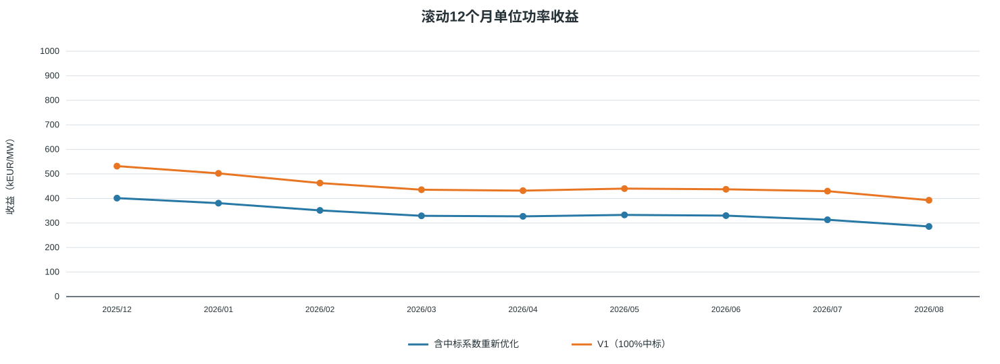
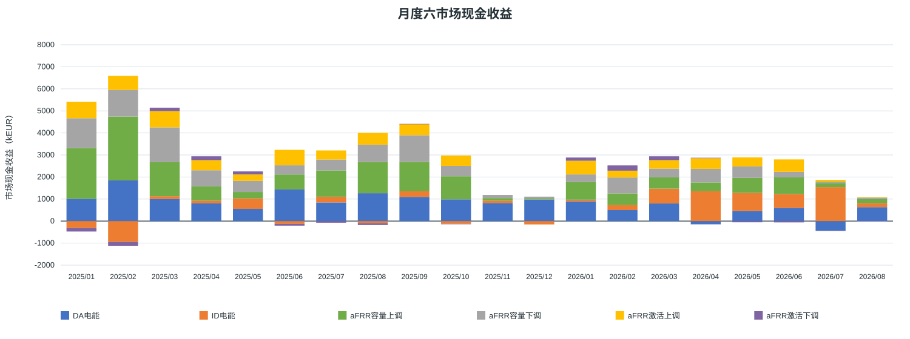
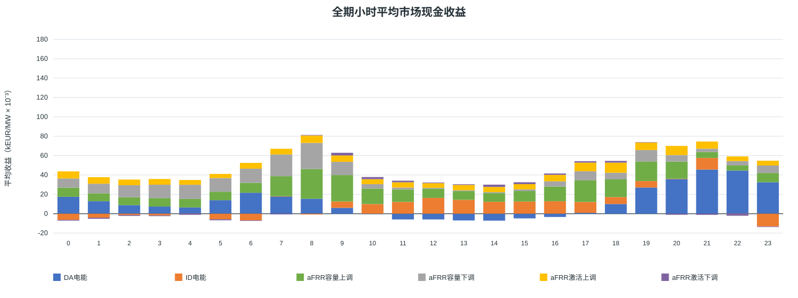
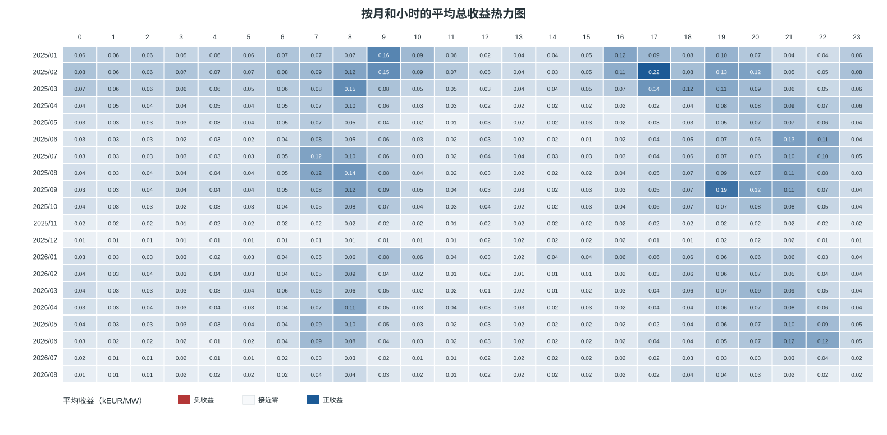
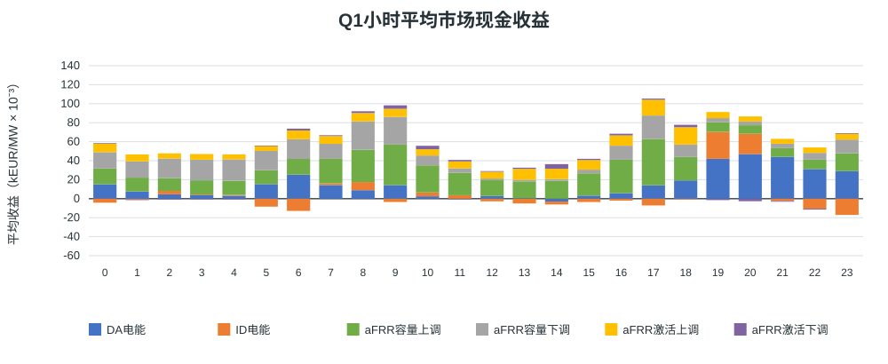
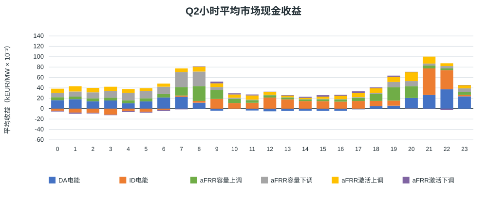
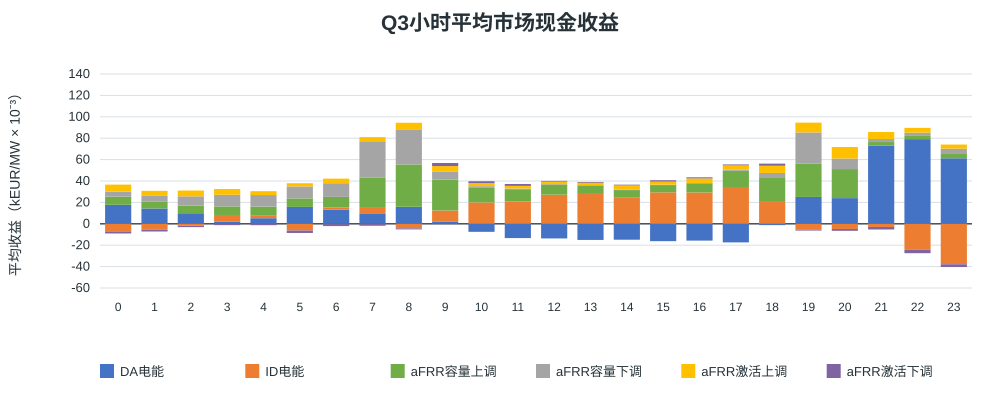
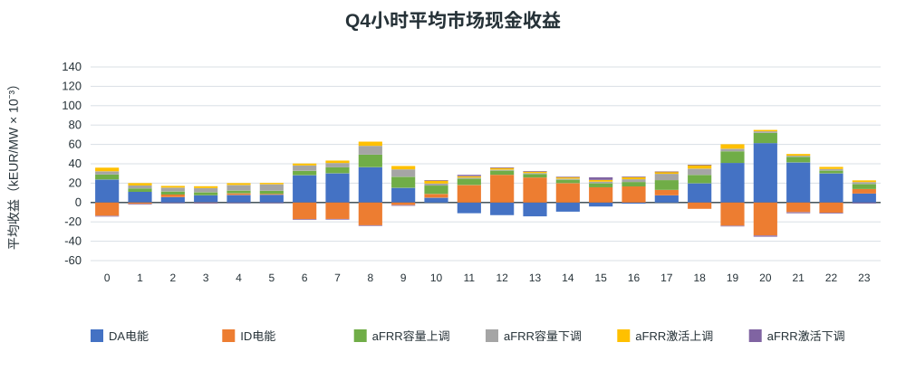

# 西班牙MILP结果展示 100 MW 可用180 MWh 含中标系数重新优化

正式统计期：2025/01/01 00:00 至 2026/08/31 23:59（含最后交付QH）；报告基线v1.0。
运行状态：True；中标模式：`optimize`；输入目录：`output/capacity_award_rate_full_accelerated_20260923`。

## 假设概览

| 项目 | 本次配置 |
|---|---|
| 正式区间与观察数据 | 内部区间 [2025-01-01T00:00:00+01:00, 2026-09-01T00:00:00+02:00)；输入加载至 2026-09-02 00:00:00+02:00。观察日不计正式收益 |
| 时区和分辨率 | Europe/Madrid；15分钟QH；夏令时日按92／96／100个QH |
| 电池配置 | 充／放功率100/100 MW；SOC边界10–190 MWh；可用时长1.80 h |
| 初始与终点SOC | 10/10 MWh |
| 效率和备用上限 | 充／放效率92.0%/92.0%；上／下备用100/100 MW |
| 来源 | eSIOS指标：2130, 632, 633, 634, 680, 681, 682, 683 |
| 系数文件 | input\processed\ES\afrr_capacity_award_rate_202501_202608.csv.gz；SHA-256：4cb874fe00103112943a68c9895808f59b54b49c890b13472f339000c8c80ef0 |
| 原始字段完整QH | 52442 / 58364 |
| 正式结算覆盖 | 52438/58364 QH（89.85%）；空闲桥接1481.5小时；阻断0 QH；结果缺行0 QH |
| 年度EFC预算 | {'2025': 548.7661703394889, '2026': 345.99166170339595}；分母为2×可用能量=360 MWh |
| 求解器累计用时 | 223.68 秒（空值表示未记录） |
| 总运行用时 | 344.19 秒（空值表示未记录，含准备和输出） |

- 历史逐QH、逐方向系统实际分配容量／总报价量的代理系数进入容量收入目标后重新优化；激活收益和完整备用物理约束沿用V1。
- 完美历史信息下的事后条件市场现金收益；两日滚动结果不代表已证明的全时域全局收益上界。
- GCT余量检查采用第一阶段全额成交建模假设。容量表为计划申报／预留MW。系数是历史系统比例代理，未据此缩减激活收益或物理预留。
- 收益为六市场带符号现金流合计，未扣除模型未计入的投资、运维等项目成本。缺失收益不按覆盖比例补算。

## 结果概览

### 全期与自然年市场现金收益

| 期间 | 收益（kEUR） | 收益（kEUR/MW） |
|---|---:|---:|
| 全期合计 | 59,305.36 | 593.05 |
| 有效结算月份月均（20/20个月，部分月不外推） | 2,965.27 | 29.65 |
| 2025年 2025/01/01–2025/12/31；完整天314/365；统计期/全年365/365 | 40,135.68 | 401.36 |
| 2026年 2026/01/01–2026/08/31；完整天190/243；统计期/全年243/365 | 19,169.67 | 191.70 |

### 最新滚动12个月市场现金收益

滚动窗口覆盖12个完整自然月，每月至少有有效结算；不代表QH全部完整，不按缺失比例外推。

最新窗口：2025-09–2026-08；28,572.43 kEUR，285.72 kEUR/MW；QH覆盖88.45%。

### 逐月滚动12个月收益

叠加同配置100%中标基线。两情景分别优化，差额包含容量计价和调度变化。各窗口覆盖率另列；覆盖不同时差额还包含覆盖差异。

| 统计月份 | 对应12个月窗口 | 当前收益（kEUR/MW） | QH覆盖率 | V1 100%中标（kEUR/MW） | 差额：V1−当前 | 基线QH覆盖率 |
|---|---|---:|---:|---:|---:|---:|
| 2025/12 | 2025-01–2025-12 | 401.36 | 91.82% | 531.77 | 130.41 | 91.82% |
| 2026/01 | 2025-02–2026-01 | 380.76 | 90.86% | 502.20 | 121.44 | 90.86% |
| 2026/02 | 2025-03–2026-02 | 351.30 | 91.07% | 462.75 | 111.45 | 91.07% |
| 2026/03 | 2025-04–2026-03 | 329.23 | 90.49% | 435.61 | 106.38 | 90.49% |
| 2026/04 | 2025-05–2026-04 | 327.10 | 90.49% | 431.80 | 104.70 | 90.49% |
| 2026/05 | 2025-06–2026-05 | 332.90 | 91.17% | 440.14 | 107.24 | 91.17% |
| 2026/06 | 2025-07–2026-06 | 330.04 | 90.55% | 437.29 | 107.25 | 90.55% |
| 2026/07 | 2025-08–2026-07 | 313.12 | 91.19% | 429.76 | 116.64 | 91.19% |
| 2026/08 | 2025-09–2026-08 | 285.72 | 88.45% | 392.74 | 107.02 | 88.45% |

### 等效循环次数

EFC直接汇总模型已执行记录，按各物理相位的SOC吞吐量／两倍可用能量计算；不使用QH起末净SOC差替代。它可为小数，与完整充放电事件次数不同。
已知EFC记录58364/58364 QH；存在未知记录时以下为已知部分累计。

| 期间 | EFC |
|---|---:|
| 全期已知合计 | 894.76 |
| 月均（20个有EFC记录的月份，部分月不外推） | 44.74 |
| 2025年 2025/01/01–2025/12/31；完整天314/365；统计期/全年365/365 | 548.77 |
| 2026年 2026/01/01–2026/08/31；完整天190/243；统计期/全年243/365 | 345.99 |

### 六市场收益和占比

| 市场 | kEUR | kEUR/MW | 占总现金收益 |
|---|---:|---:|---:|
| DA电能 | 15,944.91 | 159.45 | 26.89% |
| ID电能 | 5,091.97 | 50.92 | 8.59% |
| aFRR容量上调 | 17,567.56 | 175.68 | 29.62% |
| aFRR容量下调 | 11,976.46 | 119.76 | 20.19% |
| aFRR激活上调 | 8,361.78 | 83.62 | 14.10% |
| aFRR激活下调 | 362.68 | 3.63 | 0.61% |
| 合计 | 59,305.36 | 593.05 | 100.00% |

负收益和负占比保留，正收益市场占比之和可能超过100%；分母为0时占比不可定义。

### 各市场平均执行功率和申报容量

| 市场 | 平均MW | 口径 |
|---|---:|---|
| DA电能 | 2.04 | 买卖有符号净额，售正购负 |
| ID电能 | -3.22 | 买卖有符号净额，售正购负 |
| DA＋ID合并现货 | -1.18 | 买卖有符号净额，售正购负 |
| aFRR容量上调 | 58.84 | 计划申报／预留容量 |
| aFRR容量下调 | 54.59 | 计划申报／预留容量 |
| aFRR激活上调 | 1.38 | 执行MWh按时长折算MW |
| aFRR激活下调 | 1.54 | 执行MWh按时长折算MW |

分母为全部正式58364个QH；空闲桥接按0计。方向均值存在买卖抵消，各行不能相加视为电站容量分配比例。

## 月度结果概览

### 月度收入 kEUR

### 月度单位功率收入 kEUR/MW

### 月度明细与自然年汇总

单位：kEUR。月均按有有效结算的月份计算；部分月不外推，覆盖见月度CSV。

| 月份 | DA电能 | ID电能 | aFRR容量上调 | aFRR容量下调 | aFRR激活上调 | aFRR激活下调 | 合计 |
|---|---:|---:|---:|---:|---:|---:|---:|
| 2025/01 | 1,007.95 | -313.89 | 2,308.16 | 1,351.50 | 749.68 | -159.56 | 4,943.84 |
| 2025/02 | 1,845.23 | -947.57 | 2,899.07 | 1,208.97 | 639.44 | -172.74 | 5,472.40 |
| 2025/03 | 999.92 | 128.09 | 1,543.45 | 1,581.05 | 739.82 | 154.34 | 5,146.68 |
| 2025/04 | 807.04 | 124.67 | 642.87 | 732.22 | 457.82 | 175.34 | 2,939.96 |
| 2025/05 | 554.56 | 475.17 | 292.96 | 502.53 | 291.11 | 137.56 | 2,253.88 |
| 2025/06 | 1,437.61 | -128.70 | 676.83 | 416.40 | 701.03 | -79.28 | 3,023.90 |
| 2025/07 | 845.45 | 261.49 | 1,190.78 | 495.37 | 412.56 | -74.54 | 3,131.11 |
| 2025/08 | 1,266.34 | -92.54 | 1,410.74 | 793.03 | 532.01 | -88.42 | 3,821.16 |
| 2025/09 | 1,097.20 | 254.13 | 1,333.65 | 1,210.46 | 505.89 | 9.54 | 4,410.86 |
| 2025/10 | 986.40 | -124.16 | 1,046.70 | 473.60 | 469.16 | -4.32 | 2,847.38 |
| 2025/11 | 822.08 | 108.34 | 114.25 | 142.26 | 0.00 | 0.00 | 1,186.94 |
| 2025/12 | 976.48 | -151.59 | 45.23 | 87.45 | 0.00 | 0.00 | 957.57 |
| **2025年月均（12个月）** | **1,053.86** | **-33.88** | **1,125.39** | **749.57** | **458.21** | **-8.51** | **3,344.64** |
| **2025年合计** | **12,646.26** | **-406.56** | **13,504.70** | **8,994.84** | **5,498.52** | **-102.08** | **40,135.68** |
| 2026/01 | 894.11 | 77.36 | 797.00 | 348.47 | 620.09 | 147.47 | 2,884.50 |
| 2026/02 | 499.84 | 223.05 | 533.04 | 721.93 | 309.88 | 238.33 | 2,526.08 |
| 2026/03 | 799.72 | 672.26 | 516.94 | 391.22 | 383.69 | 175.65 | 2,939.47 |
| 2026/04 | -146.91 | 1,352.86 | 400.32 | 617.91 | 482.22 | 20.56 | 2,726.95 |
| 2026/05 | 454.01 | 824.08 | 683.12 | 520.16 | 407.40 | -54.90 | 2,833.88 |
| 2026/06 | 598.73 | 628.93 | 755.16 | 253.72 | 561.19 | -59.57 | 2,738.15 |
| 2026/07 | -432.36 | 1,541.33 | 187.30 | 59.62 | 83.27 | -0.46 | 1,438.69 |
| 2026/08 | 631.52 | 178.65 | 189.97 | 68.60 | 15.54 | -2.32 | 1,081.95 |
| **2026年月均（8个月）** | **412.33** | **687.32** | **507.86** | **372.70** | **357.91** | **58.10** | **2,396.21** |
| **2026年合计** | **3,298.65** | **5,498.52** | **4,062.86** | **2,981.62** | **2,863.26** | **464.76** | **19,169.67** |

单位：kEUR/MW。月均按有有效结算的月份计算；部分月不外推，覆盖见月度CSV。

| 月份 | DA电能 | ID电能 | aFRR容量上调 | aFRR容量下调 | aFRR激活上调 | aFRR激活下调 | 合计 |
|---|---:|---:|---:|---:|---:|---:|---:|
| 2025/01 | 10.08 | -3.14 | 23.08 | 13.51 | 7.50 | -1.60 | 49.44 |
| 2025/02 | 18.45 | -9.48 | 28.99 | 12.09 | 6.39 | -1.73 | 54.72 |
| 2025/03 | 10.00 | 1.28 | 15.43 | 15.81 | 7.40 | 1.54 | 51.47 |
| 2025/04 | 8.07 | 1.25 | 6.43 | 7.32 | 4.58 | 1.75 | 29.40 |
| 2025/05 | 5.55 | 4.75 | 2.93 | 5.03 | 2.91 | 1.38 | 22.54 |
| 2025/06 | 14.38 | -1.29 | 6.77 | 4.16 | 7.01 | -0.79 | 30.24 |
| 2025/07 | 8.45 | 2.61 | 11.91 | 4.95 | 4.13 | -0.75 | 31.31 |
| 2025/08 | 12.66 | -0.93 | 14.11 | 7.93 | 5.32 | -0.88 | 38.21 |
| 2025/09 | 10.97 | 2.54 | 13.34 | 12.10 | 5.06 | 0.10 | 44.11 |
| 2025/10 | 9.86 | -1.24 | 10.47 | 4.74 | 4.69 | -0.04 | 28.47 |
| 2025/11 | 8.22 | 1.08 | 1.14 | 1.42 | 0.00 | 0.00 | 11.87 |
| 2025/12 | 9.76 | -1.52 | 0.45 | 0.87 | 0.00 | 0.00 | 9.58 |
| **2025年月均（12个月）** | **10.54** | **-0.34** | **11.25** | **7.50** | **4.58** | **-0.09** | **33.45** |
| **2025年合计** | **126.46** | **-4.07** | **135.05** | **89.95** | **54.99** | **-1.02** | **401.36** |
| 2026/01 | 8.94 | 0.77 | 7.97 | 3.48 | 6.20 | 1.47 | 28.85 |
| 2026/02 | 5.00 | 2.23 | 5.33 | 7.22 | 3.10 | 2.38 | 25.26 |
| 2026/03 | 8.00 | 6.72 | 5.17 | 3.91 | 3.84 | 1.76 | 29.39 |
| 2026/04 | -1.47 | 13.53 | 4.00 | 6.18 | 4.82 | 0.21 | 27.27 |
| 2026/05 | 4.54 | 8.24 | 6.83 | 5.20 | 4.07 | -0.55 | 28.34 |
| 2026/06 | 5.99 | 6.29 | 7.55 | 2.54 | 5.61 | -0.60 | 27.38 |
| 2026/07 | -4.32 | 15.41 | 1.87 | 0.60 | 0.83 | 0.00 | 14.39 |
| 2026/08 | 6.32 | 1.79 | 1.90 | 0.69 | 0.16 | -0.02 | 10.82 |
| **2026年月均（8个月）** | **4.12** | **6.87** | **5.08** | **3.73** | **3.58** | **0.58** | **23.96** |
| **2026年合计** | **32.99** | **54.99** | **40.63** | **29.82** | **28.63** | **4.65** | **191.70** |

### 月度六市场占比

| 月份 | DA电能 | ID电能 | aFRR容量上调 | aFRR容量下调 | aFRR激活上调 | aFRR激活下调 |
|---|---:|---:|---:|---:|---:|---:|
| 2025/01 | 20.39% | -6.35% | 46.69% | 27.34% | 15.16% | -3.23% |
| 2025/02 | 33.72% | -17.32% | 52.98% | 22.09% | 11.68% | -3.16% |
| 2025/03 | 19.43% | 2.49% | 29.99% | 30.72% | 14.37% | 3.00% |
| 2025/04 | 27.45% | 4.24% | 21.87% | 24.91% | 15.57% | 5.96% |
| 2025/05 | 24.60% | 21.08% | 13.00% | 22.30% | 12.92% | 6.10% |
| 2025/06 | 47.54% | -4.26% | 22.38% | 13.77% | 23.18% | -2.62% |
| 2025/07 | 27.00% | 8.35% | 38.03% | 15.82% | 13.18% | -2.38% |
| 2025/08 | 33.14% | -2.42% | 36.92% | 20.75% | 13.92% | -2.31% |
| 2025/09 | 24.87% | 5.76% | 30.24% | 27.44% | 11.47% | 0.22% |
| 2025/10 | 34.64% | -4.36% | 36.76% | 16.63% | 16.48% | -0.15% |
| 2025/11 | 69.26% | 9.13% | 9.63% | 11.99% | 0.00% | 0.00% |
| 2025/12 | 101.97% | -15.83% | 4.72% | 9.13% | 0.00% | 0.00% |
| 2026/01 | 31.00% | 2.68% | 27.63% | 12.08% | 21.50% | 5.11% |
| 2026/02 | 19.79% | 8.83% | 21.10% | 28.58% | 12.27% | 9.43% |
| 2026/03 | 27.21% | 22.87% | 17.59% | 13.31% | 13.05% | 5.98% |
| 2026/04 | -5.39% | 49.61% | 14.68% | 22.66% | 17.68% | 0.75% |
| 2026/05 | 16.02% | 29.08% | 24.11% | 18.36% | 14.38% | -1.94% |
| 2026/06 | 21.87% | 22.97% | 27.58% | 9.27% | 20.50% | -2.18% |
| 2026/07 | -30.05% | 107.13% | 13.02% | 4.14% | 5.79% | -0.03% |
| 2026/08 | 58.37% | 16.51% | 17.56% | 6.34% | 1.44% | -0.21% |

## 小时级结果概览

先合计实际小时内四个有效QH，再按同一当地钟点的有效小时数取均值；重复夏令时小时分别计入。月度图使用全部有效QH，两者样本不同。
完整有效小时13043；各钟点样本数见hourly.csv。整数刻度30表示0.03 kEUR/MW。

### 月份与小时热力图

每格为当月该钟点平均总收益，单位kEUR/MW；蓝正红负、零中心；灰色破折号表示无样本。

### 季度小时收益

跨年度相同季度合并，四图共用纵轴范围；下列月份为存在完整小时样本的月份。

#### Q1

样本月份：2025-01, 2025-02, 2025-03, 2026-01, 2026-02, 2026-03；完整有效小时：4097。

#### Q2

样本月份：2025-04, 2025-05, 2025-06, 2026-04, 2026-05, 2026-06；完整有效小时：3793。

#### Q3

样本月份：2025-07, 2025-08, 2025-09, 2026-07, 2026-08；完整有效小时：3200。

#### Q4

样本月份：2025-10, 2025-11, 2025-12；完整有效小时：1953。

## 输出文件与口径

- monthly.csv、annual.csv：六市场金额、覆盖、EFC及完整天；monthly_market_shares.csv：月度占比。
- hourly.csv、quarterly_hourly.csv、monthly_hourly_heatmap.csv：小时收益与样本数，缺样本留空。
- rolling_12m.csv：窗口收益、覆盖及可选100%基线。report_manifest.json：来源、配置和报告版本。
- SVG共9张；数据不足的图显示原因，历史报告保留。
- 市场规则和中标系数的研究依据见仓库research中的MILP数学规格和中标率敏感性方案；报价曲线与半岛范围匹配仍为研究待确认项。
