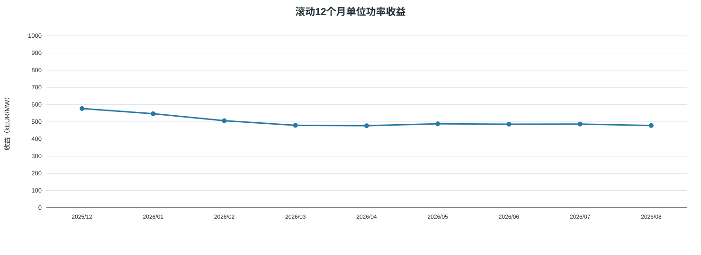
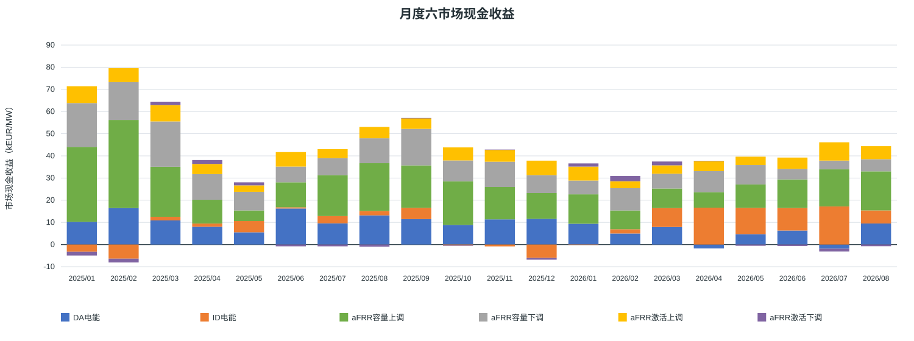
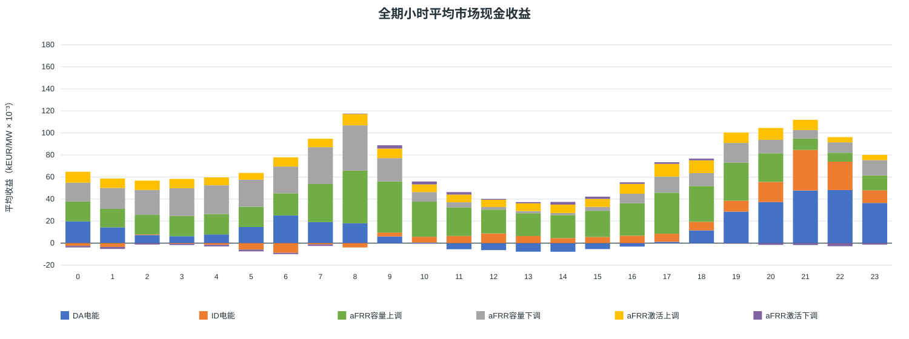
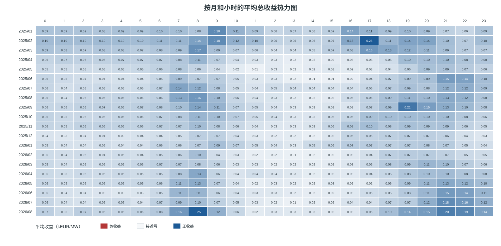
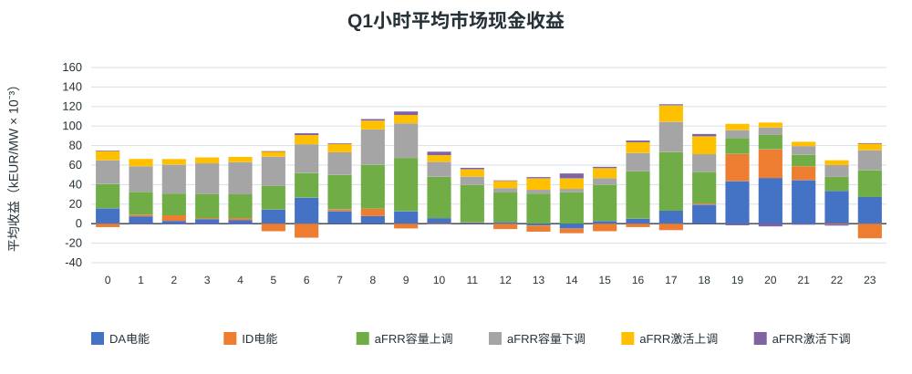
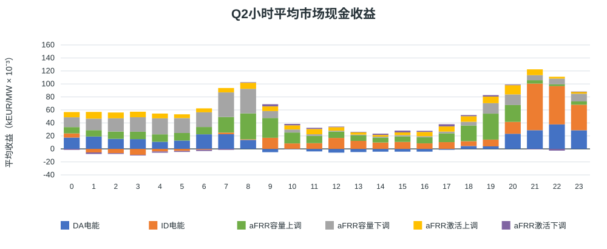
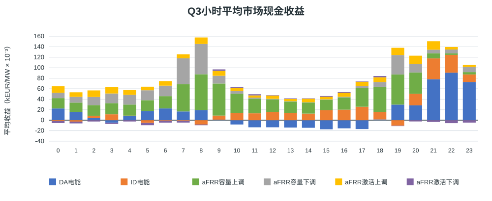
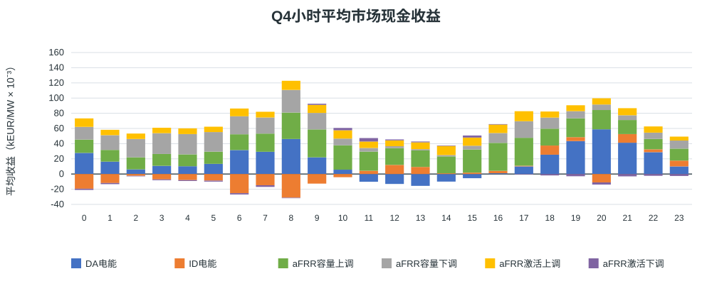

# 西班牙MILP结果展示 100 MW 可用380 MWh 100%中标

正式统计期：2025/01/01 00:00 至 2026/08/31 23:59（含最后交付QH）；报告基线v1.0。
运行状态：True；中标模式：`full_fill`；输入目录：`output/capacity_4h_fullfill_20260929`。

## 假设概览

| 项目 | 本次配置 |
|---|---|
| 正式区间与观察数据 | 内部区间 [2025-01-01T00:00:00+01:00, 2026-09-01T00:00:00+02:00)；输入加载至 2026-09-02 00:00:00+02:00。观察日不计正式收益 |
| 时区和分辨率 | Europe/Madrid；15分钟QH；夏令时日按92／96／100个QH |
| 电池配置 | 充／放功率100/100 MW；SOC边界10–390 MWh；可用时长3.80 h |
| 初始与终点SOC | 10/10 MWh |
| 效率和备用上限 | 充／放效率92.0%/92.0%；上／下备用100/100 MW |
| 来源 | eSIOS指标：2130, 632, 633, 634, 680, 681, 682, 683 |
| 系数文件 | 本模式未启用；SHA-256：不适用 |
| 原始字段完整QH | 52442 / 58364 |
| 正式结算覆盖 | 52438/58364 QH（89.85%）；空闲桥接1481.5小时；阻断0 QH；结果缺行0 QH |
| 年度EFC预算 | {'2025': 548.7661703394889, '2026': 345.99166170339595}；分母为2×可用能量=760 MWh |
| 求解器累计用时 | 147.03 秒（空值表示未记录） |
| 总运行用时 | 859.18 秒（空值表示未记录，含准备和输出） |

- aFRR容量按100%中标计价，本情景未启用容量收入折减。
- 完美历史信息下的事后条件市场现金收益；两日滚动结果不代表已证明的全时域全局收益上界。
- GCT余量检查采用第一阶段全额成交建模假设。容量表为计划申报／预留MW。系数是历史系统比例代理，未据此缩减激活收益或物理预留。
- 收益为六市场带符号现金流合计，未扣除模型未计入的投资、运维等项目成本。缺失收益不按覆盖比例补算。

## 结果概览

### 全期与自然年市场现金收益

| 期间 | 收益（kEUR） | 收益（kEUR/MW） |
|---|---:|---:|
| 全期合计 | 88,242.15 | 882.42 |
| 有效结算月份月均（20/20个月，部分月不外推） | 4,412.11 | 44.12 |
| 2025年 2025/01/01–2025/12/31；完整天314/365；统计期/全年365/365 | 57,726.22 | 577.26 |
| 2026年 2026/01/01–2026/08/31；完整天190/243；统计期/全年243/365 | 30,515.93 | 305.16 |

### 最新滚动12个月市场现金收益

滚动窗口覆盖12个完整自然月，每月至少有有效结算；不代表QH全部完整，不按缺失比例外推。

最新窗口：2025-09–2026-08；47,854.70 kEUR，478.55 kEUR/MW；QH覆盖88.45%。

### 逐月滚动12个月收益

仅展示当前情景曲线。

| 统计月份 | 对应12个月窗口 | 当前收益（kEUR/MW） | QH覆盖率 |
|---|---|---:|---:|
| 2025/12 | 2025-01–2025-12 | 577.26 | 91.82% |
| 2026/01 | 2025-02–2026-01 | 547.23 | 90.86% |
| 2026/02 | 2025-03–2026-02 | 506.65 | 91.07% |
| 2026/03 | 2025-04–2026-03 | 479.67 | 90.49% |
| 2026/04 | 2025-05–2026-04 | 477.60 | 90.49% |
| 2026/05 | 2025-06–2026-05 | 488.61 | 91.17% |
| 2026/06 | 2025-07–2026-06 | 486.28 | 90.55% |
| 2026/07 | 2025-08–2026-07 | 487.04 | 91.19% |
| 2026/08 | 2025-09–2026-08 | 478.55 | 88.45% |

### 等效循环次数

EFC直接汇总模型已执行记录，按各物理相位的SOC吞吐量／两倍可用能量计算；不使用QH起末净SOC差替代。它可为小数，与完整充放电事件次数不同。
已知EFC记录58364/58364 QH；存在未知记录时以下为已知部分累计。

| 期间 | EFC |
|---|---:|
| 全期已知合计 | 628.27 |
| 月均（20个有EFC记录的月份，部分月不外推） | 31.41 |
| 2025年 2025/01/01–2025/12/31；完整天314/365；统计期/全年365/365 | 375.91 |
| 2026年 2026/01/01–2026/08/31；完整天190/243；统计期/全年243/365 | 252.35 |

### 六市场收益和占比

| 市场 | kEUR | kEUR/MW | 占总现金收益 |
|---|---:|---:|---:|
| DA电能 | 17,264.55 | 172.65 | 19.56% |
| ID电能 | 7,423.77 | 74.24 | 8.41% |
| aFRR容量上调 | 32,343.73 | 323.44 | 36.65% |
| aFRR容量下调 | 20,402.09 | 204.02 | 23.12% |
| aFRR激活上调 | 10,775.05 | 107.75 | 12.21% |
| aFRR激活下调 | 32.97 | 0.33 | 0.04% |
| 合计 | 88,242.15 | 882.42 | 100.00% |

负收益和负占比保留，正收益市场占比之和可能超过100%；分母为0时占比不可定义。

### 各市场平均执行功率和申报容量

| 市场 | 平均MW | 口径 |
|---|---:|---|
| DA电能 | 2.70 | 买卖有符号净额，售正购负 |
| ID电能 | -5.16 | 买卖有符号净额，售正购负 |
| DA＋ID合并现货 | -2.47 | 买卖有符号净额，售正购负 |
| aFRR容量上调 | 72.85 | 计划申报／预留容量 |
| aFRR容量下调 | 67.03 | 计划申报／预留容量 |
| aFRR激活上调 | 1.74 | 执行MWh按时长折算MW |
| aFRR激活下调 | 1.80 | 执行MWh按时长折算MW |

分母为全部正式58364个QH；空闲桥接按0计。方向均值存在买卖抵消，各行不能相加视为电站容量分配比例。

## 月度结果概览

### 月度收入 kEUR

### 月度单位功率收入 kEUR/MW

### 月度明细与自然年汇总

单位：kEUR。月均按有有效结算的月份计算；部分月不外推，覆盖见月度CSV。

| 月份 | DA电能 | ID电能 | aFRR容量上调 | aFRR容量下调 | aFRR激活上调 | aFRR激活下调 | 合计 |
|---|---:|---:|---:|---:|---:|---:|---:|
| 2025/01 | 1,024.50 | -329.21 | 3,382.15 | 1,976.28 | 760.56 | -166.31 | 6,647.98 |
| 2025/02 | 1,645.87 | -636.26 | 3,973.04 | 1,708.55 | 630.48 | -172.05 | 7,149.63 |
| 2025/03 | 1,088.39 | 164.64 | 2,255.14 | 2,045.61 | 740.72 | 150.06 | 6,444.57 |
| 2025/04 | 803.25 | 144.33 | 1,073.36 | 1,158.56 | 457.31 | 174.60 | 3,811.42 |
| 2025/05 | 553.21 | 506.89 | 479.04 | 841.20 | 289.61 | 137.10 | 2,807.05 |
| 2025/06 | 1,627.18 | 53.91 | 1,128.31 | 708.18 | 654.11 | -79.83 | 4,091.86 |
| 2025/07 | 957.54 | 326.34 | 1,845.17 | 771.15 | 403.53 | -80.45 | 4,223.27 |
| 2025/08 | 1,316.43 | 197.35 | 2,156.36 | 1,123.85 | 511.16 | -93.45 | 5,211.69 |
| 2025/09 | 1,146.11 | 510.84 | 1,915.14 | 1,647.09 | 482.43 | 7.82 | 5,709.44 |
| 2025/10 | 885.69 | -32.86 | 1,968.65 | 939.79 | 588.13 | -24.72 | 4,324.68 |
| 2025/11 | 1,136.63 | -82.89 | 1,462.10 | 1,138.02 | 536.69 | 12.01 | 4,202.56 |
| 2025/12 | 1,160.61 | -603.88 | 1,163.47 | 807.33 | 653.60 | -79.04 | 3,102.09 |
| **2025年月均（12个月）** | **1,112.12** | **18.27** | **1,900.16** | **1,238.80** | **559.03** | **-17.85** | **4,810.52** |
| **2025年合计** | **13,345.39** | **219.19** | **22,801.94** | **14,865.61** | **6,708.34** | **-214.25** | **57,726.22** |
| 2026/01 | 938.07 | -15.94 | 1,327.47 | 621.25 | 630.69 | 143.05 | 3,644.59 |
| 2026/02 | 499.02 | 192.72 | 845.01 | 1,007.33 | 312.08 | 236.07 | 3,092.23 |
| 2026/03 | 792.58 | 851.41 | 885.66 | 665.75 | 378.76 | 172.15 | 3,746.31 |
| 2026/04 | -175.39 | 1,664.72 | 699.24 | 949.24 | 446.76 | 19.35 | 3,603.92 |
| 2026/05 | 469.50 | 1,187.10 | 1,055.02 | 875.16 | 377.51 | -56.32 | 3,907.98 |
| 2026/06 | 632.94 | 1,015.38 | 1,291.02 | 476.32 | 508.30 | -64.66 | 3,859.29 |
| 2026/07 | -186.93 | 1,718.19 | 1,675.32 | 393.80 | 826.14 | -127.07 | 4,299.44 |
| 2026/08 | 949.37 | 590.99 | 1,763.06 | 547.63 | 586.46 | -75.34 | 4,362.17 |
| **2026年月均（8个月）** | **489.90** | **900.57** | **1,192.72** | **692.06** | **508.34** | **30.90** | **3,814.49** |
| **2026年合计** | **3,919.16** | **7,204.57** | **9,541.79** | **5,536.48** | **4,066.71** | **247.22** | **30,515.93** |

单位：kEUR/MW。月均按有有效结算的月份计算；部分月不外推，覆盖见月度CSV。

| 月份 | DA电能 | ID电能 | aFRR容量上调 | aFRR容量下调 | aFRR激活上调 | aFRR激活下调 | 合计 |
|---|---:|---:|---:|---:|---:|---:|---:|
| 2025/01 | 10.25 | -3.29 | 33.82 | 19.76 | 7.61 | -1.66 | 66.48 |
| 2025/02 | 16.46 | -6.36 | 39.73 | 17.09 | 6.30 | -1.72 | 71.50 |
| 2025/03 | 10.88 | 1.65 | 22.55 | 20.46 | 7.41 | 1.50 | 64.45 |
| 2025/04 | 8.03 | 1.44 | 10.73 | 11.59 | 4.57 | 1.75 | 38.11 |
| 2025/05 | 5.53 | 5.07 | 4.79 | 8.41 | 2.90 | 1.37 | 28.07 |
| 2025/06 | 16.27 | 0.54 | 11.28 | 7.08 | 6.54 | -0.80 | 40.92 |
| 2025/07 | 9.58 | 3.26 | 18.45 | 7.71 | 4.04 | -0.80 | 42.23 |
| 2025/08 | 13.16 | 1.97 | 21.56 | 11.24 | 5.11 | -0.93 | 52.12 |
| 2025/09 | 11.46 | 5.11 | 19.15 | 16.47 | 4.82 | 0.08 | 57.09 |
| 2025/10 | 8.86 | -0.33 | 19.69 | 9.40 | 5.88 | -0.25 | 43.25 |
| 2025/11 | 11.37 | -0.83 | 14.62 | 11.38 | 5.37 | 0.12 | 42.03 |
| 2025/12 | 11.61 | -6.04 | 11.63 | 8.07 | 6.54 | -0.79 | 31.02 |
| **2025年月均（12个月）** | **11.12** | **0.18** | **19.00** | **12.39** | **5.59** | **-0.18** | **48.11** |
| **2025年合计** | **133.45** | **2.19** | **228.02** | **148.66** | **67.08** | **-2.14** | **577.26** |
| 2026/01 | 9.38 | -0.16 | 13.27 | 6.21 | 6.31 | 1.43 | 36.45 |
| 2026/02 | 4.99 | 1.93 | 8.45 | 10.07 | 3.12 | 2.36 | 30.92 |
| 2026/03 | 7.93 | 8.51 | 8.86 | 6.66 | 3.79 | 1.72 | 37.46 |
| 2026/04 | -1.75 | 16.65 | 6.99 | 9.49 | 4.47 | 0.19 | 36.04 |
| 2026/05 | 4.69 | 11.87 | 10.55 | 8.75 | 3.78 | -0.56 | 39.08 |
| 2026/06 | 6.33 | 10.15 | 12.91 | 4.76 | 5.08 | -0.65 | 38.59 |
| 2026/07 | -1.87 | 17.18 | 16.75 | 3.94 | 8.26 | -1.27 | 42.99 |
| 2026/08 | 9.49 | 5.91 | 17.63 | 5.48 | 5.86 | -0.75 | 43.62 |
| **2026年月均（8个月）** | **4.90** | **9.01** | **11.93** | **6.92** | **5.08** | **0.31** | **38.14** |
| **2026年合计** | **39.19** | **72.05** | **95.42** | **55.36** | **40.67** | **2.47** | **305.16** |

### 月度六市场占比

| 月份 | DA电能 | ID电能 | aFRR容量上调 | aFRR容量下调 | aFRR激活上调 | aFRR激活下调 |
|---|---:|---:|---:|---:|---:|---:|
| 2025/01 | 15.41% | -4.95% | 50.87% | 29.73% | 11.44% | -2.50% |
| 2025/02 | 23.02% | -8.90% | 55.57% | 23.90% | 8.82% | -2.41% |
| 2025/03 | 16.89% | 2.55% | 34.99% | 31.74% | 11.49% | 2.33% |
| 2025/04 | 21.07% | 3.79% | 28.16% | 30.40% | 12.00% | 4.58% |
| 2025/05 | 19.71% | 18.06% | 17.07% | 29.97% | 10.32% | 4.88% |
| 2025/06 | 39.77% | 1.32% | 27.57% | 17.31% | 15.99% | -1.95% |
| 2025/07 | 22.67% | 7.73% | 43.69% | 18.26% | 9.55% | -1.90% |
| 2025/08 | 25.26% | 3.79% | 41.38% | 21.56% | 9.81% | -1.79% |
| 2025/09 | 20.07% | 8.95% | 33.54% | 28.85% | 8.45% | 0.14% |
| 2025/10 | 20.48% | -0.76% | 45.52% | 21.73% | 13.60% | -0.57% |
| 2025/11 | 27.05% | -1.97% | 34.79% | 27.08% | 12.77% | 0.29% |
| 2025/12 | 37.41% | -19.47% | 37.51% | 26.03% | 21.07% | -2.55% |
| 2026/01 | 25.74% | -0.44% | 36.42% | 17.05% | 17.30% | 3.93% |
| 2026/02 | 16.14% | 6.23% | 27.33% | 32.58% | 10.09% | 7.63% |
| 2026/03 | 21.16% | 22.73% | 23.64% | 17.77% | 10.11% | 4.60% |
| 2026/04 | -4.87% | 46.19% | 19.40% | 26.34% | 12.40% | 0.54% |
| 2026/05 | 12.01% | 30.38% | 27.00% | 22.39% | 9.66% | -1.44% |
| 2026/06 | 16.40% | 26.31% | 33.45% | 12.34% | 13.17% | -1.68% |
| 2026/07 | -4.35% | 39.96% | 38.97% | 9.16% | 19.22% | -2.96% |
| 2026/08 | 21.76% | 13.55% | 40.42% | 12.55% | 13.44% | -1.73% |

## 小时级结果概览

先合计实际小时内四个有效QH，再按同一当地钟点的有效小时数取均值；重复夏令时小时分别计入。月度图使用全部有效QH，两者样本不同。
完整有效小时13043；各钟点样本数见hourly.csv。整数刻度30表示0.03 kEUR/MW。

### 月份与小时热力图

每格为当月该钟点平均总收益，单位kEUR/MW；蓝正红负、零中心；灰色破折号表示无样本。

### 季度小时收益

跨年度相同季度合并，四图共用纵轴范围；下列月份为存在完整小时样本的月份。

#### Q1

样本月份：2025-01, 2025-02, 2025-03, 2026-01, 2026-02, 2026-03；完整有效小时：4097。

#### Q2

样本月份：2025-04, 2025-05, 2025-06, 2026-04, 2026-05, 2026-06；完整有效小时：3793。

#### Q3

样本月份：2025-07, 2025-08, 2025-09, 2026-07, 2026-08；完整有效小时：3200。

#### Q4

样本月份：2025-10, 2025-11, 2025-12；完整有效小时：1953。

## 输出文件与口径

- monthly.csv、annual.csv：六市场金额、覆盖、EFC及完整天；monthly_market_shares.csv：月度占比。
- hourly.csv、quarterly_hourly.csv、monthly_hourly_heatmap.csv：小时收益与样本数，缺样本留空。
- rolling_12m.csv：窗口收益、覆盖及可选100%基线。report_manifest.json：来源、配置和报告版本。
- SVG共9张；数据不足的图显示原因，历史报告保留。
- 市场规则和中标系数的研究依据见仓库research中的MILP数学规格和中标率敏感性方案；报价曲线与半岛范围匹配仍为研究待确认项。
