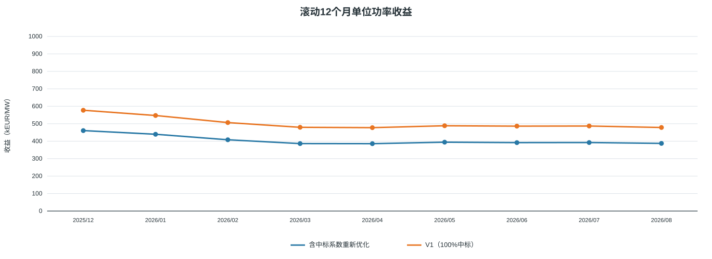
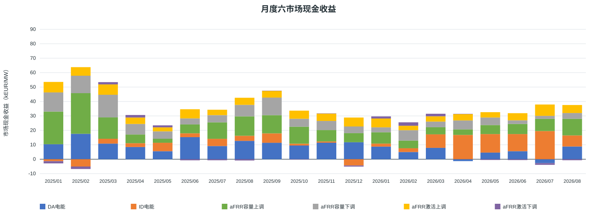
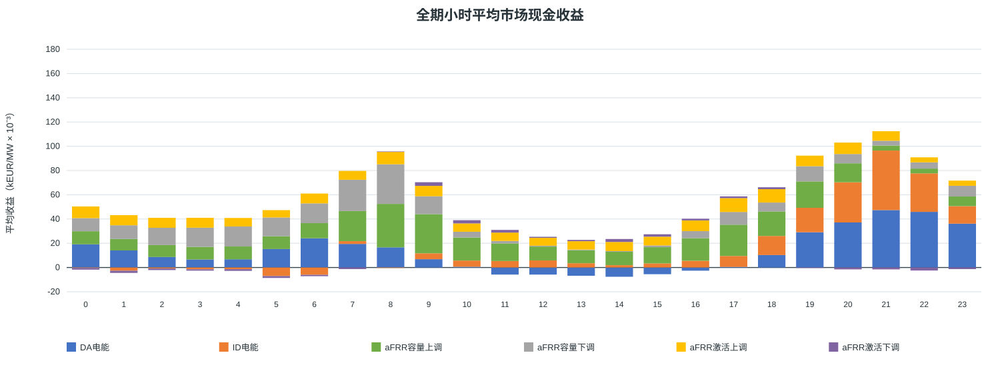
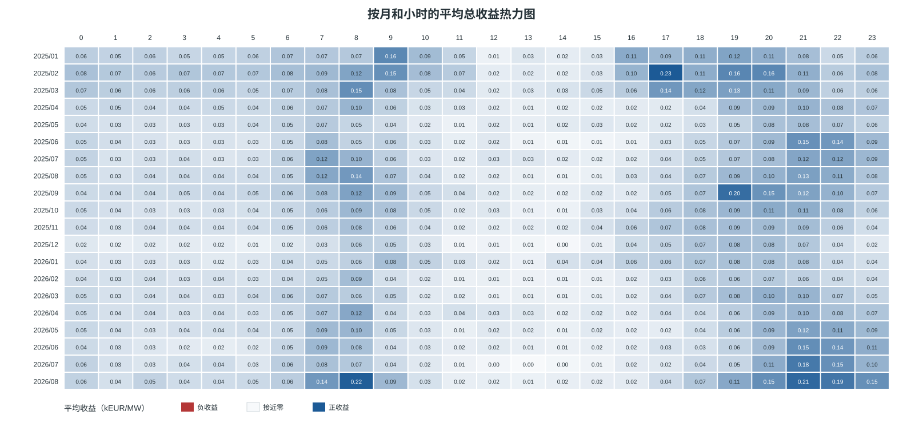
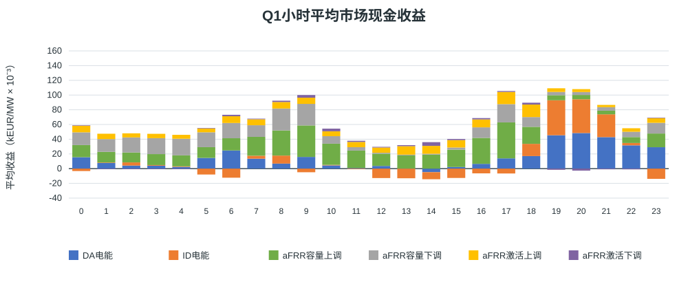
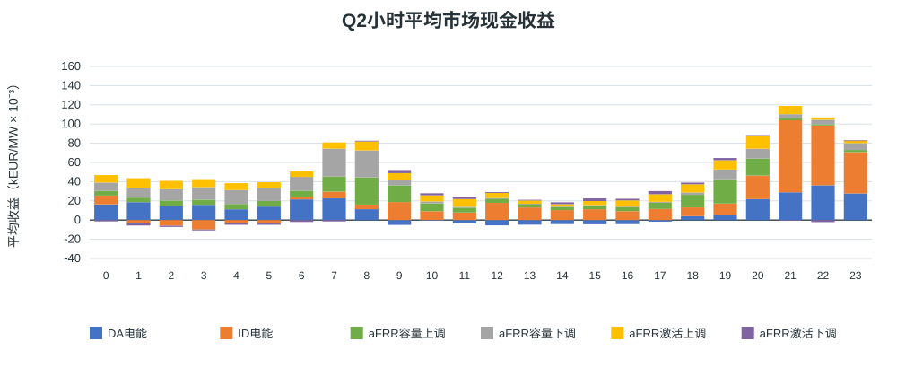
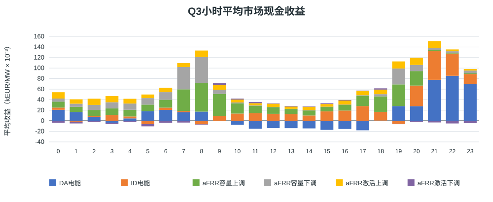
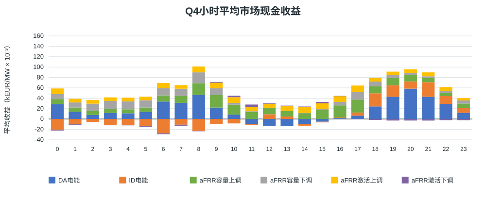

# 西班牙MILP结果展示 100 MW 可用380 MWh 含中标系数重新优化

正式统计期：2025/01/01 00:00 至 2026/08/31 23:59（含最后交付QH）；报告基线v1.0。
运行状态：True；中标模式：`optimize`；输入目录：`output/capacity_4h_award_rate_20260929`。

## 假设概览

| 项目 | 本次配置 |
|---|---|
| 正式区间与观察数据 | 内部区间 [2025-01-01T00:00:00+01:00, 2026-09-01T00:00:00+02:00)；输入加载至 2026-09-02 00:00:00+02:00。观察日不计正式收益 |
| 时区和分辨率 | Europe/Madrid；15分钟QH；夏令时日按92／96／100个QH |
| 电池配置 | 充／放功率100/100 MW；SOC边界10–390 MWh；可用时长3.80 h |
| 初始与终点SOC | 10/10 MWh |
| 效率和备用上限 | 充／放效率92.0%/92.0%；上／下备用100/100 MW |
| 来源 | eSIOS指标：2130, 632, 633, 634, 680, 681, 682, 683 |
| 系数文件 | input\processed\ES\afrr_capacity_award_rate_202501_202608.csv.gz；SHA-256：4cb874fe00103112943a68c9895808f59b54b49c890b13472f339000c8c80ef0 |
| 原始字段完整QH | 52442 / 58364 |
| 正式结算覆盖 | 52438/58364 QH（89.85%）；空闲桥接1481.5小时；阻断0 QH；结果缺行0 QH |
| 年度EFC预算 | {'2025': 548.7661703394889, '2026': 345.99166170339595}；分母为2×可用能量=760 MWh |
| 求解器累计用时 | 168.27 秒（空值表示未记录） |
| 总运行用时 | 879.71 秒（空值表示未记录，含准备和输出） |

- 历史逐QH、逐方向系统实际分配容量／总报价量的代理系数进入容量收入目标后重新优化；激活收益和完整备用物理约束沿用V1。
- 完美历史信息下的事后条件市场现金收益；两日滚动结果不代表已证明的全时域全局收益上界。
- GCT余量检查采用第一阶段全额成交建模假设。容量表为计划申报／预留MW。系数是历史系统比例代理，未据此缩减激活收益或物理预留。
- 收益为六市场带符号现金流合计，未扣除模型未计入的投资、运维等项目成本。缺失收益不按覆盖比例补算。

## 结果概览

### 全期与自然年市场现金收益

| 期间 | 收益（kEUR） | 收益（kEUR/MW） |
|---|---:|---:|
| 全期合计 | 71,175.42 | 711.75 |
| 有效结算月份月均（20/20个月，部分月不外推） | 3,558.77 | 35.59 |
| 2025年 2025/01/01–2025/12/31；完整天314/365；统计期/全年365/365 | 46,069.31 | 460.69 |
| 2026年 2026/01/01–2026/08/31；完整天190/243；统计期/全年243/365 | 25,106.11 | 251.06 |

### 最新滚动12个月市场现金收益

滚动窗口覆盖12个完整自然月，每月至少有有效结算；不代表QH全部完整，不按缺失比例外推。

最新窗口：2025-09–2026-08；38,747.52 kEUR，387.48 kEUR/MW；QH覆盖88.45%。

### 逐月滚动12个月收益

叠加同配置100%中标基线。两情景分别优化，差额包含容量计价和调度变化。各窗口覆盖率另列；覆盖不同时差额还包含覆盖差异。

| 统计月份 | 对应12个月窗口 | 当前收益（kEUR/MW） | QH覆盖率 | V1 100%中标（kEUR/MW） | 差额：V1−当前 | 基线QH覆盖率 |
|---|---|---:|---:|---:|---:|---:|
| 2025/12 | 2025-01–2025-12 | 460.69 | 91.82% | 577.26 | 116.57 | 91.82% |
| 2026/01 | 2025-02–2026-01 | 439.70 | 90.86% | 547.23 | 107.53 | 90.86% |
| 2026/02 | 2025-03–2026-02 | 408.25 | 91.07% | 506.65 | 98.41 | 91.07% |
| 2026/03 | 2025-04–2026-03 | 386.34 | 90.49% | 479.67 | 93.33 | 90.49% |
| 2026/04 | 2025-05–2026-04 | 385.83 | 90.49% | 477.60 | 91.77 | 90.49% |
| 2026/05 | 2025-06–2026-05 | 394.43 | 91.17% | 488.61 | 94.17 | 91.17% |
| 2026/06 | 2025-07–2026-06 | 391.88 | 90.55% | 486.28 | 94.40 | 90.55% |
| 2026/07 | 2025-08–2026-07 | 392.33 | 91.19% | 487.04 | 94.72 | 91.19% |
| 2026/08 | 2025-09–2026-08 | 387.48 | 88.45% | 478.55 | 91.07 | 88.45% |

### 等效循环次数

EFC直接汇总模型已执行记录，按各物理相位的SOC吞吐量／两倍可用能量计算；不使用QH起末净SOC差替代。它可为小数，与完整充放电事件次数不同。
已知EFC记录58364/58364 QH；存在未知记录时以下为已知部分累计。

| 期间 | EFC |
|---|---:|
| 全期已知合计 | 686.33 |
| 月均（20个有EFC记录的月份，部分月不外推） | 34.32 |
| 2025年 2025/01/01–2025/12/31；完整天314/365；统计期/全年365/365 | 416.58 |
| 2026年 2026/01/01–2026/08/31；完整天190/243；统计期/全年243/365 | 269.75 |

### 六市场收益和占比

| 市场 | kEUR | kEUR/MW | 占总现金收益 |
|---|---:|---:|---:|
| DA电能 | 17,057.01 | 170.57 | 23.96% |
| ID电能 | 10,369.02 | 103.69 | 14.57% |
| aFRR容量上调 | 19,915.91 | 199.16 | 27.98% |
| aFRR容量下调 | 13,394.31 | 133.94 | 18.82% |
| aFRR激活上调 | 10,338.94 | 103.39 | 14.53% |
| aFRR激活下调 | 100.23 | 1.00 | 0.14% |
| 合计 | 71,175.42 | 711.75 | 100.00% |

负收益和负占比保留，正收益市场占比之和可能超过100%；分母为0时占比不可定义。

### 各市场平均执行功率和申报容量

| 市场 | 平均MW | 口径 |
|---|---:|---|
| DA电能 | 2.70 | 买卖有符号净额，售正购负 |
| ID电能 | -5.36 | 买卖有符号净额，售正购负 |
| DA＋ID合并现货 | -2.66 | 买卖有符号净额，售正购负 |
| aFRR容量上调 | 66.93 | 计划申报／预留容量 |
| aFRR容量下调 | 60.88 | 计划申报／预留容量 |
| aFRR激活上调 | 1.66 | 执行MWh按时长折算MW |
| aFRR激活下调 | 1.74 | 执行MWh按时长折算MW |

分母为全部正式58364个QH；空闲桥接按0计。方向均值存在买卖抵消，各行不能相加视为电站容量分配比例。

## 月度结果概览

### 月度收入 kEUR

### 月度单位功率收入 kEUR/MW

### 月度明细与自然年汇总

单位：kEUR。月均按有有效结算的月份计算；部分月不外推，覆盖见月度CSV。

| 月份 | DA电能 | ID电能 | aFRR容量上调 | aFRR容量下调 | aFRR激活上调 | aFRR激活下调 | 合计 |
|---|---:|---:|---:|---:|---:|---:|---:|
| 2025/01 | 1,037.34 | -134.73 | 2,262.97 | 1,329.05 | 725.87 | -154.93 | 5,065.57 |
| 2025/02 | 1,761.72 | -505.71 | 2,814.89 | 1,209.19 | 593.44 | -171.71 | 5,701.82 |
| 2025/03 | 1,081.18 | 336.13 | 1,481.20 | 1,567.79 | 718.48 | 156.15 | 5,340.92 |
| 2025/04 | 845.13 | 263.43 | 604.06 | 731.32 | 445.91 | 173.63 | 3,063.48 |
| 2025/05 | 554.66 | 585.86 | 277.42 | 511.87 | 278.10 | 137.86 | 2,345.78 |
| 2025/06 | 1,528.81 | 265.54 | 614.52 | 420.14 | 633.36 | -76.50 | 3,385.87 |
| 2025/07 | 912.90 | 500.92 | 1,141.45 | 499.66 | 373.84 | -73.74 | 3,355.02 |
| 2025/08 | 1,272.47 | 351.64 | 1,345.99 | 796.64 | 491.15 | -88.45 | 4,169.44 |
| 2025/09 | 1,138.60 | 651.73 | 1,262.22 | 1,219.84 | 467.51 | 7.71 | 4,747.60 |
| 2025/10 | 949.98 | 126.65 | 1,177.42 | 550.15 | 560.63 | -25.10 | 3,339.73 |
| 2025/11 | 1,144.13 | 87.19 | 787.31 | 633.73 | 511.74 | 14.21 | 3,178.31 |
| 2025/12 | 1,176.14 | -434.36 | 629.35 | 464.30 | 617.65 | -77.30 | 2,375.77 |
| **2025年月均（12个月）** | **1,116.92** | **174.52** | **1,199.90** | **827.81** | **534.81** | **-14.85** | **3,839.11** |
| **2025年合计** | **13,403.06** | **2,094.28** | **14,398.79** | **9,933.68** | **6,417.67** | **-178.17** | **46,069.31** |
| 2026/01 | 873.83 | 208.42 | 784.73 | 342.46 | 611.22 | 145.78 | 2,966.44 |
| 2026/02 | 498.76 | 260.84 | 529.99 | 720.85 | 307.74 | 238.28 | 2,556.46 |
| 2026/03 | 788.25 | 935.11 | 493.28 | 390.15 | 367.36 | 176.10 | 3,150.25 |
| 2026/04 | -131.53 | 1,682.85 | 384.94 | 619.93 | 436.12 | 20.04 | 3,012.36 |
| 2026/05 | 459.27 | 1,282.62 | 625.05 | 524.89 | 366.38 | -52.20 | 3,206.01 |
| 2026/06 | 555.28 | 1,187.44 | 699.24 | 255.09 | 492.49 | -59.28 | 3,130.26 |
| 2026/07 | -270.83 | 1,950.20 | 847.04 | 207.72 | 785.05 | -119.27 | 3,399.90 |
| 2026/08 | 880.92 | 767.25 | 1,152.85 | 399.54 | 554.92 | -71.05 | 3,684.43 |
| **2026年月均（8个月）** | **456.74** | **1,034.34** | **689.64** | **432.58** | **490.16** | **34.80** | **3,138.26** |
| **2026年合计** | **3,653.96** | **8,274.74** | **5,517.12** | **3,460.63** | **3,921.27** | **278.40** | **25,106.11** |

单位：kEUR/MW。月均按有有效结算的月份计算；部分月不外推，覆盖见月度CSV。

| 月份 | DA电能 | ID电能 | aFRR容量上调 | aFRR容量下调 | aFRR激活上调 | aFRR激活下调 | 合计 |
|---|---:|---:|---:|---:|---:|---:|---:|
| 2025/01 | 10.37 | -1.35 | 22.63 | 13.29 | 7.26 | -1.55 | 50.66 |
| 2025/02 | 17.62 | -5.06 | 28.15 | 12.09 | 5.93 | -1.72 | 57.02 |
| 2025/03 | 10.81 | 3.36 | 14.81 | 15.68 | 7.18 | 1.56 | 53.41 |
| 2025/04 | 8.45 | 2.63 | 6.04 | 7.31 | 4.46 | 1.74 | 30.63 |
| 2025/05 | 5.55 | 5.86 | 2.77 | 5.12 | 2.78 | 1.38 | 23.46 |
| 2025/06 | 15.29 | 2.66 | 6.15 | 4.20 | 6.33 | -0.77 | 33.86 |
| 2025/07 | 9.13 | 5.01 | 11.41 | 5.00 | 3.74 | -0.74 | 33.55 |
| 2025/08 | 12.72 | 3.52 | 13.46 | 7.97 | 4.91 | -0.88 | 41.69 |
| 2025/09 | 11.39 | 6.52 | 12.62 | 12.20 | 4.68 | 0.08 | 47.48 |
| 2025/10 | 9.50 | 1.27 | 11.77 | 5.50 | 5.61 | -0.25 | 33.40 |
| 2025/11 | 11.44 | 0.87 | 7.87 | 6.34 | 5.12 | 0.14 | 31.78 |
| 2025/12 | 11.76 | -4.34 | 6.29 | 4.64 | 6.18 | -0.77 | 23.76 |
| **2025年月均（12个月）** | **11.17** | **1.75** | **12.00** | **8.28** | **5.35** | **-0.15** | **38.39** |
| **2025年合计** | **134.03** | **20.94** | **143.99** | **99.34** | **64.18** | **-1.78** | **460.69** |
| 2026/01 | 8.74 | 2.08 | 7.85 | 3.42 | 6.11 | 1.46 | 29.66 |
| 2026/02 | 4.99 | 2.61 | 5.30 | 7.21 | 3.08 | 2.38 | 25.56 |
| 2026/03 | 7.88 | 9.35 | 4.93 | 3.90 | 3.67 | 1.76 | 31.50 |
| 2026/04 | -1.32 | 16.83 | 3.85 | 6.20 | 4.36 | 0.20 | 30.12 |
| 2026/05 | 4.59 | 12.83 | 6.25 | 5.25 | 3.66 | -0.52 | 32.06 |
| 2026/06 | 5.55 | 11.87 | 6.99 | 2.55 | 4.92 | -0.59 | 31.30 |
| 2026/07 | -2.71 | 19.50 | 8.47 | 2.08 | 7.85 | -1.19 | 34.00 |
| 2026/08 | 8.81 | 7.67 | 11.53 | 4.00 | 5.55 | -0.71 | 36.84 |
| **2026年月均（8个月）** | **4.57** | **10.34** | **6.90** | **4.33** | **4.90** | **0.35** | **31.38** |
| **2026年合计** | **36.54** | **82.75** | **55.17** | **34.61** | **39.21** | **2.78** | **251.06** |

### 月度六市场占比

| 月份 | DA电能 | ID电能 | aFRR容量上调 | aFRR容量下调 | aFRR激活上调 | aFRR激活下调 |
|---|---:|---:|---:|---:|---:|---:|
| 2025/01 | 20.48% | -2.66% | 44.67% | 26.24% | 14.33% | -3.06% |
| 2025/02 | 30.90% | -8.87% | 49.37% | 21.21% | 10.41% | -3.01% |
| 2025/03 | 20.24% | 6.29% | 27.73% | 29.35% | 13.45% | 2.92% |
| 2025/04 | 27.59% | 8.60% | 19.72% | 23.87% | 14.56% | 5.67% |
| 2025/05 | 23.65% | 24.98% | 11.83% | 21.82% | 11.86% | 5.88% |
| 2025/06 | 45.15% | 7.84% | 18.15% | 12.41% | 18.71% | -2.26% |
| 2025/07 | 27.21% | 14.93% | 34.02% | 14.89% | 11.14% | -2.20% |
| 2025/08 | 30.52% | 8.43% | 32.28% | 19.11% | 11.78% | -2.12% |
| 2025/09 | 23.98% | 13.73% | 26.59% | 25.69% | 9.85% | 0.16% |
| 2025/10 | 28.44% | 3.79% | 35.26% | 16.47% | 16.79% | -0.75% |
| 2025/11 | 36.00% | 2.74% | 24.77% | 19.94% | 16.10% | 0.45% |
| 2025/12 | 49.51% | -18.28% | 26.49% | 19.54% | 26.00% | -3.25% |
| 2026/01 | 29.46% | 7.03% | 26.45% | 11.54% | 20.60% | 4.91% |
| 2026/02 | 19.51% | 10.20% | 20.73% | 28.20% | 12.04% | 9.32% |
| 2026/03 | 25.02% | 29.68% | 15.66% | 12.38% | 11.66% | 5.59% |
| 2026/04 | -4.37% | 55.86% | 12.78% | 20.58% | 14.48% | 0.67% |
| 2026/05 | 14.33% | 40.01% | 19.50% | 16.37% | 11.43% | -1.63% |
| 2026/06 | 17.74% | 37.93% | 22.34% | 8.15% | 15.73% | -1.89% |
| 2026/07 | -7.97% | 57.36% | 24.91% | 6.11% | 23.09% | -3.51% |
| 2026/08 | 23.91% | 20.82% | 31.29% | 10.84% | 15.06% | -1.93% |

## 小时级结果概览

先合计实际小时内四个有效QH，再按同一当地钟点的有效小时数取均值；重复夏令时小时分别计入。月度图使用全部有效QH，两者样本不同。
完整有效小时13043；各钟点样本数见hourly.csv。整数刻度30表示0.03 kEUR/MW。

### 月份与小时热力图

每格为当月该钟点平均总收益，单位kEUR/MW；蓝正红负、零中心；灰色破折号表示无样本。

### 季度小时收益

跨年度相同季度合并，四图共用纵轴范围；下列月份为存在完整小时样本的月份。

#### Q1

样本月份：2025-01, 2025-02, 2025-03, 2026-01, 2026-02, 2026-03；完整有效小时：4097。

#### Q2

样本月份：2025-04, 2025-05, 2025-06, 2026-04, 2026-05, 2026-06；完整有效小时：3793。

#### Q3

样本月份：2025-07, 2025-08, 2025-09, 2026-07, 2026-08；完整有效小时：3200。

#### Q4

样本月份：2025-10, 2025-11, 2025-12；完整有效小时：1953。

## 输出文件与口径

- monthly.csv、annual.csv：六市场金额、覆盖、EFC及完整天；monthly_market_shares.csv：月度占比。
- hourly.csv、quarterly_hourly.csv、monthly_hourly_heatmap.csv：小时收益与样本数，缺样本留空。
- rolling_12m.csv：窗口收益、覆盖及可选100%基线。report_manifest.json：来源、配置和报告版本。
- SVG共9张；数据不足的图显示原因，历史报告保留。
- 市场规则和中标系数的研究依据见仓库research中的MILP数学规格和中标率敏感性方案；报价曲线与半岛范围匹配仍为研究待确认项。
