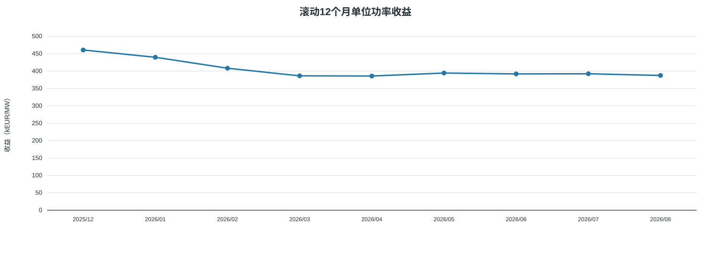
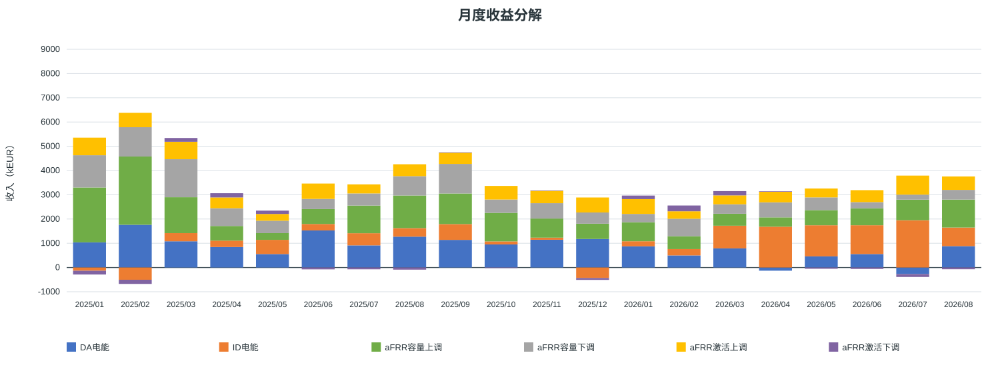
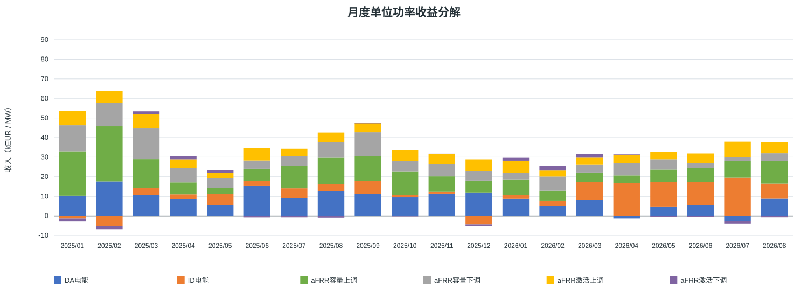
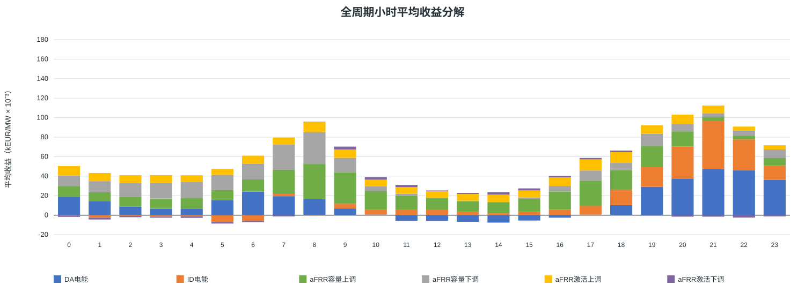
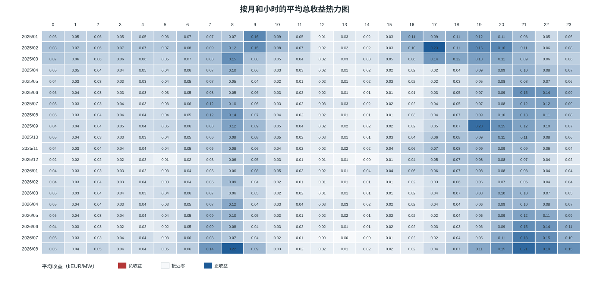
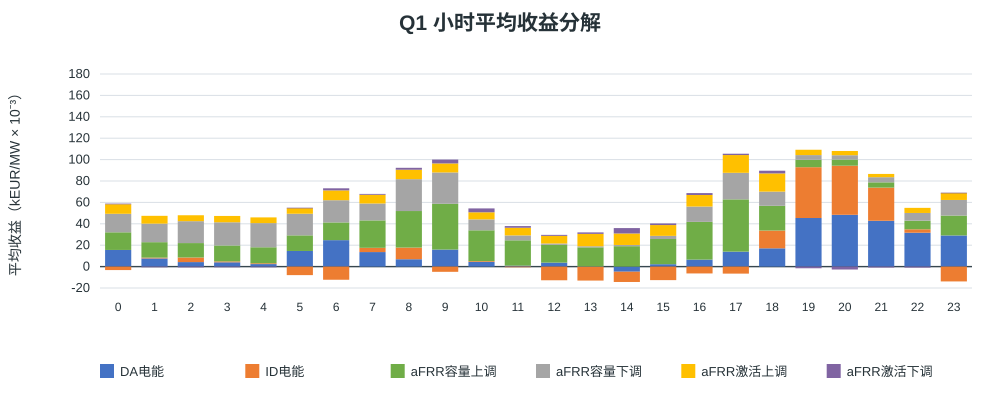
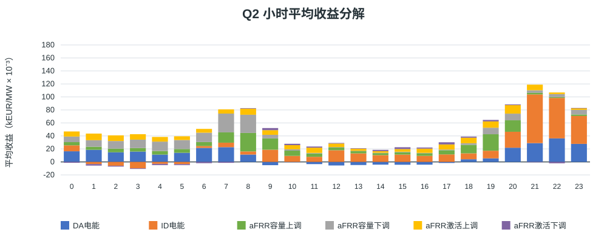
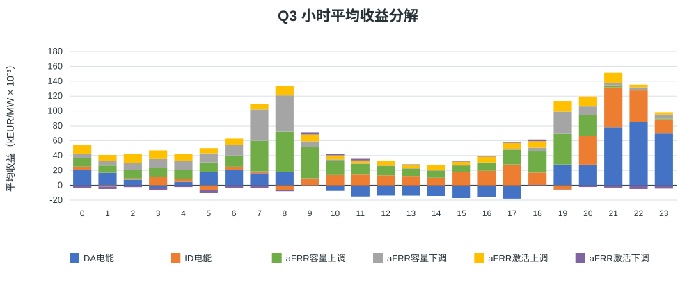
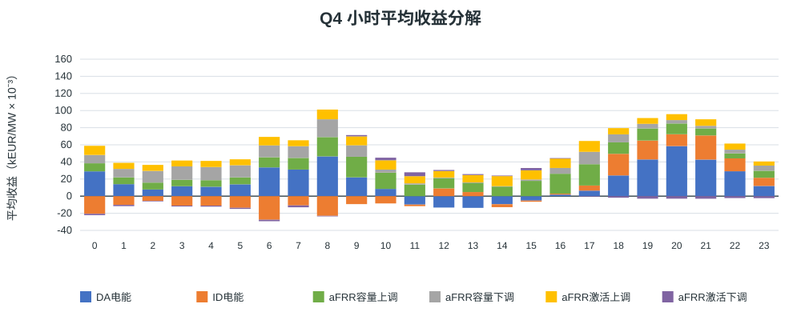

# 西班牙储能 MILP 结果展示

输入结果目录：`output/capacity_4h_award_rate_20260929`。情景：`ts_start/cap_old/D/capacity_award_rate_proxy_optimize`；中标系数模式：`optimize`。
正式统计期：马德里当地 **2025/01/01 至 2026/08/31**（结束日期按排除端处理）。本次计算成功：`True`。

## 假设概览

| 项目 | 本次配置 |
|---|---|
| 数据时间范围 | 正式结算日 2025/01/01–2026/08/31；求解输入加载到 `2026-09-02 00:00:00+02:00`（含观察数据） |
| 时间分辨率与时区 | 15 分钟 QH；本地展示按 Europe/Madrid |
| 输入来源标识 | eSIOS 指标 632, 633, 634, 680, 681, 682, 683, 2130；aFRR 系数文件 `afrr_capacity_award_rate_202501_202608.csv.gz` |
| 系数文件 SHA-256 | `4cb874fe00103112943a68c9895808f59b54b49c890b13472f339000c8c80ef0` |
| 原始字段完整度 | 52,442 / 58,364 QH (89.85%) |
| 已结算覆盖率 | 52,438 / 58,364 QH (89.85%)；假设空缺时段空闲桥接 1,481.5 小时；未知状态阻断 QH 0 |
| 完整天统计口径 | 当地自然日内所有预期 QH 均有有效结算记录；夏令时切换日按实际 92 或 100 个 QH 计算 |
| 电池配置 | 充电/放电功率 100/100 MW；能量边界 10–390 MWh；初始/终端能量 10/10 MWh |
| 效率与备用上限 | 充/放电效率 92.0%/92.0%；aFRR 上/下备用功率上限 100/100 MW |
| 年度 EFC 预算 | 2025: 548.766；2026: 345.992 EFC |
| 循环口径 | EFC 分母 = 2 × 可用能量 = 760.0 MWh；循环数采用模型记录的等效全循环（EFC） |

重要建模假设：

- 完美历史价格信息是事后理论上限，不是可执行的实时策略收益。
- 中标系数仅折减 aFRR 容量收入优化目标；本结果列示的上下调容量仍是第一阶段全额成交假设下的计划申报量，不是按中标率折算后的预期中标 MW。激活收益与物理容量承诺沿用原 V1 口径。系统分配量/报价量是敏感性代理，不是该电站的真实中标率。
- GCT 后备用余量按第一阶段全额成交建模假设处理；缺失输入按配置允许的空闲桥接处理。

## 结果概览

### 收益：全期、月均与自然年

| 期间 | 收益（kEUR） | 收益（kEUR/MW） |
|---|---:|---:|
| 全期合计 | 71,175.42 | 711.75 |
| 月均（20个月） | 3,558.77 | 35.59 |
| 2025年（完整天 314/365） | 46,069.31 | 460.69 |
| 2026年（完整天 190/243） | 25,106.11 | 251.06 |

### 年化收益：截至最新月份的滚动12个月

| 滚动窗口 | 年化收益（kEUR） | 年化收益（kEUR/MW） |
|---|---:|---:|
| 最近完整12个月（2025/09–2026/08） | 38,747.52 | 387.48 |

### 逐月滚动12个月收益（kEUR/MW）

每个统计月份以当月为窗口终点，累计当月及此前连续11个月；仅列出具备连续12个月数据的窗口。V1 按同一 12 个月窗口计算，容量收入系数为 100%。V1 使用自身重新优化的调度结果，因此两条线的差额同时包含容量收益计价方式和调度变化。

| 统计月份 | 对应12个月窗口 | 滚动收益（kEUR/MW） |
|---|---|---:|
| 2025/12 | 2025/01–2025/12 | 460.69 |
| 2026/01 | 2025/02–2026/01 | 439.70 |
| 2026/02 | 2025/03–2026/02 | 408.25 |
| 2026/03 | 2025/04–2026/03 | 386.34 |
| 2026/04 | 2025/05–2026/04 | 385.83 |
| 2026/05 | 2025/06–2026/05 | 394.43 |
| 2026/06 | 2025/07–2026/06 | 391.88 |
| 2026/07 | 2025/08–2026/07 | 392.33 |
| 2026/08 | 2025/09–2026/08 | 387.48 |

### 循环次数：全期、月均与自然年

EFC（等效全循环）按各 QH 的 SOC 变化绝对值累计，再除以 2 × 可用能量；它可为小数，表示累计吞吐量折合了多少次满可用能量往返。完整充放电循环则是一次实际的充电—放电过程，按事件计数；部分循环、跨期循环及不同深度循环使两者不必相等。

| 期间 | 等效循环次数（EFC） |
|---|---:|
| 全期合计 | 686.33 |
| 月均（20个月） | 34.32 |
| 2025年（完整天 314/365） | 416.58 |
| 2026年（完整天 190/243） | 269.75 |

### 市场收益和净收益占比

| 市场 | 收益（kEUR） | 收益（kEUR/MW） | 占净总收益 |
|---|---:|---:|---:|
| DA电能 | 17,057.01 | 170.57 | 23.96% |
| ID电能 | 10,369.02 | 103.69 | 14.57% |
| aFRR容量上调 | 19,915.91 | 199.16 | 27.98% |
| aFRR容量下调 | 13,394.31 | 133.94 | 18.82% |
| aFRR激活上调 | 10,338.94 | 103.39 | 14.53% |
| aFRR激活下调 | 100.23 | 1.00 | 0.14% |
| **合计** | **71,175.42** | **711.75** | **100.00%** |

占比以净总收益为分母，因此负收益市场显示负占比，正收益市场占比之和可能超过 100%。

### 各市场平均执行功率和申报容量

| 市场/方向 | 平均功率（MW） | 口径 |
|---|---:|---|
| DA电能执行功率 | 2.70 | 按全部正式QH求有符号均值；售电为正、购电为负，空闲桥接按0计 |
| ID电能执行功率 | -5.36 | 按全部正式QH求有符号均值；售电为正、购电为负，空闲桥接按0计 |
| DA+ID合并现货执行功率 | -2.66 | 逐QH合并DA和ID有符号净功率后求全期平均 |
| aFRR容量上调 | 66.93 | 第一阶段全额成交假设下的方向容量QH平均 |
| aFRR容量下调 | 60.88 | 第一阶段全额成交假设下的方向容量QH平均 |
| aFRR激活上调 | 1.66 | QH平均激活功率（MWh按时长折算） |
| aFRR激活下调 | 1.74 | QH平均激活功率（MWh按时长折算） |

DA、ID 和合并现货行均按全期正式 QH 求带方向的净功率均值，不取绝对值；售电为正、购电为负，相反方向时段会抵消。没有有效市场数据并按假设空闲桥接的 QH 按 0 MW 计入平均。若要衡量市场内交易强度，可另看平均绝对净功率，本表不采用该口径。aFRR 上下调列是按全期 QH 统计的第一阶段全额成交假设下申报容量均值，空闲桥接 QH 以 0 计；供需系数折减容量收益，不折减申报 MW。上、下方向分开列示，不能相加理解为同一方向功率；激活列是平均实际激活功率。

## 月度结果概览

### 月度收入（kEUR）

### 月度单位功率收入（kEUR/MW）

### 月度收益明细与自然年合计

单位：kEUR。

| 月份 | DA电能 | ID电能 | aFRR容量上调 | aFRR容量下调 | aFRR激活上调 | aFRR激活下调 | 合计 |
| --- | --- | --- | --- | --- | --- | --- | --- |
| 2025/01 | 1,037.34 | -134.73 | 2,262.97 | 1,329.05 | 725.87 | -154.93 | 5,065.57 |
| 2025/02 | 1,761.72 | -505.71 | 2,814.89 | 1,209.19 | 593.44 | -171.71 | 5,701.82 |
| 2025/03 | 1,081.18 | 336.13 | 1,481.20 | 1,567.79 | 718.48 | 156.15 | 5,340.92 |
| 2025/04 | 845.13 | 263.43 | 604.06 | 731.32 | 445.91 | 173.63 | 3,063.48 |
| 2025/05 | 554.66 | 585.86 | 277.42 | 511.87 | 278.10 | 137.86 | 2,345.78 |
| 2025/06 | 1,528.81 | 265.54 | 614.52 | 420.14 | 633.36 | -76.50 | 3,385.87 |
| 2025/07 | 912.90 | 500.92 | 1,141.45 | 499.66 | 373.84 | -73.74 | 3,355.02 |
| 2025/08 | 1,272.47 | 351.64 | 1,345.99 | 796.64 | 491.15 | -88.45 | 4,169.44 |
| 2025/09 | 1,138.60 | 651.73 | 1,262.22 | 1,219.84 | 467.51 | 7.71 | 4,747.60 |
| 2025/10 | 949.98 | 126.65 | 1,177.42 | 550.15 | 560.63 | -25.10 | 3,339.73 |
| 2025/11 | 1,144.13 | 87.19 | 787.31 | 633.73 | 511.74 | 14.21 | 3,178.31 |
| 2025/12 | 1,176.14 | -434.36 | 629.35 | 464.30 | 617.65 | -77.30 | 2,375.77 |
| **2025年月均（12个月）** | **1,116.92** | **174.52** | **1,199.90** | **827.81** | **534.81** | **-14.85** | **3,839.11** |
| **2025年合计** | **13,403.06** | **2,094.28** | **14,398.79** | **9,933.68** | **6,417.67** | **-178.17** | **46,069.31** |
| 2026/01 | 873.83 | 208.42 | 784.73 | 342.46 | 611.22 | 145.78 | 2,966.44 |
| 2026/02 | 498.76 | 260.84 | 529.99 | 720.85 | 307.74 | 238.28 | 2,556.46 |
| 2026/03 | 788.25 | 935.11 | 493.28 | 390.15 | 367.36 | 176.10 | 3,150.25 |
| 2026/04 | -131.53 | 1,682.85 | 384.94 | 619.93 | 436.12 | 20.04 | 3,012.36 |
| 2026/05 | 459.27 | 1,282.62 | 625.05 | 524.89 | 366.38 | -52.20 | 3,206.01 |
| 2026/06 | 555.28 | 1,187.44 | 699.24 | 255.09 | 492.49 | -59.28 | 3,130.26 |
| 2026/07 | -270.83 | 1,950.20 | 847.04 | 207.72 | 785.05 | -119.27 | 3,399.90 |
| 2026/08 | 880.92 | 767.25 | 1,152.85 | 399.54 | 554.92 | -71.05 | 3,684.43 |
| **2026年月均（8个月）** | **456.74** | **1,034.34** | **689.64** | **432.58** | **490.16** | **34.80** | **3,138.26** |
| **2026年合计** | **3,653.96** | **8,274.74** | **5,517.12** | **3,460.63** | **3,921.27** | **278.40** | **25,106.11** |

单位：kEUR/MW。

| 月份 | DA电能 | ID电能 | aFRR容量上调 | aFRR容量下调 | aFRR激活上调 | aFRR激活下调 | 合计 |
| --- | --- | --- | --- | --- | --- | --- | --- |
| 2025/01 | 10.37 | -1.35 | 22.63 | 13.29 | 7.26 | -1.55 | 50.66 |
| 2025/02 | 17.62 | -5.06 | 28.15 | 12.09 | 5.93 | -1.72 | 57.02 |
| 2025/03 | 10.81 | 3.36 | 14.81 | 15.68 | 7.18 | 1.56 | 53.41 |
| 2025/04 | 8.45 | 2.63 | 6.04 | 7.31 | 4.46 | 1.74 | 30.63 |
| 2025/05 | 5.55 | 5.86 | 2.77 | 5.12 | 2.78 | 1.38 | 23.46 |
| 2025/06 | 15.29 | 2.66 | 6.15 | 4.20 | 6.33 | -0.77 | 33.86 |
| 2025/07 | 9.13 | 5.01 | 11.41 | 5.00 | 3.74 | -0.74 | 33.55 |
| 2025/08 | 12.72 | 3.52 | 13.46 | 7.97 | 4.91 | -0.88 | 41.69 |
| 2025/09 | 11.39 | 6.52 | 12.62 | 12.20 | 4.68 | 0.08 | 47.48 |
| 2025/10 | 9.50 | 1.27 | 11.77 | 5.50 | 5.61 | -0.25 | 33.40 |
| 2025/11 | 11.44 | 0.87 | 7.87 | 6.34 | 5.12 | 0.14 | 31.78 |
| 2025/12 | 11.76 | -4.34 | 6.29 | 4.64 | 6.18 | -0.77 | 23.76 |
| **2025年月均（12个月）** | **11.17** | **1.75** | **12.00** | **8.28** | **5.35** | **-0.15** | **38.39** |
| **2025年合计** | **134.03** | **20.94** | **143.99** | **99.34** | **64.18** | **-1.78** | **460.69** |
| 2026/01 | 8.74 | 2.08 | 7.85 | 3.42 | 6.11 | 1.46 | 29.66 |
| 2026/02 | 4.99 | 2.61 | 5.30 | 7.21 | 3.08 | 2.38 | 25.56 |
| 2026/03 | 7.88 | 9.35 | 4.93 | 3.90 | 3.67 | 1.76 | 31.50 |
| 2026/04 | -1.32 | 16.83 | 3.85 | 6.20 | 4.36 | 0.20 | 30.12 |
| 2026/05 | 4.59 | 12.83 | 6.25 | 5.25 | 3.66 | -0.52 | 32.06 |
| 2026/06 | 5.55 | 11.87 | 6.99 | 2.55 | 4.92 | -0.59 | 31.30 |
| 2026/07 | -2.71 | 19.50 | 8.47 | 2.08 | 7.85 | -1.19 | 34.00 |
| 2026/08 | 8.81 | 7.67 | 11.53 | 4.00 | 5.55 | -0.71 | 36.84 |
| **2026年月均（8个月）** | **4.57** | **10.34** | **6.90** | **4.33** | **4.90** | **0.35** | **31.38** |
| **2026年合计** | **36.54** | **82.75** | **55.17** | **34.61** | **39.21** | **2.78** | **251.06** |

## 小时级结果概览

下图按马德里本地钟点，将每个完整且有效的实际小时内四个 QH 市场现金流先求和，再按可用小时求平均；数值按 0.001 kEUR/MW 作整数刻度，轴标题标明缩放系数，重复夏令时小时按实际 UTC 偏移分别计入。

完整有效小时：13,043。小时均值分母按小时 0–23 分别计算；每小时样本数见 `hourly.csv`。

### 月度 × 小时平均收益热力图

每格为该月该小时的完整有效小时平均总收益，单位 kEUR/MW；收益先按四个 QH 合计，再在当月同一钟点的样本小时间取平均。颜色以零为中心，红色表示负收益、蓝色表示正收益；格内显示数值。

### 按季度分组的小时收益

每张图按跨年度相同季度汇总（例如 Q1 合并所有年份的一月至三月）；整数轴刻度为 0.001 kEUR/MW。

#### Q1

#### Q2

#### Q3

#### Q4

## 输出文件与口径

- `monthly.csv`：逐月六市场收益、总收益、每 MW 收益、结算覆盖率和 EFC；自然年合计另列于 `annual.csv`。
- `hourly.csv`、`quarterly_hourly.csv`：小时均值、样本小时数与六市场拆分。
- `monthly_hourly_heatmap.csv`：热力图每月每小时平均总收益和样本小时数。
- `rolling_12m.csv`：每月为窗口终点的连续12个月总收益。
- 图表均为 SVG，可放大查看；本脚本使用 Python 标准库生成，不依赖绘图库。
- 输入结果目录、来源清单、系数文件哈希以及本报告的小时完整性过滤口径均保留，便于审计和复算。
