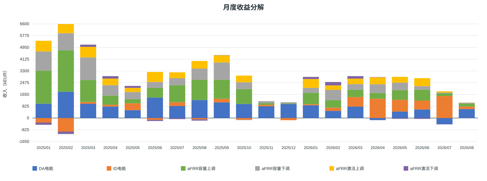
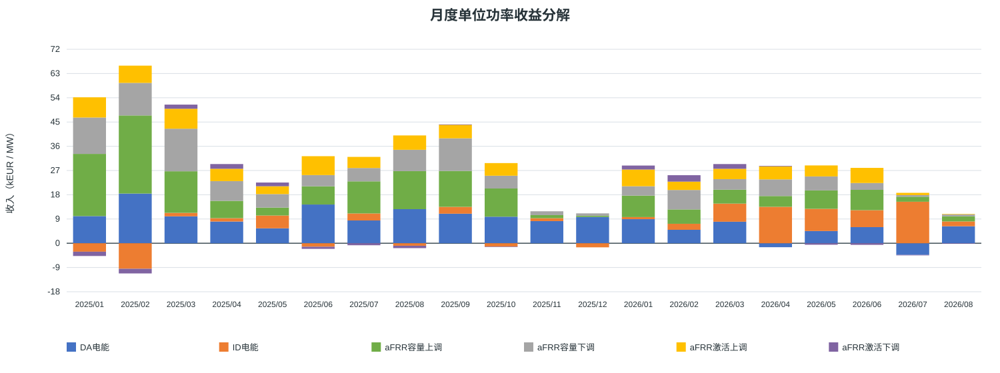
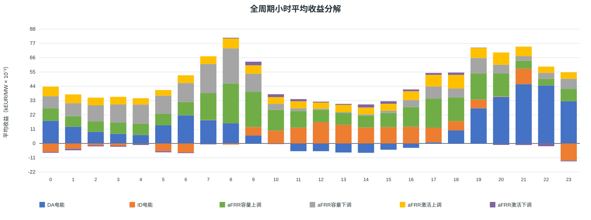
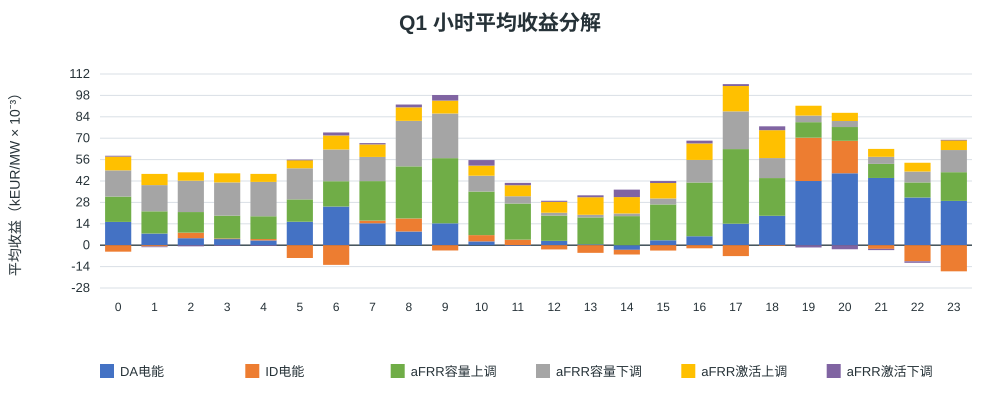
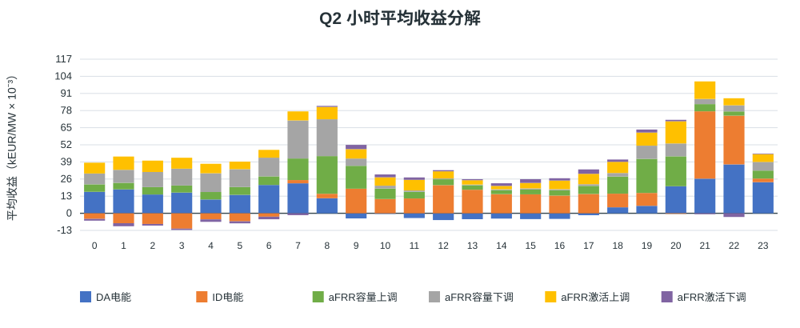
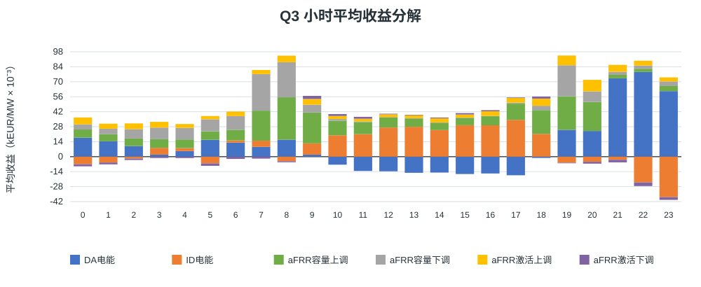
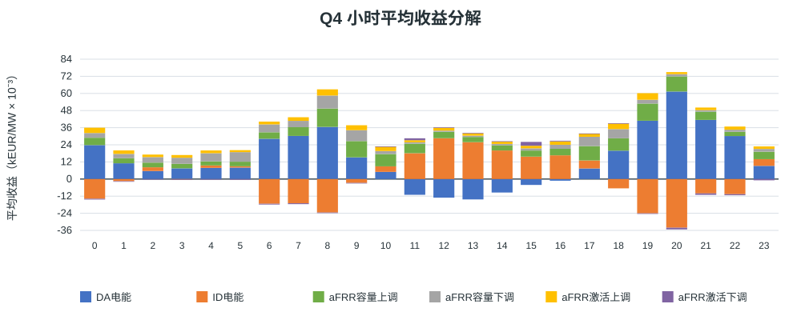

# 西班牙储能 MILP 结果展示

输入结果目录：`output/capacity_award_rate_full_accelerated_20260923`。情景：`ts_start/cap_old/D/capacity_award_rate_proxy`；中标系数模式：`optimize`。
正式统计期：马德里当地 **2025/01/01 至 2026/08/31**（结束日期按排除端处理）。本次计算成功：`True`。

## 假设概览

| 项目 | 本次配置 |
|---|---|
| 数据时间范围 | 正式结算日 2025/01/01–2026/08/31；求解输入加载到 `2026-09-02 00:00:00+02:00`（含观察数据） |
| 时间分辨率与时区 | 15 分钟 QH；本地展示按 Europe/Madrid |
| 输入来源标识 | eSIOS 指标 632, 633, 634, 680, 681, 682, 683, 2130；aFRR 系数文件 `afrr_capacity_award_rate_202501_202608.csv.gz` |
| 系数文件 SHA-256 | `4cb874fe00103112943a68c9895808f59b54b49c890b13472f339000c8c80ef0` |
| 原始字段完整度 | 52,442 / 58,364 QH (89.85%) |
| 已结算覆盖率 | 52,438 / 58,364 QH (89.85%)；假设空缺时段空闲桥接 1,481.5 小时；未知状态阻断 QH 0 |
| 电池配置 | 充电/放电功率 100/100 MW；能量边界 10–190 MWh；初始/终端能量 10/10 MWh |
| 效率与备用上限 | 充/放电效率 92.0%/92.0%；aFRR 上/下备用功率上限 100/100 MW |
| 年度 EFC 预算 | 2025: 548.766；2026: 345.992 EFC |
| 循环口径 | EFC 分母 = 2 × 可用能量 = 360.0 MWh；循环数采用模型记录的等效全循环（EFC） |

重要建模假设：

- 完美历史价格信息是事后理论上限，不是可执行的实时策略收益。
- 中标系数仅进入 aFRR 容量收入优化目标；激活收益与物理容量承诺仍沿用原 V1 口径。系统分配量/报价量是敏感性代理，不是该电站的真实中标率。
- GCT 后备用余量按第一阶段全额成交建模假设处理；缺失输入按配置允许的空闲桥接处理。

## 结果概览

### 收益：全期、月均与自然年

| 期间 | 收益（kEUR） | 收益（kEUR/MW） |
|---|---:|---:|
| 全期合计 | 59,305.36 | 593.05 |
| 月均（20个月） | 2,965.27 | 29.65 |
| 2025年 | 40,135.68 | 401.36 |
| 2026年 | 19,169.67 | 191.70 |

### 循环次数：全期、月均与自然年

按当前模型定义，EFC 即电池等效全循环次数；它不是完整充放电事件的整数计数。

| 期间 | 等效循环次数（EFC） |
|---|---:|
| 全期合计 | 894.76 |
| 月均（20个月） | 44.74 |
| 2025年 | 548.77 |
| 2026年 | 345.99 |

### 市场收益和净收益占比

| 市场 | 收益（kEUR） | 收益（kEUR/MW） | 占净总收益 |
|---|---:|---:|---:|
| DA电能 | 15,944.91 | 159.45 | 26.89% |
| ID电能 | 5,091.97 | 50.92 | 8.59% |
| aFRR容量上调 | 17,567.56 | 175.68 | 29.62% |
| aFRR容量下调 | 11,976.46 | 119.76 | 20.19% |
| aFRR激活上调 | 8,361.78 | 83.62 | 14.10% |
| aFRR激活下调 | 362.68 | 3.63 | 0.61% |
| **合计** | **59,305.36** | **593.05** | **100.00%** |

占比以净总收益为分母，因此负收益市场显示负占比，正收益市场占比之和可能超过 100%。

### 各市场平均申报/执行功率

| 市场/方向 | 平均申报或执行功率（MW） | 口径 |
|---|---:|---|
| DA电能 | 79.25 | QH平均净申报/承诺功率绝对值 |
| ID电能 | 78.19 | QH平均净申报/承诺功率绝对值 |
| aFRR容量上调 | 58.84 | QH平均净申报/承诺功率绝对值 |
| aFRR容量下调 | 54.59 | QH平均净申报/承诺功率绝对值 |
| aFRR激活上调 | 1.38 | QH平均激活功率（MWh按时长折算） |
| aFRR激活下调 | 1.54 | QH平均激活功率（MWh按时长折算） |

DA 与 ID 单独列示时分别计算市场内 QH 净头寸的绝对值，所以两行均值不能相加为站点功率。若先将买卖方向净额并合并 DA+ID，本次每 QH 平均绝对现货净头寸为 **15.42 MW**。aFRR 上下调是分方向容量承诺，分别统计；其平均值也不能当成同一时刻的净功率相加。激活列是平均实际激活功率，不是申报容量。

## 月度结果概览

### 月度收入（kEUR）

### 月度单位功率收入（kEUR/MW）

### 月度收益明细与自然年合计

单位：kEUR。

| 月份 | DA电能 | ID电能 | aFRR容量上调 | aFRR容量下调 | aFRR激活上调 | aFRR激活下调 | 合计 |
| --- | --- | --- | --- | --- | --- | --- | --- |
| 2025/12 | 976.48 | -151.59 | 45.23 | 87.45 | 0.00 | 0.00 | 957.57 |
| **2025年合计** | **12,646.26** | **-406.56** | **13,504.70** | **8,994.84** | **5,498.52** | **-102.08** | **40,135.68** |
| 2026/08 | 631.52 | 178.65 | 189.97 | 68.60 | 15.54 | -2.32 | 1,081.95 |
| **2026年合计** | **3,298.65** | **5,498.52** | **4,062.86** | **2,981.62** | **2,863.26** | **464.76** | **19,169.67** |

单位：kEUR/MW。

| 月份 | DA电能 | ID电能 | aFRR容量上调 | aFRR容量下调 | aFRR激活上调 | aFRR激活下调 | 合计 |
| --- | --- | --- | --- | --- | --- | --- | --- |
| 2025/12 | 9.76 | -1.52 | 0.45 | 0.87 | 0.00 | 0.00 | 9.58 |
| **2025年合计** | **126.46** | **-4.07** | **135.05** | **89.95** | **54.99** | **-1.02** | **401.36** |
| 2026/08 | 6.32 | 1.79 | 1.90 | 0.69 | 0.16 | -0.02 | 10.82 |
| **2026年合计** | **32.99** | **54.99** | **40.63** | **29.82** | **28.63** | **4.65** | **191.70** |

## 小时级结果概览

下图按马德里本地钟点，将每个完整且有效的实际小时内四个 QH 市场现金流先求和，再按可用小时求平均；数值按 0.001 kEUR/MW 作整数刻度，轴标题标明缩放系数，重复夏令时小时按实际 UTC 偏移分别计入。

完整有效小时：13,043。小时均值分母按小时 0–23 分别计算；每小时样本数见 `hourly.csv`。

### 按季度分组的小时收益

每张图按跨年度相同季度汇总（例如 Q1 合并所有年份的一月至三月）；整数轴刻度为 0.001 kEUR/MW。

#### Q1

#### Q2

#### Q3

#### Q4

## 输出文件与口径

- `monthly.csv`：逐月六市场收益、总收益、每 MW 收益、结算覆盖率和 EFC；自然年合计另列于 `annual.csv`。
- `hourly.csv`、`quarterly_hourly.csv`：小时均值、样本小时数与六市场拆分。
- 图表均为 SVG，可放大查看；本脚本使用 Python 标准库生成，不依赖绘图库。
- 输入结果目录、来源清单、系数文件哈希以及本报告的小时完整性过滤口径均保留，便于审计和复算。
