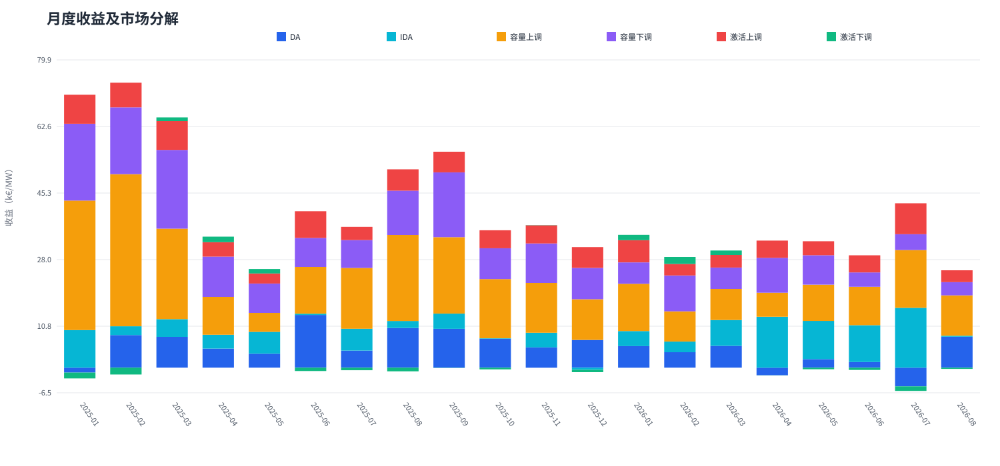
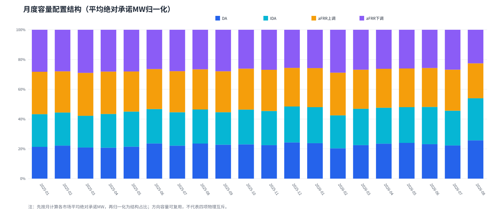
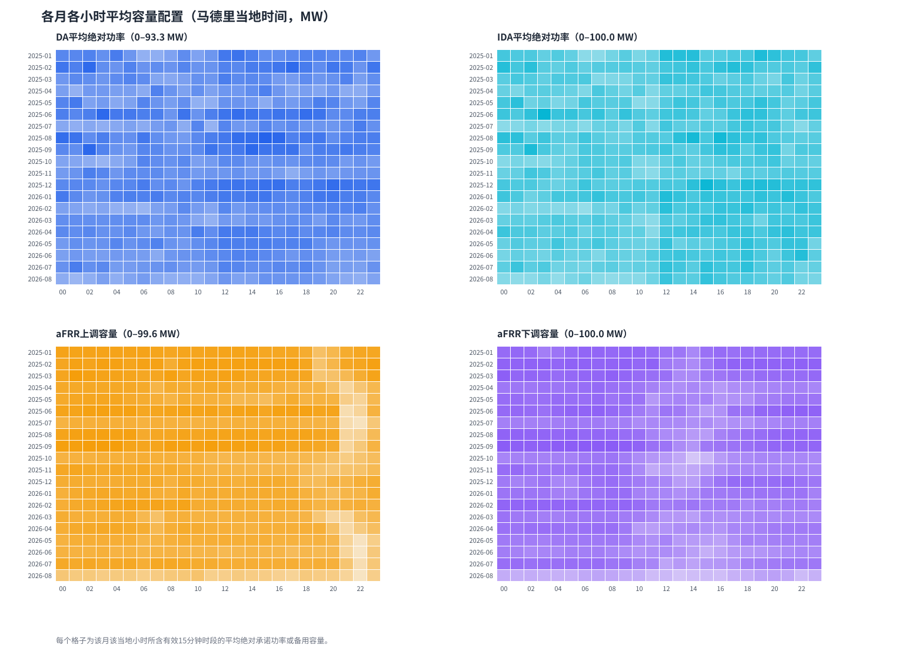

# 西班牙储能MILP全量测算结果汇总

## 1. 数据区间、模型范围和主要假设

- 测算区间：马德里当地时间2025-01-01 00:00至2026-09-01 00:00（右端不含，即截至2026-08-31）。目标58,364个15分钟时段，共同有效52,247个，覆盖率89.52%，分为134个连续数据段。
- 单一情景：`ts_start + cap_old + rolling2 + D`。激活比例按时段起点映射，激活顺序为先下后上；采用两日滚动窗口，每次仅执行首日。
- 电站参数：充放电功率各100 MW，电网进出口各100 MW；SOC范围10–190 MWh，初始和段末SOC均为10 MWh，充放电效率均为92%。
- 求解器：SciPy MILP/HiGHS，presolve关闭，相对MIP gap为1e-4，单窗口时限30秒，A1–A3实验优化关闭。
- 完美信息条件测算：决策使用事后完整价格和激活信息；收益为条件毛收益，未扣交易费用、税费、融资成本和电池退化现金成本。
- `cap_old`采用16:00/16:30容量时表。该时表的历史适用切换日期仍未证实，因此属于建模假设。
- 长期滚动适配：非最终窗口预留0.543478 EFC用于段末SOC回归，并保留1e-6 EFC数值余量；没有提高年度EFC预算。边界归一均小于既有1e-5审计容差。

## 2. 测算结果和月度收益分析

最终状态为`CONDITIONAL_PASS`，条件毛收益为**796.61 k€/MW**。收益统一按100 MW额定功率折算为k€/MW。

全区间分项为：DA 102.53 k€/MW、IDA 102.95 k€/MW、aFRR容量上调 299.43 k€/MW、容量下调 193.66 k€/MW、aFRR激活上调 99.43 k€/MW、激活下调 -1.40 k€/MW。

下表为图中各市场收益占当月毛收益的比例，采用带符号收益计算，因此亏损市场显示负比例，其他市场占比可能相应超过100%。

| 月份 | DA | IDA | 容量上调 | 容量下调 | 激活上调 | 激活下调 |
|---|---:|---:|---:|---:|---:|---:|
| 2025-01 | -1.9% | 14.3% | 49.4% | 29.3% | 11.1% | -2.2% |
| 2025-02 | 11.7% | 3.2% | 54.7% | 24.0% | 8.9% | -2.4% |
| 2025-03 | 12.3% | 7.1% | 36.2% | 31.5% | 11.5% | 1.5% |
| 2025-04 | 14.6% | 10.6% | 28.9% | 30.8% | 11.0% | 4.2% |
| 2025-05 | 14.2% | 22.2% | 19.2% | 29.7% | 10.2% | 4.5% |
| 2025-06 | 34.4% | 0.8% | 30.5% | 19.0% | 17.4% | -2.2% |
| 2025-07 | 12.4% | 15.8% | 43.9% | 20.2% | 9.5% | -1.8% |
| 2025-08 | 20.4% | 3.6% | 44.2% | 22.8% | 11.0% | -1.9% |
| 2025-09 | 18.0% | 7.0% | 35.4% | 30.0% | 9.6% | -0.1% |
| 2025-10 | 21.4% | 0.3% | 43.6% | 22.7% | 13.3% | -1.3% |
| 2025-11 | 14.3% | 10.2% | 34.9% | 27.7% | 12.8% | 0.1% |
| 2025-12 | 23.9% | -1.8% | 35.1% | 27.0% | 17.9% | -2.1% |
| 2026-01 | 16.3% | 11.3% | 35.6% | 16.1% | 16.7% | 4.0% |
| 2026-02 | 14.0% | 9.6% | 27.3% | 32.4% | 10.4% | 6.3% |
| 2026-03 | 18.6% | 22.1% | 26.5% | 18.2% | 10.7% | 3.8% |
| 2026-04 | -6.4% | 42.6% | 20.1% | 29.2% | 14.4% | -0.0% |
| 2026-05 | 6.8% | 30.7% | 29.0% | 23.6% | 11.2% | -1.3% |
| 2026-06 | 5.2% | 33.4% | 34.8% | 13.1% | 15.5% | -2.1% |
| 2026-07 | -13.2% | 42.4% | 40.9% | 11.2% | 21.9% | -3.3% |
| 2026-08 | 32.2% | 1.1% | 41.9% | 13.8% | 12.3% | -1.2% |

月度收益最高的是**2025-02（72.21 k€/MW）**，最低的是**2026-08（24.97 k€/MW）**。月度之间同时受价格、aFRR容量价格、激活情况和有效数据覆盖时数影响，因此不能仅凭月度总额判断单位时间盈利能力。

| 月份 | DA | IDA | 容量上调 | 容量下调 | 激活上调 | 激活下调 | 合计 | 每有效小时收益 |
|---|---:|---:|---:|---:|---:|---:|---:|---:|
| 2025-01 | -1.26 k€/MW | 9.76 k€/MW | 33.60 k€/MW | 19.94 k€/MW | 7.54 k€/MW | -1.52 k€/MW | **68.06 k€/MW** | 0.093 k€/MW·h |
| 2025-02 | 8.48 k€/MW | 2.28 k€/MW | 39.47 k€/MW | 17.34 k€/MW | 6.41 k€/MW | -1.75 k€/MW | **72.21 k€/MW** | 0.111 k€/MW·h |
| 2025-03 | 8.00 k€/MW | 4.60 k€/MW | 23.49 k€/MW | 20.44 k€/MW | 7.46 k€/MW | 0.97 k€/MW | **64.96 k€/MW** | 0.088 k€/MW·h |
| 2025-04 | 4.96 k€/MW | 3.59 k€/MW | 9.82 k€/MW | 10.46 k€/MW | 3.73 k€/MW | 1.44 k€/MW | **34.00 k€/MW** | 0.056 k€/MW·h |
| 2025-05 | 3.63 k€/MW | 5.68 k€/MW | 4.92 k€/MW | 7.61 k€/MW | 2.61 k€/MW | 1.15 k€/MW | **25.61 k€/MW** | 0.044 k€/MW·h |
| 2025-06 | 13.69 k€/MW | 0.34 k€/MW | 12.12 k€/MW | 7.54 k€/MW | 6.93 k€/MW | -0.87 k€/MW | **39.75 k€/MW** | 0.057 k€/MW·h |
| 2025-07 | 4.44 k€/MW | 5.68 k€/MW | 15.77 k€/MW | 7.23 k€/MW | 3.42 k€/MW | -0.66 k€/MW | **35.89 k€/MW** | 0.058 k€/MW·h |
| 2025-08 | 10.29 k€/MW | 1.84 k€/MW | 22.32 k€/MW | 11.50 k€/MW | 5.54 k€/MW | -0.95 k€/MW | **50.53 k€/MW** | 0.070 k€/MW·h |
| 2025-09 | 10.10 k€/MW | 3.94 k€/MW | 19.83 k€/MW | 16.83 k€/MW | 5.35 k€/MW | -0.05 k€/MW | **56.00 k€/MW** | 0.078 k€/MW·h |
| 2025-10 | 7.52 k€/MW | 0.12 k€/MW | 15.35 k€/MW | 8.01 k€/MW | 4.67 k€/MW | -0.45 k€/MW | **35.23 k€/MW** | 0.057 k€/MW·h |
| 2025-11 | 5.28 k€/MW | 3.79 k€/MW | 12.93 k€/MW | 10.24 k€/MW | 4.72 k€/MW | 0.05 k€/MW | **37.02 k€/MW** | 0.058 k€/MW·h |
| 2025-12 | 7.20 k€/MW | -0.53 k€/MW | 10.56 k€/MW | 8.12 k€/MW | 5.40 k€/MW | -0.62 k€/MW | **30.14 k€/MW** | 0.043 k€/MW·h |
| 2026-01 | 5.61 k€/MW | 3.90 k€/MW | 12.27 k€/MW | 5.55 k€/MW | 5.76 k€/MW | 1.39 k€/MW | **34.48 k€/MW** | 0.053 k€/MW·h |
| 2026-02 | 4.02 k€/MW | 2.76 k€/MW | 7.85 k€/MW | 9.30 k€/MW | 3.00 k€/MW | 1.82 k€/MW | **28.74 k€/MW** | 0.043 k€/MW·h |
| 2026-03 | 5.66 k€/MW | 6.71 k€/MW | 8.07 k€/MW | 5.54 k€/MW | 3.26 k€/MW | 1.16 k€/MW | **30.41 k€/MW** | 0.044 k€/MW·h |
| 2026-04 | -1.98 k€/MW | 13.21 k€/MW | 6.24 k€/MW | 9.06 k€/MW | 4.47 k€/MW | -0.00 k€/MW | **31.01 k€/MW** | 0.050 k€/MW·h |
| 2026-05 | 2.21 k€/MW | 9.94 k€/MW | 9.39 k€/MW | 7.64 k€/MW | 3.63 k€/MW | -0.41 k€/MW | **32.40 k€/MW** | 0.050 k€/MW·h |
| 2026-06 | 1.47 k€/MW | 9.55 k€/MW | 9.96 k€/MW | 3.74 k€/MW | 4.44 k€/MW | -0.59 k€/MW | **28.58 k€/MW** | 0.045 k€/MW·h |
| 2026-07 | -4.83 k€/MW | 15.54 k€/MW | 15.00 k€/MW | 4.12 k€/MW | 8.01 k€/MW | -1.19 k€/MW | **36.64 k€/MW** | 0.055 k€/MW·h |
| 2026-08 | 8.03 k€/MW | 0.26 k€/MW | 10.47 k€/MW | 3.44 k€/MW | 3.07 k€/MW | -0.31 k€/MW | **24.97 k€/MW** | 0.052 k€/MW·h |

## 3. 不同月份的平均容量配置

容量配置按每个有效15分钟时段计算：DA和IDA取净成交功率的绝对值，aFRR分别保留上调和下调容量；先求月均MW，再将四项归一化为结构占比。由于能量头寸可以互相对冲、上下调容量具有方向复用属性，这些占比用于描述市场承诺结构，不表示四项在物理上互斥切分100 MW。

| 月份 | DA均值MW | IDA均值MW | aFRR上调MW | aFRR下调MW | DA占比 | IDA占比 | 上调占比 | 下调占比 |
|---|---:|---:|---:|---:|---:|---:|---:|---:|
| 2025-01 | 67.0 | 68.9 | 89.4 | 88.6 | 21.3% | 22.0% | 28.5% | 28.2% |
| 2025-02 | 73.4 | 73.5 | 91.6 | 92.3 | 22.2% | 22.2% | 27.7% | 27.9% |
| 2025-03 | 64.1 | 65.3 | 88.5 | 88.8 | 20.9% | 21.3% | 28.8% | 29.0% |
| 2025-04 | 57.7 | 63.1 | 79.2 | 78.1 | 20.8% | 22.7% | 28.5% | 28.1% |
| 2025-05 | 61.4 | 67.4 | 77.1 | 80.2 | 21.5% | 23.6% | 27.0% | 28.0% |
| 2025-06 | 77.4 | 75.7 | 88.1 | 86.5 | 23.6% | 23.1% | 26.9% | 26.4% |
| 2025-07 | 59.0 | 59.8 | 73.5 | 74.1 | 22.1% | 22.4% | 27.6% | 27.8% |
| 2025-08 | 76.0 | 73.8 | 87.2 | 85.7 | 23.6% | 22.9% | 27.0% | 26.6% |
| 2025-09 | 74.5 | 71.4 | 90.1 | 91.3 | 22.8% | 21.8% | 27.5% | 27.9% |
| 2025-10 | 61.0 | 62.0 | 73.0 | 69.2 | 23.0% | 23.4% | 27.5% | 26.1% |
| 2025-11 | 62.3 | 63.7 | 76.8 | 74.6 | 22.5% | 23.0% | 27.7% | 26.9% |
| 2025-12 | 76.2 | 75.7 | 81.4 | 80.3 | 24.3% | 24.1% | 26.0% | 25.6% |
| 2026-01 | 74.6 | 75.9 | 82.3 | 80.8 | 23.8% | 24.2% | 26.2% | 25.8% |
| 2026-02 | 60.4 | 65.7 | 85.1 | 85.5 | 20.4% | 22.1% | 28.7% | 28.8% |
| 2026-03 | 62.3 | 67.6 | 72.8 | 74.3 | 22.5% | 24.4% | 26.3% | 26.8% |
| 2026-04 | 69.5 | 71.4 | 77.4 | 77.5 | 23.5% | 24.2% | 26.1% | 26.2% |
| 2026-05 | 68.2 | 68.3 | 73.9 | 73.9 | 24.0% | 24.0% | 26.0% | 26.0% |
| 2026-06 | 61.7 | 66.8 | 69.8 | 68.5 | 23.1% | 25.0% | 26.2% | 25.7% |
| 2026-07 | 64.5 | 67.5 | 79.8 | 77.6 | 22.3% | 23.3% | 27.6% | 26.8% |
| 2026-08 | 52.8 | 58.0 | 48.2 | 46.3 | 25.7% | 28.3% | 23.5% | 22.6% |

全区间平均绝对承诺为：DA 66.6 MW、IDA 68.3 MW、aFRR上调 80.0 MW、aFRR下调 79.4 MW；归一化结构分别为22.6%、23.2%、27.2%和27.0%。

## 4. 月份 × 当地小时容量配置

下图按马德里当地小时聚合。每格为对应月份、对应小时内所有有效15分钟时段的平均绝对成交功率或备用容量；颜色越深表示平均分配越高。夏令时切换日按真实当地时钟处理。

全区间按小时平均的峰值时段分别为：DA约12:00、IDA约18:00、aFRR上调约04:00、aFRR下调约07:00。具体月份可能明显偏离该全区间平均，应以热力图及`monthly_hourly_capacity.csv`为准。

## 5. 结果解释、验证和限制

- 636个MILP窗口全部成功，无30秒时限命中；纯求解器时间158.25秒，正式成功运行总墙钟274.54秒。最大相对gap为9.99564e-5。
- 月度市场收益分项由最终现金账本重新聚合，合计与最终条件毛收益的差额小于1e-10 k€/MW；容量统计覆盖52,247个最终有效QH。
- 规则事实：价格和aFRR输入沿用本地保存的OMIE、REE/eSIOS官方原始数据。研究解释：月度收益差异反映价格、激活与有效覆盖共同作用。建模假设：完美信息、cap_old时表、两日滚动、费用与退化现金未计入。
- 本报告不能作为实际可执行交易收益承诺；尤其是完美信息、数据缺口和容量时表未核实会造成向上偏差。

## 附件

- `monthly_revenue_breakdown.csv`：月度DA、IDA及aFRR容量/激活上下调六项收益。
- `monthly_capacity_allocation.csv`：月度平均容量及归一化结构。
- `monthly_hourly_capacity.csv`：月份×当地小时容量明细。
- `charts/`：报告使用的SVG图表。
