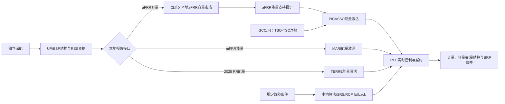

# 西班牙辅助服务市场研究总报告（独立储能）

> **报告状态**：ES-GF 主线程研究终审稿（2026-08-21）  
> **研究基线**：历史规则与数据期为 2025-01-01—2025-12-31；规则基准日为 2026-08-11。  
> **研究对象**：西班牙半岛电力系统中的独立电化学储能。  
> **范围**：辅助服务、平衡能量、不平衡结算及其直接相关的储能准入和数据接口。日前、日内和现货市场完整规则不在本报告范围内。

## 1. 结论先行

1. 西班牙平衡体系由欧盟平衡规则、CNMC/BOE 约束性程序、REE 运行和结算接口共同构成；容量资格、平衡能量激活和 BRP 不平衡结算是三个不同层次。
2. 在已核对的 2025 规则中，**aFRR 是唯一明确存在本地平衡容量采购和容量费的标准平衡产品**。这并不自动证明每个独立储能项目已取得 aFRR 产品资格；项目仍需满足 REE 资格、测试、聚合和持续履约条件。
3. aFRR 能量主要通过 PICASSO，mFRR 能量主要通过 MARI；2025 年 RR 能量通过 TERRE，TERRE 于 2025-12-30 停止。2026 年 RR 替代路径在 2026-08-11 基准日仍未形成完整的西班牙官方规则闭环。
4. 已确认的独立储能通用入口包括：可成为 BSP、一般 1 MW 报价能力、aFRR 上下方向预认证备用合计 100 MW、控制中心和遥测、双向计量及 15 分钟 ISP。FCR、SRAD、SOC/持续时间/补能、强制可用率和恢复阈值仍不能当作已确认模型参数。
5. 2025 年 15 分钟结算和储能双向计量规则已经建立，但 REE/eSIOS 的具体指标 ID、字段权限、历史覆盖、revision 和 TERRE 归档仍需逐项核验。未核验的数据字段不进入收益模型。

## 2. 证据口径和范围边界

### 2.1 三层内容

- **规则事实（F）**：BOE、CNMC、MITECO、REE、ENTSO-E、ACER 等第一方资料直接支持的内容。
- **研究解释（I）**：对市场流程、收入层次、数据风险和储能运营含义的解释，不等于法律规则。
- **建模假设（A）**：为未来情景分析而设定的简化参数。本报告不新增任何未经主线程批准的建模假设。
- **待确认（U）**：官方资料尚未闭合、不能直接转化为规则参数或收入来源的事项。

### 2.2 不纳入本报告

- OMIE 日前、日内及现货产品的完整申报、出清、价格和结算；
- 现货套利或现货—辅助服务联合策略；
- 电压、无功、黑启动等非核心服务的详细补偿规则；
- 交易策略、MILP、生产代码、原始时序下载、历史回测和预测模拟。

## 3. 政策体系、参与主体与平台

### 3.1 四层政策体系（F）

| 层级 | 主要机构/文件 | 作用 |
|---|---|---|
| 欧盟框架 | EBGL（S-EBGL-2017）、ACER 平台实施框架 | 定义 BSP、BRP、平衡容量/能量、欧洲平台和不平衡结算共同框架 |
| 西班牙监管 | CNMC、BOE、MITECO；S-CNMC-2024-MP、S-CNMC-2024-11535-PO、S-MITECO-2025-ISP | 规定平衡服务条件、P.O. 程序、储能入口、计量和结算接口 |
| 系统运行 | REE；S-REE-GUIDE-2024、S-REE-FAQ-2026 | 负责资格、测试、报价接收、激活、遥测、履约和操作通知 |
| 欧洲平台/数据 | PICASSO、MARI、TERRE、IGCC；REE/eSIOS、ENTSO-E | 跨 TSO 平衡能量交换、净额过程及公共数据入口 |

详细来源机构、标题、发布日期/生效日、URL、访问日和条款/页码见 [ES 来源登记](sources.md)。

### 3.2 主要参与主体（F/I）

| 主体 | 职责 | 独立储能接口 |
|---|---|---|
| REE | 西班牙输电系统运营商，执行资格、调度、激活和履约监测 | 项目必须满足 REE 适用的控制、通信、测试和数据要求 |
| BSP | 提交平衡容量或能量报价 | 储能持有人可在满足服务条件后自行成为 BSP，也可加入已有 BSP |
| BRP | 承担计划偏差的财务责任 | 可由持有人、代表或其他合格 BRP 承担；aFRR 储能存在专门委托规则 |
| UP/UF | 计划、报价、计量和结算结构单元 | 双向储能的 UP/UF 结构和计量配置仍有部分待确认 |
| PICASSO | aFRR 欧洲平衡能量平台 | 处理自动频率恢复备用的跨区能量激活 |
| MARI | mFRR 欧洲平衡能量平台 | 处理人工频率恢复备用的跨区能量激活 |
| TERRE | RR 欧洲平台 | 西班牙 2025-12-30 停止，2026 替代机制待确认 |
| IGCC/IN | TSO—TSO 不平衡净额过程 | 影响 aFRR 需求和激活，不是储能直接投标产品 |
| SRAD | 西班牙需求响应特定服务 | 2025 年已有年度服务/拍卖框架；2025-11 修订的后续周期自 2026-01-01 起实施；独立储能资格未确认 |

### 3.3 西班牙本地层与欧洲平台层



**解释（I）**：本地层决定资格、测试、报价接口和本地结算；欧洲平台层负责跨 TSO 的平衡能量排序和激活。fallback 是故障或过渡期的操作分支，不改变资格、遥测和测试义务。

## 4. 产品及其作用

| 产品 | 西班牙术语/对应 | 主要作用 | 2025 机制 | 独立储能状态 |
|---|---|---|---|---|
| FCR | regulación primaria | 秒级稳定频率，不直接恢复 ACE | 约束性规则确认物理响应；REE 指南描述并网发电机强制且无偿（S-CNMC-2024-MP；S-REE-GUIDE-2024） | 储能资格、测试和补偿 U（ES04-U01） |
| aFRR | regulación secundaria | 自动恢复频率和交换计划 | 本地 D-1、QH、上下独立容量市场；能量接入 PICASSO（S-CNMC-2024-11535-PO；S-REE-PLATFORMS-2026） | 一般储能 BSP 入口 F；产品专门资格仍需核验 |
| mFRR | regulación terciaria | 手动恢复和补充调节 | 以能量报价/激活为核心，能量接入 MARI（S-CNMC-2024-11535-PO；S-ACER-mFRR-IF） | 一般入口 F；SOC/持续性和细节 U |
| RR | reservas de sustitución | 替换已经使用的备用 | 2025 通过 TERRE；2025-12-30 停止（S-CNMC-2025-QH；S-ENTSOE-TERRE-2026） | 2026 替代产品及资格 U（ES04-U08） |
| SRAD | respuesta activa de la demanda | 需求响应特定容量服务 | 2025 年已有年度服务/拍卖框架；2025-11 修订的后续周期自 **2026-01-01 起实施**，2026 原则上半年合同（S-SRAD-2025；S-SRAD-2026） | 独立储能是否可参加 U（ES04-U06）；2025 框架不能计入“已确认的独立储能收入” |
| IN/IGCC | imbalance netting | TSO—TSO 净额和 aFRR 需求修正 | 影响 aFRR 调用量，不是储能投标产品（S-ACER-IN-IF；S-REE-PLATFORMS-2026） | 仅系统接口 F |

技术参数中已由来源确认的关键值：aFRR FAT 约 5 分钟、mFRR FAT 12.5 分钟、RR FAT 30 分钟（S-REE-FAQ-2026；S-CNMC-2024-11535-PO；S-CNMC-2025-QH）；具体持续时长、SOC 和恢复条件仍不能从 FAT 反推。

## 5. 独立储能参与方式与技术要求

### 5.1 参与安排（F/I）

1. **直接成为 BSP**：储能持有人自行管理资格、报价、控制、计量和结算接口。
2. **加入已有 BSP**：BSP 负责市场接口，项目承担可用容量、SOC、执行和数据责任。
3. **委托代表/BRP**：由代表承担部分计划和结算责任，合同需明确收入分成、偏差、通信和未履约责任。

### 5.2 已确认的准入和技术要求（F）

| 项目 | 已确认内容 | 证据/边界 |
|---|---|---|
| BSP 身份 | 储能持有人可在满足服务条件后成为 BSP | S-CNMC-2024-MP Arts.7–9；S-CNMC-2024-11535-PO |
| 一般规模 | 一般 UP/BSP 报价能力门槛为 1 MW | S-CNMC-2024-MP；适用产品仍须检查更具体门槛 |
| aFRR 规模 | aFRR BSP 上、下方向预认证备用合计至少 100 MW | S-CNMC-2024-MP Art.7(5)；方向合计含义已确认 |
| 控制和遥测 | aFRR AGC、约 4 秒遥测、控制中心通信 | S-CNMC-2024-11535-PO P.O.9.2 Annex I；具体字段仍由 ES-06 标记 open |
| 响应能力 | aFRR FAT 约 5 分钟；mFRR 12.5 分钟；RR 30 分钟 | S-REE-FAQ-2026；S-CNMC-2024-11535-PO；S-CNMC-2025-QH；FAT 不等于持续时间 |
| 测试 | 产品资格通常需要测试；Art.9(2)(d)存在并入既有合格 UP 的比例例外 | S-CNMC-2024-MP；例外比例、方向和四舍五入仍 U（ES04-U02） |
| 双向计量 | 注入与取电方向分别计量；15 分钟 ISP 计量规则自 2025-05-01 起适用 | S-MITECO-2025-ISP；具体 SIMEL 字段 U |
| 履约 | 持续监测、未交付和资格暂停存在规则接口 | S-CNMC-2024-11535-PO；S-CNMC-2025-VOLTAGE-13076；具体系数、宽限期、恢复阈值 U（ES04-U05、ES05-Q04） |

### 5.3 尚未确认、不得直接建模的要求（U）

- 独立储能 FCR 申请、测试、补偿和并网路径；
- 独立储能 SRAD 资格及其计量/基线接口；
- aFRR/mFRR/RR 的 SOC、持续供能时长、容量预留、补能和恢复；
- 强制可用率、停权计数、整改和恢复测试阈值；
- 双向储能采用一个 UP 还是发电/需求分拆 UP 的完整配置；
- 2026-09-01 后新规则或 2026 RR 替代机制对产品资格的具体影响。

## 6. 容量、能量和不平衡结算

### 6.1 容量收入（F）

- **aFRR**：已确认本地 D-1 容量采购、15 分钟时段、上下方向独立和边际容量价格；中标后通常伴随至少等量能量支持报价义务（S-CNMC-2024-MP；S-CNMC-2024-11535-PO）。
- **SRAD**：2025 年已有需求响应年度服务/拍卖框架；2025-11 修订的后续周期自 2026-01-01 起实施，但独立储能资格未确认，因此 2025 框架不能计入“已确认的独立储能收入”（S-SRAD-2025；S-SRAD-2026）。
- **FCR**：未确认独立储能可获得竞价容量收入（S-REE-GUIDE-2024；S-CNMC-2024-MP）。
- **mFRR/RR**：在已审 2025 规则中未识别独立的 €/MW 容量采购或容量费；备用要求不等于容量中标收入（S-CNMC-2024-11535-PO；S-CNMC-2025-QH）。

### 6.2 能量激活收入（F/I）

- aFRR：本地算法/平台路径与 PICASSO；自动激活，已确认 FAT 约 5 分钟和 15 分钟交付接口（S-REE-FAQ-2026；S-ACER-aFRR-IF）。
- mFRR：本地算法/平台路径与 MARI；人工激活，已确认 FAT 12.5 分钟（S-CNMC-2024-11535-PO；S-ACER-mFRR-IF）。
- RR：2025 通过 TERRE；FAT 30 分钟、交付 15–60 分钟，2025-12-30 后的替代机制 U（S-CNMC-2025-QH；S-ACER-RR-IF；S-ENTSOE-TERRE-2026）。
- fallback：在规定故障条件下由本地算法、SRS 或适用 RCP 承接；RCP 不是通用的免资格路径（S-CNMC-2024-11535-PO；S-REE-FAQ-2026）。

### 6.3 不平衡结算（F）

在 15 分钟 ISP 内，BRP 偏差使用计划、实际计量和适用的激活调整量计算（S-CNMC-2024-ISP15；S-MITECO-2025-ISP）。已确认的核心方向为：

```text
DESV = MEDBC − (POSFIN + AJUDSV)
```

正负偏差方向、单/双价、2%阈值、PBALSUB/PBALBAJ 及未交付支付接口已在 ES-05 规则文件中登记（S-CNMC-2025-QH；S-CNMC-2025-VOLTAGE-13076）。实际公开数据字段、储能双向净额、修订和 BRP 私有结算文件权限仍为 U，不在本报告中自行补齐。

### 6.4 三种现金流不能混同（I）

| 现金流 | 单位 | 含义 |
|---|---|---|
| 容量费 | €/MW | 为可用备用能力支付；当前明确对应本地 aFRR 容量市场 |
| 能量费/支付 | €/MWh | 为实际激活的平衡能量或未交付结果结算 |
| 不平衡费/支付 | €/MWh | 为 BRP 计划偏差结算 |

后续建模必须将三者分列，并分别使用其适用时间、方向和版本。

## 7. 2025 历史期与 2026-08-11 基准时间线

| 时间 | 已确认边界 | 研究处理 |
|---|---|---|
| 2024-07-06 | BOE-A-2024-11535 相关平衡条件生效（S-CNMC-2024-MP；S-CNMC-2024-11535-PO） | 作为 2025 产品和储能入口的主要上位规则 |
| 2024-12-01 | ISP15 相关 P.O.14.4 版本边界（S-CNMC-2024-ISP15） | 与后续 2025 版本分开记录 |
| 2024-12 | MARI 接入西班牙（S-REE-PLATFORMS-2026） | mFRR 能量平台路径；逐日切换通知仍 U |
| 2025-03-17 | BOE-A-2025-5342 发布（S-CNMC-2025-QH） | 15 分钟 RR/调度相关版本；具体生产日适用按来源登记 |
| 2025-05-01 | 15 分钟计量/运行接口生效（S-MITECO-2025-ISP） | 计量规则进入历史期；字段和公开覆盖仍 U |
| 2025-06 | PICASSO 接入月份边界（S-REE-PLATFORMS-2026） | 具体接入日和 fallback 切换日 U |
| 2025-12-30 | TERRE 在西班牙停止（S-ENTSOE-TERRE-2026） | 2025 RR 数据和规则按停止时点截断 |
| 2026-05-16 | SRAD 2026 修订生效（S-SRAD-2026） | 半年合同等变化不回填 2025 |
| 2026-06-27 / 2026-09-01 | BOE-A-2026-14009 发布/生效（S-CNMC-2026-RT） | 2026-08-11 基准日时尚未生效，不能覆盖 2025 或基准日 |

## 8. 官方数据目录和可复现性

### 8.1 已确认的数据入口（F）

| 数据入口 | 已确认内容 | 尚未确认 |
|---|---|---|
| REE REData API（S-REE-REData-API-2026） | GET widgets、日期过滤和 JSON/缓存元数据入口 | widget ID、单位、刷新、历史覆盖、revision |
| eSIOS indicator API（S-eSIOS-API-IND-2026） | `/indicators?text` 搜索、API key、指标 ID 和 JSON 返回模式 | 实际平衡指标 ID、权限、延迟和字段字典 |
| REE 结算指南（S-REE-LIQ-GUIDE-2024） | `reganecuQH`、`p48cierre`、`prdv*`、SIMEL、A1–A5/C1–C5 文件角色 | BRP 私有文件的完整字段权限和公开替代 |
| BOE/MITECO 计量规则（S-MITECO-2025-ISP） | active saliente/entrante、QH best value、估计和 M+1/D+1 接口 | SIMEL/eSIOS 实际字段名和异常标志 |
| 欧洲平台/EDI（S-ENTSOE-EDI-2024） | 平台报价、激活和资源计划 schema 入口 | 西班牙归档文件和本地结算字段映射 |

### 8.2 数据使用约束

- 公开 API 入口不等于全年数据已实际可下载；指标 ID、分辨率、时区、延迟和历史覆盖必须逐项验证。
- 2025 决策输入和事后结算输入必须分开保存；修订数据不得覆盖原始版本。
- `open`、`open-critical` 和 `provisional` 字段不得直接进入模型、策略或收益计算。
- 2026-09-01 生效的新实时字段只作为未来版本边界记录，不回填历史期或 2026-08-11 基准。

## 9. 未决事项和研究结论

### 9.1 对研究闭环有直接影响的未决事项

1. FCR 和 SRAD 的独立储能资格、测试及补偿；
2. SOC、持续时长、补能、可用率和恢复测试；
3. Art.9(2)(d) 测试比例的精确公式；
4. 2026 RR 替代平台、产品和结算；
5. PICASSO/MARI 逐日切换和 fallback 通知；
6. REE/eSIOS 具体指标、时区、延迟、revision 和 2025 TERRE 归档；
7. BRP 私有结算文件与公共数据的字段映射。

### 9.2 本阶段结论

- **规则事实已足以形成市场架构和储能准入框架**：aFRR 本地容量、aFRR/mFRR/RR 能量、平台关系、15 分钟计量和不平衡结算层次清晰。
- **规则事实尚不足以直接形成完整收益模型**：FCR/SRAD、SOC/持续性、2026 RR 和公开数据字段存在关键缺口。
- **不应把开放事项隐藏为假设**：后续策略或模型若必须继续，必须逐项建立显式情景假设、敏感性分析和排除清单。

## 10. 来源与复核记录

主要第一方来源包括：S-EBGL-2017、S-CNMC-2024-MP、S-CNMC-2024-11535-PO、S-CNMC-2024-ISP15、S-CNMC-2025-QH、S-CNMC-2025-VOLTAGE-13076、S-MITECO-2025-ISP、S-SRAD-2025、S-SRAD-2026、S-CNMC-2026-RT、S-REE-GUIDE-2024、S-REE-PLATFORMS-2026、S-REE-REData-API-2026、S-eSIOS-API-IND-2026、S-ENTSOE-TERRE-2026、S-ENTSOE-EDI-2024 及 ACER 平台实施框架。完整 source ID、URL、发布日期/生效关系、访问日及条款/页码见 [countries/ES/sources.md](sources.md)。

本报告基于 ES-01—ES-06 研究文件形成；ES-04、ES-05、ES-06 均已通过独立复审。报告不替代 REE 项目级资格确认、法律意见或正式结算审核。
