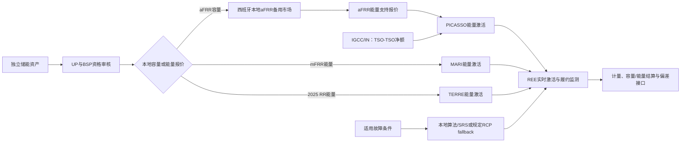
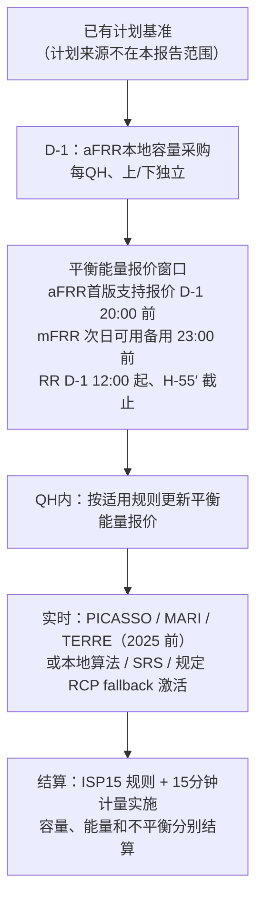

# 西班牙调频市场：独立储能参与指南

> **读者定位**：独立储能项目投资者、开发商、运营商、BSP/BRP和电力交易人员。本文假定读者理解功率、能量、调度和电价等基本概念，但不要求熟悉西班牙平衡市场术语。
>
> **研究基线**：西班牙半岛电力系统；历史规则重点为 2025 年，现行规则核对日为 2026-08-11；对象重点为独立电化学储能参与调频和其他平衡服务的路径。
>
> **范围边界**：本文只讨论调频、平衡能量、辅助服务及其直接相关的储能准入和结算接口。日前、日内和现货市场的完整规则不在本文范围内。

## 1. 西班牙调频市场概括

### 1.1 政策与规则体系

西班牙调频市场不是由单一交易所独立运行，而是由“欧盟规则—西班牙监管程序—REE运行系统”三层共同构成：

1. **欧盟层**：欧盟《电力平衡指南》（EBGL）规定平衡服务提供商（BSP）、平衡责任主体（BRP）、欧洲平衡平台和不平衡结算的共同框架。
2. **西班牙监管层**：CNMC批准西班牙平衡服务条件和主要系统运行程序（P.O.）；MITECO/能源国务秘书处批准部分计量和运行程序。
3. **系统运营层**：Red Eléctrica（REE）负责资格审核、系统需求、报价接收、激活、实时监测和履约管理。
4. **欧洲平台层**：REE把符合条件的平衡能量接入PICASSO、MARI、TERRE等平台，并通过IGCC参与不平衡净额过程。

对独立储能运营商而言，最重要的区别是：**容量资格和能量激活是两件事，REE本地程序和欧洲平台也不是同一个市场**。同一套储能资产可能先在西班牙本地取得资格，再通过欧洲平台完成能量激活。

本项目已核实的第一方政策文件按四个层级列出（来源ID 为 sources.md 登记标识）：

#### 1.1.1 欧盟层政策文件

| 文件（来源ID） | 机构 | 日期/版本 | 作用（与储能相关） |
|---|---|---|---|
| 《电力平衡指南》EBGL（S-EBGL-2017） | 欧盟委员会 | Reg. (EU) 2017/2195；2017-12-18 生效；2022-06-19 合并版 | 规定 BSP/BRP、平衡容量与平衡能量、四大欧洲平台和不平衡结算的共同框架；西班牙所有平衡规则的上位基线 |
| aFRR/PICASSO 实施框架（S-ACER-aFRR-IF） | ACER | 决定 02/2020、15/2022、08/2024 | PICASSO 跨 TSO 平衡能量交换与激活规则；西班牙 2025-06 接入后适用 |
| mFRR/MARI 实施框架（S-ACER-mFRR-IF） | ACER | 决定 03/2020、14/2022 | MARI 平台规则；西班牙 2024-12 接入后适用 |
| RR/TERRE 实施框架（S-ACER-RR-IF） | ACER / 相关 NRA | 2019 批准、2023 修订 | TERRE 平台规则；西班牙参与至 2025-12-30 |
| IN/IGCC 实施框架（S-ACER-IN-IF） | ACER | 决定 13/2020、16/2022 | 不平衡净额过程规则；影响 aFRR 需求，不是储能投标产品 |

#### 1.1.2 西班牙监管层政策文件（CNMC / MITECO / BOE）

| 文件（来源ID） | 机构 | 日期/版本 | 作用（与储能相关） |
|---|---|---|---|
| 平衡服务条件（S-CNMC-2019-BAL） | CNMC | 2019-12-23 发布、2020-01-22 生效 | 原始 BSP/BRP 条件；确认生产、需求、储能可参与；被 2024 修订替代 |
| 平衡条件与 P.O. 修订（S-CNMC-2024-MP、S-CNMC-2024-11535-PO） | CNMC | BOE-A-2024-11535；2024-06-06 发布、条件 2024-07-06 生效 | **核心文件**：FCR/aFRR/mFRR/RR 产品对应、储能持有人可成为 BSP、1 MW 门槛、aFRR 100 MW 条件、aFRR 本地容量市场、P.O.7.2/7.3/14.4 能量与结算入口 |
| P.O. 适应平衡条件（S-CNMC-2020-PO） | 能源国务秘书处 | BOE-A-2021-142 | 历史桥接文件；后被 2022/2024 修订取代 |
| P.O.3.3 RR 修订（S-CNMC-2021-RR） | CNMC | BOE-A-2021-701 | RR 需求、激活和资格的历史入口 |
| 四小时段调度 P.O.（S-CNMC-2022-QH） | CNMC | BOE-A-2022-4969 | 调整 P.O. 至 QH 调度，是 15 分钟交易的前身 |
| 15 分钟交易 P.O.（S-CNMC-2025-QH） | CNMC | BOE-A-2025-5342；2025-03-17 | RR 能量产品（TERRE）、24 horizons、H-55′、每方向 40 块、96 次闭市触发 RR 停止、交付前 25 分钟更新 |
| 15 分钟不平衡计量（S-MITECO-2025-ISP） | MITECO/能源国务秘书处 | BOE-A-2025-6693；2025-05-01 生效 | 15 分钟 ISP 计量与程序接口，用于平衡验证和结算输入 |
| SRAD 修订（S-SRAD-2025） | CNMC | BOE-A-2025-22853 | 需求响应特定产品，年度容量拍卖与容量费 |
| SRAD 修订（S-SRAD-2026） | CNMC | BOE-A-2026-10602；2026-05-16 生效 | SRAD 原则上半年合同、每年最多两次拍卖；含保密附件 |

#### 1.1.3 系统运营层政策文件（REE）

| 文件（来源ID） | 机构 | 日期/版本 | 作用（与储能相关） |
|---|---|---|---|
| 平衡服务提供商指南 v5.0（S-REE-GUIDE-2024） | REE | 2024-12 | 非规范性操作说明：储能可成为 BSP、1 MW 报价能力、遥测/控制中心/测试路径、aFRR 100 MW 技术条件 |
| 平衡服务 FAQ（S-REE-FAQ-2026） | REE | 现行网页 | 标准产品说明（aFRR FAT 5、mFRR FAT 12.5、SRAD）与储能/需求/发电 >1 MW 资格 |
| 欧洲平衡平台页面（S-REE-PLATFORMS-2026） | REE | 现行网页 | 平台接入日期：IGCC 2020-10、MARI 2024-12、PICASSO 2025-06 |
| P.O.7.3 文本（S-REE-TERTIARY-2024） | CNMC/BOE（REE 托管） | BOE-A-2024-11535 | mFRR 产品表、FAT、1 MW 报价和术语对应入口 |

#### 1.1.4 欧洲平台与数据层

| 文件（来源ID） | 机构 | 日期/版本 | 作用（与储能相关） |
|---|---|---|---|
| TERRE 平台状态（S-ENTSOE-TERRE-2026） | ENTSO-E | 页面更新至 2026 | 记录 TERRE 于 2025-12-30 停止及 REE 退出时点，划出 2025/2026 RR 边界 |
| EDI 平衡数据 schema（S-ENTSOE-EDI-2024） | ENTSO-E | 2024 | 平台激活、报价、资源计划的数据 schema 入口（ES-06 用） |
| eSIOS 平衡数据门户（S-REE-DATA-BAL-2026） | REE/eSIOS | 持续更新 | 平衡能量、aFRR/mFRR/RR、IGCC/SEPE 数据入口（ES-06 核对字段/时区/延迟） |
| eSIOS 价格门户（S-eSIOS-PRICES-2026） | REE/eSIOS | 持续更新 | 实时偏差价格显示与平衡 P.O. 文档入口（ES-05/06） |

> 上表只列各文件在本项目中的作用摘要；URL、访问日期、页码和条款定位已登记在 `countries/ES/sources.md`。

### 1.2 市场参与主体与平台

| 主体/平台 | 作用 | 对独立储能参与的意义 |
|---|---|---|
| REE | 西班牙输电系统运营商和调频执行机构 | 决定独立储能的资格、测试、调度、激活和履约 |
| BSP | 平衡服务提供商，提交平衡容量或能量报价 | 独立储能可以自行成为BSP，或加入已有BSP |
| BRP | 对计划偏差承担财务责任的主体 | 独立储能的偏差责任可由项目持有人、代表或其他BRP承担 |
| UP | 参与计划、报价和结算的计划单元 | 独立储能通常需要配置到适当的UP结构中 |
| PICASSO | aFRR欧洲平衡能量平台 | 主要处理自动恢复备用的能量激活 |
| MARI | mFRR欧洲平衡能量平台 | 主要处理人工恢复备用的能量激活 |
| TERRE | RR欧洲平台 | 2025年仍是西班牙RR的重要平台，2025-12-30停止运行 |
| IGCC/IN | TSO之间的不平衡净额过程 | 不是储能可以直接投标的产品，但会影响aFRR需求 |
| SRAD | 西班牙需求响应特定产品 | 有容量拍卖，但独立储能能否参加尚未确认 |

### 1.3 从调频需求到不平衡结算：过程链条

本节参考德国研究对平衡体系的三层拆分（`countries/DE/germany_market_research_report.md` 第 2 章），把西班牙从"物理偏差"到"不平衡结算"的完整链条理清。核心是记住：**物理系统偏差、平衡服务激活、BRP 不平衡结算是三个不同层级，不是同一笔交易**。

#### 1.3.1 三层逻辑

```text
物理系统偏差 / REE 控制偏差
        ↓
IGCC 净额化 + PICASSO / MARI / TERRE 与本地控制激活
        ↓
TSO 与 BSP：容量可用性、实际激活能量、欠履约的结算
        ↓
BRP 与 TSO：15 分钟平衡偏差 × 不平衡价的结算
```

#### 1.3.2 调频需求如何产生

- REE 通过负荷频率控制（LFC）持续观测实际频率和实际交换；实际交换相对计划交换的偏离、以及频率偏差，构成需要平衡的来源。
- **FCR / regulación primaria** 先通过并网发电机/调速器路径自动稳定频率（物理响应，P.O.1.5 §4.1），不直接恢复交换计划（ACE），也不进入 BRP 不平衡结算。
- **aFRR / regulación secundaria** 自动恢复频率和交换计划；**mFRR / regulación terciaria** 手动恢复；**RR / reservas de sustitución** 替换已使用的备用。
- 注意：这里的"控制偏差"是系统运行层面，不是 BRP 的最终 15 分钟不平衡结算；两者在时间与主体上都不同。

#### 1.3.3 IGCC：TSO间净额与平台激活协调

- 当西班牙与其他控制区同时存在相反方向的 aFRR 需求时，**IGCC（不平衡净额过程，2020-10 接入）在控制周期内进行 TSO–TSO 净额化协调**，避免一边上调一边下调的相反调用。公开规则不支持把它简化为固定的“IGCC先于aFRR激活”顺序。
- 净额化不是对 BSP 的付费；它改变的是 aFRR 需求量和平台激活量（P.O.7.2 §8.1–8.2）。
- 西班牙实现：OS 实时提供西班牙 aFRR 需求和法葡 ATC，IGCC 返回校正信号进入主调节器，PICASSO 据此优化/激活（ES03-IN-002）。

#### 1.3.4 各类产品的激活

| 产品 | 触发时机 | 激活方式 | 2025 平台/路径 |
|---|---|---|---|
| FCR | 频率偏差（秒级） | 并网发电机/调速器自动物理响应（REE 指南描述为强制无偿；约束性 P.O.1.5 确认物理响应与年度需求） | 本地（无竞价平台） |
| aFRR | 频率/交换计划恢复（自动） | 自动跟踪目标值，FAT 5 min、15 min 交付 | PICASSO（2025-06 接入）主路径；本地算法/SRS/RCP fallback |
| mFRR | 手动 | 手动激活，FAT 12.5 min；同时参与aFRR/secondary的供应商适用5–30 min标准交付，mFRR-only供应商的程序化/直接交付参数另行适用 | MARI（2024-12 接入）主路径；本地算法 fallback |
| RR | 替换已使用的备用 | 手动程序化，FAT 30 min、交付 15–60 min | TERRE 至 2025-12-30；2026 替代机制未决 |

#### 1.3.5 aFRR 激活链（参考德国调用链）

| 环节 | 进入该环节的数据/事件 | 输出 | 不应混同的概念 |
|---|---|---|---|
| 1. 控制偏差识别 | 实际频率、实际交换、计划交换及 FCR 修正 | REE 控制区的待平衡偏差 | 不是 BRP 最终 15 分钟不平衡结算 |
| 2. IGCC 净额化 | 各控制区相反方向 aFRR 需求 | 减少相反方向的 aFRR 调用 | 净额化不是对 BSP 的付费 |
| 3. PICASSO 激活 | 剩余需求、共同报价序列、跨区可用能力 | 被激活的 aFRR 能量 | 平台激活量不等于储能实际交付量 |
| 4. BSP 跟踪与交付 | 目标值、实时遥测 | 实际响应功率 | 目标值不等于实际响应 |
| 5. 接受量与欠履约 | 实际值、容差带、监测 | 可结算接受量与欠履约量 | 西班牙欠履约系数留 ES-04/05 |

#### 1.3.6 aFRR 的三层财务关系（参考德国框架）

| 层级 | 结算对象 | 西班牙已确认内容 | 边界 |
|---|---|---|---|
| A. TSO–TSO | 参与 PICASSO 的 TSO | 跨区 aFRR 能量交换按欧洲平台方法处理 | 未取得并锁定西班牙 TSO–TSO 结算公式，不虚构 |
| B. TSO–BSP | REE 与提供 aFRR 的 BSP | 容量市场（€/MW）与能量激活（€/MWh）分开结算；容量中标伴随等量能量报价义务 | 未交付/欠履约系数留 ES-04/05 |
| C. TSO–BRP | REE 与平衡责任方 | 15 分钟偏差按不平衡价结算 | 西班牙不平衡单/双价与公式留 ES-05，未确认 |

#### 1.3.7 imbalance 如何产生与结算

- 无论储能还是普通 BRP，实际交付与计划（含被激活后的调整计划）在每个 15 分钟结算期（ISP）的偏差，就是不平衡（desvío）。
- ISP15 结算规则自 2024-12-01 形成适用边界；P.O.10.x 的 15 分钟计量实施自 2025-05-01 起（S-CNMC-2024-ISP15；S-MITECO-2025-ISP）。偏差由 BRP 按不平衡价承担。
- 不平衡价、平衡能量价、容量价是三个不同现金流（详见 3.2.5）。
- 西班牙不平衡的单/双价、净额和更正结算公式留 ES-05，本文不写成固定参数。

### 1.4 调频产品和各自作用

| 产品 | 西班牙名称 | 技术要求 | 2025年主要机制 | 储能状态 |
|---|---|---|---|---|
| FCR | regulación primaria | 需具备扰动后的快速、连续有功功率响应，并按频率偏差自动改变出力；具体储能响应曲线、响应时间、对称性和测试方法需以REE适用程序确认为准 | 主要表现为物理响应和系统需求；REE指南将其描述为并网发电机强制、无偿服务 | 独立储能资格、补偿和测试未确认 |
| aFRR | regulación secundaria | 需接入REE自动调节系统，接受自动功率设定值，具备双向调节、持续跟踪和实时遥测能力；需通过资格测试并满足容量/能量报价接口要求 | 有本地容量市场；能量激活接入PICASSO | 一般储能BSP资格已确认，产品专门要求仍需核实 |
| mFRR | regulación terciaria | 需提交可激活的上调或下调能量，按要求在规定准备和完全激活时间内达到目标功率，并具备人工指令接收、执行和计量能力 | 主要是能量报价和激活；接入MARI | 一般储能参与入口已确认 |
| RR | reservas de sustitución | 需提供可持续的替代调节功率，满足产品规定的报价、激活、持续时间、通信和计量要求；2026年替代产品技术参数仍待确认 | 2025年主要通过TERRE处理平衡能量 | 2026替代机制和储能资格未决 |
| SRAD | respuesta activa de la demanda | 需满足需求响应资源的可调负荷、响应时间、持续时间、基线/计量和可用性要求；储能是否按该产品单独认可不能由一般储能资格推定 | 需求响应特定容量拍卖 | 不能从标准储能资格推定可参加 |
| IN/IGCC | compensación de desequilibrios | 属于TSO间自动净额过程，储能不直接提交该产品报价；储能只需能够按REE调节指令响应，并接受由净额过程改变后的aFRR激活信号 | TSO-TSO协调，不是储能投标产品 | 仅作为系统接口 |

产品之间可以用一句话概括：FCR负责快速稳定，aFRR负责自动恢复，mFRR负责人工补充，RR负责替换已使用的备用；IGCC在控制周期内减少系统之间相反方向的调节需求。

### 1.5 西班牙本地市场与欧洲平台的关系



图中要点：

- **aFRR容量市场是西班牙本地层**；PICASSO主要处理后续能量激活。
- **mFRR的能量激活通过MARI**，但本地程序仍决定资格、报价接口和fallback。
- **RR在2025年使用TERRE**；TERRE于2025-12-30约10:00 CET停止，2026替代机制尚未形成完整官方闭环。
- **IGCC/IN不是储能产品**，而是TSO之间的净额协调过程。
- fallback是异常或平台故障分支，不代表可以免除资格、遥测或测试要求。

#### 1.5.1 本地层与欧洲平台层不是同一个市场

对储能而言，每个标准产品都至少有两个不同层次，不能混为一个：

| 层次 | 干什么 | 例子 |
|---|---|---|
| 本地层（西班牙） | 决定资格、预认证、测试、容量/能量报价接口和本地结算 | CNMC/BOE 条件与 P.O.、REE 资格审核、aFRR 本地备用市场 |
| 欧洲平台层 | 跨 TSO 交换和激活平衡能量、形成共同报价序列 | PICASSO（aFRR）、MARI（mFRR）、TERRE（RR，2025-12-30 停止） |

对独立储能的实际含义：

- 储能参与某个产品，先满足本地资格和测试，再通过本地接口提交报价；能量能否被激活、以什么价格激活，由平台层决定。
- **容量收入来自本地层，能量收入来自平台激活**，两者是不同现金流。
- 平台故障或过渡期按适用条件由本地算法/SRS等 fallback 接续；RCP仅用于P.O.7.2规定的SRS一般技术/安全故障并须由OS通知切换。任何fallback都不改变资格、遥测和测试要求。

#### 1.5.2 各产品“本地 + 平台”的组合（2025 历史）

| 产品 | 本地层 | 欧洲平台层 | 2025 平台接入/停止 |
|---|---|---|---|
| aFRR | 本地容量市场（D-1、QH、上/下独立）+ 本地能量算法 | PICASSO 能量激活 | PICASSO 2025-06 接入 |
| mFRR | P.O.7.3 资格、可用备用能量报价接口、本地算法 | MARI 能量激活 | MARI 2024-12 接入 |
| RR | P.O.3.3 能量报价与本地结算 | TERRE 能量激活 | TERRE 运行至 2025-12-30 停止 |
| IN/IGCC | aFRR控制周期内需求净额与校正 | IGCC（TSO–TSO 净额） | 2020-10 运行至今 |
| SRAD | 本地特定产品（需求响应容量拍卖） | 无欧洲平台 | 不涉及 |

#### 1.5.3 两条需要记住的时序

1. **容量先于能量**：aFRR 先进入本地备用市场取得容量中标（D-1），再提交等量能量支持报价，之后才可能被 PICASSO 激活。没有容量中标，就不能把 aFRR 能量收入当作独立、稳定的收入流。
2. **2025 是平台过渡年**：MARI（2024-12）和 PICASSO（2025-06）在 2025 年内先后接入，TERRE 在 2025-12-30 停止。aFRR 能量路径存在“本地算法 → PICASSO”的切换，RR 只在年底前使用 TERRE；规则版本和数据序列都要按这些切点分段。

## 2. 储能参与方式和技术要求

### 2.1 独立储能的参与方式

独立储能通常有三类参与安排：

1. **独立储能直接参与**：项目自行建立UP、报价、控制、计量和结算能力，直接申请相应服务资格。
2. **加入已有BSP**：储能由已有BSP负责报价和市场接口，项目重点管理可用容量、SOC、调度执行和履约数据。
3. **委托代表或综合服务商**：由代表承担部分BRP、交易和结算工作，合同中需明确收入分成、SOC管理、通信责任和未履约责任。

独立储能的调频资格通常取决于可控功率、实时通信、资格测试、计量配置和持续履约能力，而不是储能是否与其他发电设施共址。

### 2.2 进入市场的基本流程

```text
确定资产和代表关系
        ↓
建立UP / 加入BSP
        ↓
向REE申请相应服务资格
        ↓
建立控制中心、遥测和实时通信
        ↓
完成产品测试或满足既有合格UP的比例例外
        ↓
提交容量/能量报价
        ↓
接受激活、计量和履约监测
        ↓
进行容量、能量和偏差相关结算
```

### 2.3 已确认的基本准入要求

BOE/CNMC的平衡条件确认：

- 储能设施持有人可以在满足相应服务条件后成为BSP；
- 每个BSP计划单元一般最低报价能力为 **1 MW**，但欧洲标准产品框架可能规定不同门槛；
- aFRR BSP的上、下方向已预认证备用容量合计至少 **100 MW**；
- 储能、需求和发电设施需要申请资格、保持结构数据、通过实时控制中心交换信息，并满足对应产品的响应要求；
- 测试通常是产品资格的一部分，但Art.9(2)(d)允许在规定比例条件下，将尚未单独完成测试的设施并入已有合格UP。

这些是市场准入框架，不等于独立电池已经获得FCR、aFRR、mFRR、RR或SRAD的全部产品资格。

## 3. 独立储能参与调频市场的收入来源

### 3.1 容量收入

目前资料支持的容量收入主要有：

| 收入类型 | 适用产品 | 说明 |
|---|---|---|
| 本地平衡容量收入 | aFRR | D-1每日采购、15分钟时段、上下方向独立、边际容量价格 |
| 需求响应容量收入 | SRAD | 需求响应特定产品；独立储能资格尚未确认 |
| FCR容量收入 | FCR | 当前资料未确认独立储能可获得竞价容量收入 |
| mFRR/RR容量收入 | mFRR、RR | 已审2025规则中未识别独立容量采购或€/MW容量费 |

需要特别避免的误读：规则中的“备用MW”“可用备用”或“预认证容量”不一定等于已经获得容量费的容量中标。

#### 3.1.1 aFRR：目前唯一已确认的储能容量收入来源

在标准产品中，只有 aFRR（regulación secundaria）具有已确认的本地容量/备用市场：

- **采购频率与时段**：D-1 每日采购，覆盖供给日每个 15 分钟（QH）编程期；不是年度或季度容量合约。
- **方向独立**：上调与下调分开竞价、分开出清；储能要分别承诺每个方向的可用容量，不能只看一个“额定 MW”。
- **报价字段**：MW 数量 + €/MW 容量价 + 方向，可按每个 QH、每个方向提交多个报价块。
- **出清方式**：系统按最低总成本、每个 QH 独立分配，形成上、下方向各自的边际容量价；中标量 1 MW 起步、1 MW 粒度。
- **中标后义务**：容量中标是 firm commitment——BSP 至少要在对应 QH 和方向提交不低于中标容量的 aFRR 能量支持报价；未提交会触发 P.O.14.4 支付义务。

储能参与 aFRR 容量市场的门槛：

- 储能持有人可成为 BSP（需满足服务专门条件）；
- 每个 UP/BSP 一般最低报价能力为 1 MW；
- aFRR BSP 的上、下方向已预认证备用合计至少 100 MW——这是聚合储能组建 aFRR BSP 时的硬门槛。

**待确认**：储能专用的 SOC、持续时间、恢复要求，以及 100 MW 条件的聚合适用方式尚未闭合；不能把“可报容量”直接当作“必然能交付的容量”。

#### 3.1.2 SRAD：需求响应特定容量拍卖（储能资格未确认）

- SRAD 是西班牙本地特定平衡产品，存在容量拍卖和容量费，按 MW 及边际拍卖价支付。
- 2025 适用年度拍卖框架；2026 起原则上六个月合同、每年最多两次拍卖。
- 正式对象是需求响应（demand UP）；**独立储能能否以需求响应或储能身份参加未确认**，不能从标准产品储能资格推断。

#### 3.1.3 什么不是容量收入

- **FCR / regulación primaria**：当前资料只确认并网发电机的强制、无偿物理响应，未发现独立储能可竞价的 FCR 容量市场或容量费。
- **mFRR / regulación terciaria**：2025 规则中 P.O.7.3 只有“可用备用/能量报价”，未识别独立 €/MW 容量采购或容量费。
- **RR / reservas de sustitución**：2025 P.O.3.3 是能量报价与激活（TERRE），未识别独立容量采购；TERRE 停止后 2026 替代机制未确认。

### 3.2 能量激活收入

储能在被REE或欧洲平台激活后，可能产生平衡能量收入或支付：

- aFRR本地/ PICASSO能量；
- mFRR本地/ MARI能量；
- RR/TERRE能量（2025年TERRE停止前）；
- 平台故障时的本地fallback能量。

这些价格通常按€/MWh表达，与aFRR容量市场的€/MW容量价格是不同现金流。能量价格、激活量和不平衡价格也不能混为一项。

#### 3.2.1 aFRR 能量（PICASSO 为主路径）

- **产品**：自动激活，FAT 5 分钟，15 分钟交付；最小/粒度 1 MW，价格分辨率 0.01 €/MWh，每个方向最多 25 个报价块。
- **报价义务与时间**：容量中标后必须提交至少等量能量支持报价；D-1 12:00 起可接收能量报价，首版支持报价在 D-1 20:00 前，交付前 25 分钟为当前更新接口。
- **价格形成**：PICASSO 接入前由本地算法按方向形成边际价；接入后分配仍用本地算法，但边际价由 PICASSO 平台确定。价外被接受的块按其报价价支付；平台连接后对供应商取更有利价格（激活后 5 分钟规则）。
- **fallback**：按适用条件使用本地算法/SRS后备；RCP仅针对P.O.7.2规定的SRS一般技术/安全故障，并以OS通知切换为条件。

#### 3.2.2 mFRR 能量（MARI 为主路径）

- **产品**：手动激活，FAT 12.5 分钟，最小 1 MW，价格分辨率 0.01 €/MWh；同时参与aFRR/secondary的供应商适用标准交付 5–30 分钟（程序化 5 分钟、直接最长 20 分钟），mFRR-only供应商适用15分钟程序化交付、直接激活最长约29分钟，具体按P.O.7.3产品表记录。
- **报价**：PM 每日 23:00 前提交次日全时域可用上调/下调备用；计划变化时持续更新，QH 开始前 25 分钟截止。
- **价格形成**：本地激活时按上调/下调各自有效报价阶梯形成边际价（上调从低到高、下调从高到低）；MARI 平台路径下共同排序与边际价由平台/IF 决定，逐日切点以 OS 通知为准。
- **fallback**：MARI 无结果时由其他机制或本地算法覆盖。

#### 3.2.3 RR 能量（TERRE，2025-12-30 停止）

- **产品**：手动程序化激活，FAT 30 分钟，交付 15–60 分钟，最小 1 MW，价格分辨率 0.01 €/MWh，共 24 个 activation horizons。
- **报价时间**：D-1 12:00 起提交；H-55′（交付小时前 55 分钟）为 eSIOS 接收截止；每 UP、每方向每小时最多 40 个报价块。
- **平台边界**：TERRE 于 2025-12-30 停止运行；2026 替代平台或本地 fallback 尚未形成官方闭环，不能外推。

#### 3.2.4 本地 fallback 能量

- 平台故障或过渡期，激活按适用条件由本地算法/SRS承接；RCP仅用于P.O.7.2规定的SRS一般技术/安全故障并须由OS通知切换，能量按本地规则结算。
- fallback 是系统可靠性分支，不改变储能资格、遥测和测试要求。

#### 3.2.5 三层价格必须分开

| 现金流层 | 单位 | 含义 | 代表 |
|---|---|---|---|
| 容量价 | €/MW | 为“可用备用能力”支付 | aFRR 本地容量市场 |
| 能量价 | €/MWh | 为“实际被激活的能量”支付 | PICASSO / MARI / TERRE、本地 fallback |
| 不平衡价 | €/MWh | 为“计划偏差”结算 | 完整公式留 ES-05 |

把“备用 MW”“激活 MW”“偏差 MW”写成同一笔钱，是储能收益分析最常见的错误。

### 3.3 从容量投标到不平衡结算：辅助服务范围内的流程

本节只描述辅助服务、平衡能量和不平衡结算之间的关系。现货市场的完整规则和现货—辅助服务联合策略留给后续独立任务。

#### 3.3.1 一图看清时间顺序



#### 3.3.2 每一步在做什么

| 阶段 | 谁在做 | 干什么 | 与储能的关系 |
|---|---|---|---|
| 计划基准 | 计划和结算主体 | 形成每个 ISP 的计划比较基线；计划来源不在本文展开 | 储能的实际计量和激活结果需要与基线对照 |
| D-1 平衡容量 | REE 本地 aFRR 备用市场 | 每 QH 上/下独立容量采购，形成边际容量价 | aFRR 容量收入来源；中标后有能量报价义务 |
| 平衡能量 | BSP 向 REE 提交 | aFRR 支持报价、mFRR 次日可用备用、RR 能量报价 | 影响被激活后的能量收入或支付 |
| 实时激活 | PICASSO / MARI / TERRE 或本地 fallback | 按系统需要激活平衡能量 | 储能需按指令响应并接受履约监测 |
| 结算 | REE / 结算系统 | 容量费、能量费、不平衡费分开处理 | 实际交付与计划偏差形成 BRP 责任 |

#### 3.3.3 四个先后关系

1. **计划基准先形成，平衡服务后纠偏差**：平衡能量是系统偏离计划后用来恢复的增量/减量，不是容量费或不平衡费。
2. **容量先于能量**：aFRR 先取得容量中标（D-1），才产生等量能量支持报价义务，之后才可能被 PICASSO 激活。
3. **报价窗口接力**：aFRR 能量报价从 D-1 12:00 开启，首版支持报价在 D-1 20:00 前；mFRR 在 D-1 23:00 前提交次日可用备用；RR 从 D-1 12:00 到 H-55′。具体更新时间按产品规则和 OS 通知执行。
4. **不平衡是最末端的结果**：实际交付与计划（含被激活后的调整计划）的偏差，在结算期按不平衡价清算；单/双价和公式留 ES-05，不能在本文写成固定参数。

#### 3.3.4 对储能收益的含义

```text
aFRR容量收入
+ 被激活的平衡能量收入/支付
- 偏差 / 不平衡结算
- 履约、通信与计量成本
- 电池效率、循环和衰减成本
= 辅助服务业务净收入
```

本文不把现货收入或现货—辅助服务联合收益写入西班牙辅助服务基线。

### 3.4 收入之外的成本和风险

独立储能评估调频项目时，至少应把以下项目单独建账：

- 未提交规定能量报价的支付义务；
- 可用备用不足或响应偏差造成的扣减；
- SOC不足导致的激活失败风险；
- 控制中心、通信、遥测和计量成本；
- 代表或BSP服务费；
- BRP偏差和不平衡结算成本；
- 电池循环、效率损失和容量衰减成本。

可以用下面的简化现金流关系理解项目收入：

```text
容量收入
+ 激活能量收入
- 未履约和偏差成本
- 交易、控制、通信和计量成本
- 电池效率、循环和衰减成本
= 调频业务净收入
```

本文没有把任何固定的激活概率、SOC安全区或电池衰减费用写成西班牙规则；这些属于后续建模假设。

## 4. 政策性变化和不确定事项

### 4.1 2025—2026关键变化

| 时间 | 变化 | 对独立储能项目的意义 |
|---|---|---|
| 2024年12月 | MARI接入西班牙系统 | mFRR能量进入欧洲平台路径 |
| 2025年 | PICASSO接入西班牙系统 | aFRR能量激活进入欧洲平台路径 |
| 2025年5月1日 | 15分钟计量/运行接口生效 | 平衡验证和结算数据边界发生变化 |
| 2025年12月30日 | TERRE停止运行 | 2025 RR数据和规则需要在停止时点截断 |
| 2026年 | RR替代平台或本地机制仍未形成完整公开闭环 | 不得用2025 TERRE规则外推2026收入 |
| 2026年 | SRAD原则上转向半年合同框架 | 需求响应项目的合同周期发生变化 |

### 4.2 当前最重要的不确定事项

以下内容不能直接作为投资模型或运营参数：

1. 独立电化学储能能否提供FCR，以及FCR补偿和测试规则；
2. 独立储能能否以储能身份或关联需求身份参与SRAD；
3. 2026年RR替代平台、有效P.O.和本地fallback；
4. aFRR、mFRR和RR的SOC、持续供能、恢复和资格保持要求；
5. 未交付、可用率、资格暂停和支付义务的具体计算公式；
6. PICASSO/MARI的逐日连接日期和故障切换通知；
7. REE/eSIOS数据的字段、时区、发布延迟、修订号和2025 TERRE归档方式。

### 4.3 如何理解本文的确定性

- **规则事实**：BOE、CNMC、REE、MITECO、ACER或ENTSO-E文件直接支持的内容。
- **研究解释**：对独立储能项目投资和运营的业务含义，例如“容量费和能量费必须分开”。
- **待确认事项**：官方资料尚未闭合的内容，不能直接写入模型、报价策略或收益预测。

## 5. 名词解释和资料来源

### 5.1 名词解释

- **BSP**：Balance Service Provider，平衡服务提供商，负责提交平衡容量或能量报价。
- **BRP**：Balance Responsible Party，平衡责任主体，承担计划偏差的财务责任。
- **UP**：Unidad de Programación，计划单元，参与计划、报价和结算的基本单元。
- **FCR**：Frequency Containment Reserve，一次调频/频率遏制备用。
- **aFRR**：automatic Frequency Restoration Reserve，自动频率恢复备用，西班牙传统上对应二次调频。
- **mFRR**：manual Frequency Restoration Reserve，人工频率恢复备用，西班牙传统上对应三次调频。
- **RR**：Replacement Reserve，替代备用。
- **FAT**：Full Activation Time，从收到激活指令到达到全部承诺响应的时间。
- **SOC**：State of Charge，电池荷电状态。
- **PICASSO**：欧洲aFRR平衡能量激活平台。
- **MARI**：欧洲mFRR平衡能量激活平台。
- **TERRE**：欧洲RR平衡能量平台，西班牙于2025-12-30停止参与。
- **IGCC/IN**：International Grid Control Cooperation / Imbalance Netting，TSO之间的不平衡净额过程。
- **SRAD**：Servicio de Respuesta Activa de la Demanda，西班牙需求响应特定服务。

### 5.2 主要官方资料

以下资料是本文的主要证据来源；具体页码和条款已登记在`countries/ES/sources.md`。

1. [CNMC/BOE 2024-11535：MARI、PICASSO及平衡服务条件](https://www.boe.es/eli/es/res/2024/04/25/%286%29)（S-CNMC-2024-MP、S-CNMC-2024-11535-PO）。
2. [CNMC/BOE 2025-5342：15分钟交易及P.O.3.1/P.O.3.3修订](https://www.boe.es/eli/es/res/2025/03/06/%2812%29)（S-CNMC-2025-QH）。
3. [MITECO/BOE 2025-6693：15分钟不平衡计量和运行程序](https://www.boe.es/eli/es/res/2025/03/28/%282%29)（S-MITECO-2025-ISP）。
4. [REE：调频/平衡服务提供商指南](https://www.ree.es/sites/default/files/12_CLIENTES/Documentos/Guia_descriptiva_Ser_proveedor_servicios_de_ajuste.pdf)（S-REE-GUIDE-2024）。
5. [REE：西班牙参与欧洲平衡平台页面](https://www.ree.es/es/clientes/comercializador/participacion-en-servicios-de-balance)（S-REE-PLATFORMS-2026）。
6. [CNMC/BOE 2025-22853：SRAD修订](https://www.boe.es/diario_boe/txt.php?id=BOE-A-2025-22853)（S-SRAD-2025）。
7. [ENTSO-E：TERRE平台停止运行记录](https://www.entsoe.eu/network_codes/eb/terre/)（S-ENTSOE-TERRE-2026）。
8. [ACER：欧洲平衡平台实施框架](https://www.acer.europa.eu/electricity/implementation-monitoring/eb)（S-ACER-aFRR-IF、S-ACER-mFRR-IF、S-ACER-RR-IF、S-ACER-IN-IF）。
9. [EUR-Lex：Regulation (EU) 2017/2195](https://eur-lex.europa.eu/eli/reg/2017/2195)（S-EBGL-2017）。合并文本用于阅读，正式法规及修订文本具有法律控制地位。

本文是基于项目现有西班牙辅助服务研究材料形成的业务说明，不替代正式法律意见、REE资格确认或项目级交易和结算审核。
