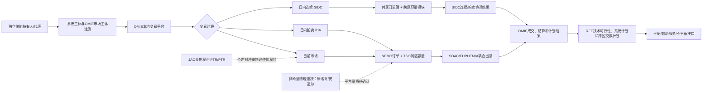

# 西班牙现货市场：制度、主体与市场架构（ES-SP-01）

> 研究对象：西班牙大陆竞价区内的独立电化学储能。  
> 历史期：2025-01-01—2025-12-31。  
> 规则基准日：2026-08-11。  
> 本文件只覆盖制度、主体、平台和市场流程架构；日前/日内订单参数、套利方式、储能详细结算和联合现货—调频策略分别留在 ES-SP-02—ES-SP-06。

## 1. 结论摘要

西班牙现货市场不是一个独立的“西班牙交易所”，而是以伊比利亚电力市场（MIBEL）为国家/区域落地层、以 OMIE 为指定电力市场运营商（NEMO）、以 REE 为西班牙输电系统运营商和系统运营商，并接入欧洲统一日前耦合（SDAC）和日内耦合（SIDC）的多层市场架构。

对独立储能而言，核心链条可以简化为：

```text
储能持有人/代表
        ↓ 作为市场主体向 OMIE 注册并提交交易
OMIE 市场平台（日前、日内拍卖、日内连续）
        ↓ 与 NEMO/TSO 共同进行欧洲耦合和跨区容量分配
市场成交与交易计划
        ↓
REE 技术可行性校核、系统计划、平衡和不平衡接口
```

本阶段可以确认：2025 年规则已明确“储能设施持有人”可以成为市场主体；但储能的注册路径、单位映射、BRP 责任、充放电计量和费用仍需 ES-SP-04 单独核验，不能由本文件推导为可执行的储能交易方案。

## 2. 制度层级与机构分工

### 2.1 规则事实

| 层级 | 机构/文件 | 在现货架构中的作用 | 证据 |
|---|---|---|---|
| 欧盟市场设计 | 欧盟《CACM》Regulation (EU) 2015/1222 | 规定 NEMO、竞价区、跨区容量、SDAC/SIDC 的共同框架 | `S-EU-CACM-2015` |
| 欧盟市场设计 | Regulation (EU) 2019/943 | 要求市场提供与结算周期相匹配的交易粒度，并规定内部电力市场设计原则 | `S-EU-ELEC-2019` |
| 西班牙法律 | Ley 24/2013 | 将市场的经济管理交给市场运营商，将系统安全、调度和输电系统运行交给系统运营商 | `S-SP-LAW-24-2013`，Arts.28–30 |
| 西班牙监管 | CNMC Circular 3/2019及其后续决议 | 将欧盟市场设计转化为西班牙的市场方法、跨区耦合和运行程序 | `S-SP-CNMC-2019-C3` |
| 伊比利亚市场 | MIBEL | 西班牙和葡萄牙共同的现货市场区域；市场层按西班牙、葡萄牙价格区组织 | `S-SP-REE-MIBEL-2026`；`S-SP-BOE-2025-RULES` Rule 12 |
| 市场运营 | OMIE（OMI-Polo Español, S.A.） | 接收和管理日前/日内买卖报价，运行市场平台，形成并结算成交结果；作为交易中央对手方 | `S-SP-BOE-2025-RULES` Rules 1–2 |
| 系统运行 | REE | 负责西班牙系统的技术运行、计划和安全；接收 OMIE 结果并进行技术可行性与后续系统过程 | `S-SP-LAW-24-2013` Art.30；`S-SP-REE-ROLE-2026` |
| 欧洲耦合 | 其他 NEMO 与欧洲 TSO 协作机构 | 共同运行 SDAC、SIDC、EUPHEMIA、共享订单簿和跨区容量模块 | `S-SP-ENTSOE-MCSC-2026`；`S-SP-OMIE-NEMO-2026` |
| 长期跨区权利 | JAO 与相关 TSO | 运行欧盟内部边界长期容量权利分配；该安排不等同于日前/日内成交 | `S-SP-JAO-HAR-2024`；`S-SP-REE-ANNUAL-CAP-2025` |

### 2.2 机构职责的边界

**规则事实：** OMIE 管理“经济市场”部分；REE 管理“技术系统”部分。OMIE 先接收报价并完成市场成交，再将结果送交系统运营商；REE 会基于网络和系统安全进行技术可行性检查并形成后续计划。西班牙法律同时要求两者协调。

**研究解释：** 因此，OMIE 成交并不等于储能一定可以按该计划物理执行。储能至少要同时满足市场主体/报价要求、系统单位/计划要求、并网与计量要求。任何一个环节尚未完成，现货收益分析都不能只使用 OMIE 的成交价格。

**建模假设：** 本阶段不新增建模假设。

## 3. 市场参与主体

### 3.1 规则事实

2025 年市场规则 Rule 4.1 明确以下主体可以成为日前和日内市场主体（S-SP-BOE-2025-RULES，Rule 4.1）：

- 发电商；
- 商业化主体（comercializadores）；
- 直接进入市场的消费者；
- 储能设施持有人；
- 代表（representantes），可以代表其他主体参与市场及处理相关收付款。

获取市场主体资格还需要满足规则规定的注册和接入条件，包括（S-SP-BOE-2025-RULES，Rules 4–6）：

1. 具备相应的行政注册或活动/代表证明；
2. 已成为电力系统主体（sujeto del sistema eléctrico）；
3. 签署日前和日内市场规则及结算的加入合同；
4. 向 OMIE 提供有效的市场主体代码、NIF、ACER 代码和银行账户；
5. 由 OMIE 完成信息系统注册后才能开始参加相应市场和场次。

OMIE 的操作指引将“先向 REE 成为系统主体，再向 OMIE 办理市场注册”作为实际接入顺序（S-SP-OMIE-AGENT-2026）。该页面是操作指引，规范性要求以 BOE 市场规则和适用的系统注册规则为准。

### 3.2 独立储能在主体架构中的位置

**规则事实：** 独立储能不是必须先被归入传统发电商或消费者类别才能成为市场主体；2025 年规则直接列出“储能设施持有人”（S-SP-BOE-2025-RULES，Rule 4.1）。

**研究解释：** 这说明市场规则层面已经为储能设置了明确的主体入口，但“主体资格”与“某个具体储能项目可以用何种报价单位、计划单位和计量配置参与”不是同一个问题。后者需要结合 REE 注册、并网、UP/UO、BRP 以及双向计量规则核验。

**待确认：**

- 独立储能在实际系统注册中应使用哪一种设施/活动注册路径；
- 储能的 market agent、UP、UO、BRP 是否可以全部由同一主体承担；
- 代表参与时，代表的责任是直接结算责任还是仅为代理关系；
- 储能充电与放电是否必须分成不同的报价单位/计划单位。

## 4. 市场平台与产品层次

### 4.1 OMIE 本地平台

OMIE 为西班牙和葡萄牙的指定 NEMO，提供三类主要交易平台（S-SP-OMIE-NEMO-2026；S-SP-OMIE-AGENT-2026）：

1. **日前市场（Mercado Diario）**：为下一交付日形成能源交易和基础计划（S-SP-BOE-2025-RULES）；
2. **日内拍卖（Intraday Auctions, IDA）**：日前结果和系统可行性信息形成后，通过欧洲耦合拍卖进行后续调整；2024 年 IDA 法规与 2025 年持续适用的市场规则共同构成其依据（S-SP-BOE-2024-IDAS；S-SP-BOE-2025-RULES；S-SP-OMIE-NEMO-2026）；
3. **日内连续市场（Mercado Intradiario Continuo）**：通过欧洲共享订单簿和跨区容量模块，连续调整接近交付时段的能源计划（S-SP-OMIE-NEMO-2026；S-SP-ENTSOE-MCSC-2026）。

这里的“平台”是交易和信息系统层面的概念；它不等同于一个单独的储能产品，也不自动代表储能获得平衡服务资格。

### 4.2 SDAC：日前欧洲耦合

**规则事实：** SDAC 的目标是建立统一的欧洲跨区日前市场。各地区 NEMO 接收本地买卖报价，系统运营商提供跨区容量和相关网络信息，EUPHEMIA 算法在一个耦合过程中同时确定各竞价区的成交结果和跨区交换（S-EU-CACM-2015；S-SP-OMIE-NEMO-2026；S-SP-ENTSOE-MCSC-2026）。

**研究解释：** 西班牙储能在 OMIE 交易平台上提交报价，但其跨区成交机会受到西班牙—葡萄牙、西班牙—法国等边界的可用跨区容量和耦合结果影响。容量不是储能单独向 OMIE 购买的一个“现货附加产品”，而是市场耦合过程中的约束条件。

### 4.3 SIDC：日内欧洲耦合

SIDC 包含两个层次（S-EU-CACM-2015；S-SP-ENTSOE-MCSC-2026）：

- **欧洲日内拍卖（IDA）**：在指定场次统一处理跨区能源和容量（S-SP-BOE-2024-IDAS）；
- **日内连续交易**：各 NEMO 的报价进入共享订单簿，跨区交易同时由跨区容量模块处理（S-SP-ENTSOE-MCSC-2026）。

截至本研究基准，不能把 IDA 与连续交易合成一条“日内价格序列”。两者在时间窗口、出清方式、信息交互和成交记录上是不同机制，具体订单参数留在 ES-SP-03。

### 4.4 REE 系统平台和程序接口

市场成交后，OMIE 将市场计划结果和交易结果提供给 REE。REE 进行（S-SP-REE-ROLE-2026；S-SP-LAW-24-2013 Art.30）：

- 市场结果的技术可行性检查；
- 日前可行计划、最终计划和运行计划的形成；
- 与葡萄牙、法国等系统运营商的跨区交换计划协调；
- 后续平衡、辅助服务和偏差结算所需的系统接口。

**范围边界：** 本文件只确认这些接口的存在和职责，不提取平衡产品的容量/能量价格、激活顺序或储能技术参数；这些内容属于已完成的辅助服务研究或 ES-SP-06 耦合研究。

## 5. 西班牙竞价区和跨区接口

### 5.1 竞价区架构

**规则事实：** 2025 年市场规则在市场信息和单位定义中区分西班牙与葡萄牙两个价格区。MIBEL 的西班牙市场研究对象是西班牙半岛价格区；西班牙非半岛系统不纳入本子项目（S-SP-BOE-2025-RULES；S-SP-REE-MIBEL-2026）。

REE 同时确认西班牙半岛在物理上与法国、葡萄牙、安道尔和摩洛哥相连（S-SP-REE-INTERCONNECTIONS-2026）。物理连接不等于全部边界都参加 SDAC/SIDC。

### 5.2 边界主数据（ES-SP-01 版本）

| boundary_id | 相邻系统/性质 | 长期权利 | 正常日前 | 正常日内 | 现阶段结论 | 主要来源 |
|---|---|---|---|---|---|---|
| `ES::PT::MIBEL` | 葡萄牙，MIBEL内部边界 | `FTR option`（长期权利层） | 隐式耦合/SDAC | SIDC（IDA+连续，具体边界字段留ES-SP-03） | 2025架构已确认 | `S-SP-BOE-2025-RULES`; `S-SP-JAO-HAR-2024` |
| `ES::FR::EU` | 法国，欧盟内部边界 | `PTR`（JAO/HAR边界清单；长期权利层） | 隐式耦合/SDAC | SIDC（具体容量字段留ES-SP-03） | 2025架构已确认 | `S-EU-CACM-2015`; `S-SP-OMIE-NEMO-2026`; `S-SP-BOE-2025-RULES`; `S-SP-JAO-HAR-2024`；`S-SP-BOE-2026-17285` 仅用于 2026 后续程序 |
| `ES::MA::EXT` | 摩洛哥，非欧盟外部边界 | 未在本阶段分类 | 未确认参加SDAC | 未确认参加SIDC | 仅确认物理连接；不得假定为欧洲耦合边界 | `S-SP-REE-INTERCONNECTIONS-2026` |
| `ES::AD::EXT` | 安道尔，非欧盟外部边界 | 未在本阶段分类 | 未确认参加SDAC | 未确认参加SIDC | 仅确认物理连接；不得假定为欧洲耦合边界 | `S-SP-REE-INTERCONNECTIONS-2026` |
| `ES::BAL::INTERNAL` | 西班牙半岛—巴利阿里群岛内部连接 | 不适用为相邻竞价区 | 不作为本项目独立竞价区 | 不作为本项目独立竞价区 | 本项目范围排除；不作现货边界事实判断 | 主线程范围决策；不进入现货数据边界 |

长期 FTR option/PTR 与日前/日内隐式容量分配是两个层次：前者是跨区价差对冲或物理使用权层，后者是每次耦合出清时的短期容量和能量联合分配。本文件不将两者合并。

### 5.3 边界流程图



图中需要区分：

- OMIE 接收和管理报价；
- NEMO/TSO 共同参与欧洲耦合；
- REE 对市场结果进行技术和系统层面的后续处理；
- JAO 长期权利不是日前/日内成交；
- 物理互联边界不能自动推导出 SDAC/SIDC 资格。

## 6. 2025 历史期与 2026-08-11 基准日的架构版本

| 时间 | 事件/版本 | 适用判断 |
|---|---|---|
| 2024-06-13 | 欧洲 IDA 架构开始在官方市场说明中运行（S-SP-BOE-2024-IDAS） | 作为 2025 年日内拍卖架构背景；具体参数留 ES-SP-03 |
| 2025-03-18 | MIBEL 日内拍卖和连续市场进入四分之一小时交易；交付日从 2025-03-19 起（S-SP-OMIE-QH-ID-2025） | 2025 年日内版本边界 |
| 2025-03-18 | 2025 市场规则和新报价类型开始在 MIBEL 运行，但日前市场当时仍保持小时粒度（S-SP-OMIE-QH-ID-2025；S-SP-OMIE-MTU15-DA-2025） | 不得将日前 MTU15 从 3 月 18 日回填到整个 2025 年 |
| 2025-10-01 | SDAC 日前市场统一进入四分之一小时交易；首次交付日为 2025-10-01（S-SP-OMIE-MTU15-DA-2025） | 2025 年日前版本边界 |
| 2025-12-30 | 西班牙/葡萄牙系统与 TERRE 平台断开（S-ENTSOE-TERRE-2026） | 2025 年 RR/日内连续交易过渡边界，具体影响交给 ES-SP-06 与辅助服务研究 |
| 2026-08-07 | BOE-A-2026-17285 发布，批准 96 轮连续日内交易等运行程序变化（S-SP-BOE-2026-17285） | 已发布但在 2026-08-11 基准日尚未确认实际应用日，不回填 2025 |
| 2026-08-11 | 本子项目规则基准日（S-SP-BOE-2026-17285；S-SP-OMIE-NEMO-2026） | 采用已发布且在该日已经适用的规则；未确认应用日期的 96 轮不作为基准日运行事实 |

**研究解释：** 2025 年不能只用一个“全年统一规则版本”描述。至少应区分日内四分之一小时切换（3 月）和日前四分之一小时切换（10 月）。历史价格、成交量和计划数据在后续数据阶段必须保存这一版本边界。

**建模假设：** 本阶段不新增建模假设。

## 7. 对独立储能的直接接口说明

### 7.1 已确认接口

1. 储能设施持有人可以作为市场主体申请参与日前和日内市场（S-SP-BOE-2025-RULES，Rule 4.1）；
2. 市场主体必须通过 OMIE 市场信息系统并遵守市场规则和结算加入条件（S-SP-BOE-2025-RULES；S-SP-OMIE-AGENT-2026）；
3. 交易结果以报价单位和系统计划单位的形式进入 OMIE—REE 信息交换（S-SP-BOE-2025-RULES；S-SP-REE-ROLE-2026）；
4. REE 需要对市场结果进行技术可行性和系统运行处理（S-SP-LAW-24-2013 Art.30；S-SP-REE-ROLE-2026）；
5. 日前和日内现货计划会成为后续平衡、不平衡和辅助服务接口的基础输入（S-SP-REE-ROLE-2026；S-SP-BOE-2025-RULES）。

### 7.2 本阶段不确认的储能细节

- 储能充电作为买方、放电作为卖方时的具体 UO/UP 结构；
- 充放电是否使用同一市场主体、同一 BRP 或不同代表；
- 独立储能的最小报价量、保证金、市场费、网络费和税费；
- 充放电双向计量、SOC、可用功率、计划偏差和效率的结算处理；
- 现货成交和 aFRR/mFRR/RR/FCR 等辅助服务的容量占用和计划冲突处理。

上述事项不得在本阶段被写成“储能已具备完整现货准入”或“可以直接形成套利收益”。

## 8. 待确认问题

详细问题登记见 [spot_open_questions.md](spot_open_questions.md)。ES-SP-01 重点未决项如下：

| 编号 | 问题 | 影响阶段 | 状态 |
|---|---|---|---|
| ES-SP-01-Q01 | 2026-08-11 时 96 轮日内连续交易的实际启用日期、OMIE 指令和相应规则版本是什么？ | ES-SP-03/07 | open-critical |
| ES-SP-01-Q02 | 2025 年不同月份的 OMIE 规则、P.O.3.1/P.O.9.1 和计划文件版本边界如何逐日映射？ | ES-SP-03/07 | open |
| ES-SP-01-Q03 | 西班牙—法国和西班牙—葡萄牙边界的 SDAC/SIDC fallback、partial/full decoupling 和 shadow auction 如何具体触发？ | ES-SP-03/07 | open |
| ES-SP-01-Q04 | JAO FTR option/PTR 与短期隐式容量字段如何在数据中区分，物理线路 subset 与竞价区边界如何交叉映射？ | ES-SP-07 | open |
| ES-SP-01-Q05 | 摩洛哥、安道尔物理互联的现货交易是否存在受监管的显式/双边市场通道，哪些数据可以进入现货研究？ | ES-SP-02/03/07 | open |
| ES-SP-01-Q06 | 独立储能的系统主体、市场主体、UO/UP、BRP/代表之间是否有强制的一对一或可选组合关系？ | ES-SP-04 | open-critical |
| ES-SP-01-Q07 | 2025 规则中“储能设施持有人”市场主体资格对应的行政注册和并网证明具体是什么？ | ES-SP-04 | open-critical |
| ES-SP-01-Q08 | OMIE 成交计划经 REE 技术可行性校核后，储能最终执行计划和偏差结算使用哪个具体版本字段？ | ES-SP-04/07 | open-critical |

## 9. 证据分层与建模声明

### 9.1 规则事实

- 欧盟 CACM 建立 NEMO、竞价区、SDAC/SIDC 和跨区容量分配框架；
- 西班牙法律分离 OMIE 的经济市场管理职责和 REE 的技术系统运行职责；
- 2025 年市场规则明确 OMIE 的市场运营/中央对手方角色、市场主体类别和储能设施持有人类别；
- MIBEL 市场层按西班牙和葡萄牙价格区组织；
- 2025 年日内四分之一小时和日前四分之一小时存在不同的上线时间；
- 2026-08-07 发布的 BOE-A-2026-17285 在基准日尚不能作为已启用的 96 轮运行规则。

### 9.2 研究解释

- 现货交易平台、系统计划、平衡服务和不平衡结算是相互连接但不同的模块；
- OMIE 成交结果不能单独证明储能可以物理执行或获得全部交易收入；
- 2025 年历史数据需要按 3 月和 10 月两个现货交易粒度边界处理；
- 长期 FTR option/PTR、短期隐式容量、物理潮流和市场商业计划必须分开记录。

### 9.3 建模假设

本阶段不新增建模假设，不写入 `model/`、`src/`、`tests/`、`outputs/` 或 `data/raw/`。

## 10. 交付检查

- [x] 机构、主体、NEMO、TSO、MIBEL、SDAC、SIDC 和 JAO 架构已区分。
- [x] 2025 年日内/日前四分之一小时版本切换已分开记录。
- [x] 竞价区、欧盟内部边界和非欧盟物理连接未混为同一市场边界。
- [x] 独立储能市场主体入口已记录，但详细储能准入/结算留待 ES-SP-04。
- [x] 规则事实、研究解释、建模假设和待确认事项已分离。
- [x] 所有关键来源已登记于 `countries/ES/sources.md`，并记录机构、日期、生效、URL、章节/页码、2025 适用性和状态（来源 ID 包括 S-SP、S-EU 及 S-ENTSOE）。
- [x] 未研究日前/日内订单参数、套利策略、MILP、代码、回测或预测模拟。
